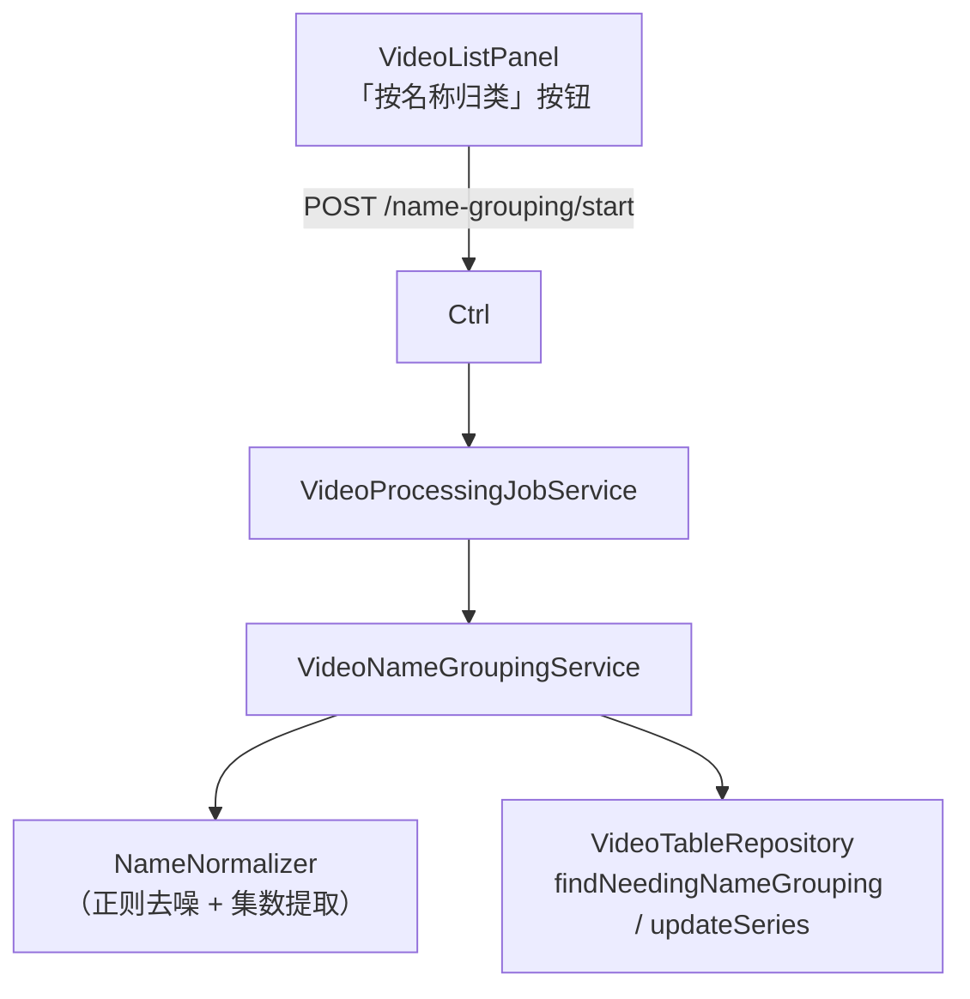
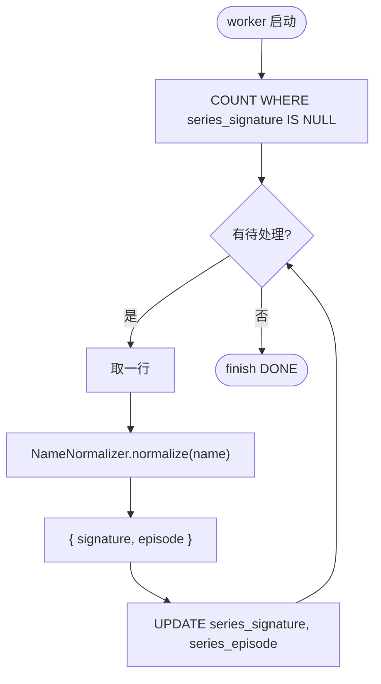

# 视频名称归类（技术方案）

> 最后更新：2026-05-21
> 模版：完整-技术
> 父需求：[视频库-current.md](../视频库-current.md)
> 前置：[视频表与同步功能](../视频表与同步功能/视频表与同步功能-current.md)
> 注：**无 AI 模型依赖**，纯 Java 正则 + 字符串归一化，性能极快

## 1. 目标与边界

### 做什么

- 通过**文件名规则化**自动识别"同系列"视频：同一动漫各集、同一剧集多季多集、同名电影的不同压制版本，自动聚到同一个 `series_signature`
- 字段：`treesize_video.series_signature`（归一化后的"系列签名"，相同字符串视为同系列）
- 字段：`treesize_video.series_episode`（可选，从原文件名识别出的"第 N 集"数字，便于排序）
- 按钮触发，后台任务，按 `size DESC` 顺序处理 `series_signature IS NULL` 的行（任务很快，万级视频秒级）
- 复用 `VideoProcessingJobService`，type=NAME_GROUPING

### 不做什么

- **不用 AI / 不调 ai-vision** —— 纯规则化即可达 90%+ 准确率
- 不做"系列"实体表（series_signature 字段已经足够；同 signature 即同系列）
- 不做用户自定义系列名（前端展示可允许，但持久化不本期）
- 不做跨多盘相同片源的去重（path 不同视为不同视频，这是视频表既有约定）

### 设计结论

| 决策 | 选择 | 原因 |
|------|------|------|
| 算法 | 正则去噪 + 归一化 → 直接 `signature == signature` 判同系列 | 实现极简，accuracy 高 |
| 集数识别 | 正则匹配 `E01 / 第01话 / [01] / #01 / 第一集` 等模式，提取数字 | 便于排序，可选 |
| 算法不上字符串相似度 | 去噪后直接精确匹配即可（相似度阈值难调，精确匹配最稳） | 简单稳定 |
| 顺序 | `WHERE series_signature IS NULL ORDER BY size DESC` | 与其他任务一致 |
| 执行 | 单 virtual thread + 礼让；但批量纯字符串处理可选改并行（本期保持简单一致） | 与其他任务一致 |
| 重跑 | 用户改了归一化规则后可清字段重跑（本期不暴露 UI） | YAGNI |
| 规则集 | 内置规则集（动漫 / 影视 / 综艺），yml 可覆盖 | 兼顾默认效果与可调 |

## 2. 整体架构



## 3. 核心流程



## 4. 归一化规则

### 4.1 去噪正则（按顺序应用）

| # | 规则 | 例子 |
|---|------|------|
| 1 | 去文件扩展名 | `xxx.mp4` → `xxx` |
| 2 | 去字幕组/压制组方括号标签 | `[VCB-Studio][Hi10P]` / `【喵萌】` 整体删除 |
| 3 | 去年份括号 | `(2024)` / `【2024】` 删除 |
| 4 | 去画质/编码/容器标签 | `1080p` / `720p` / `4K` / `HDR` / `BD` / `WEB-DL` / `x264` / `x265` / `H.264` / `HEVC` / `AAC` / `FLAC` / `BDrip` / `WEBRip` 删除 |
| 5 | 去分辨率数字 | `1920x1080` / `3840x2160` 删除 |
| 6 | 去语言标记 | `中字` / `简中` / `繁中` / `双语` / `内嵌` / `外挂` 删除 |
| 7 | 去 release group 后缀 | `-XXX` 末尾连字符短语（保守：仅当前面已有内容） |
| 8 | **提取集数 → 单独字段** | `E01` / `EP01` / `第01话` / `第01集` / `第1集` / `第一集` / `#01` / ` 01 ` / `[01]` |
| 9 | 去残留方括号空内容 | `[]` / `()` / `【】` 删除 |
| 10 | 空白归一化 + 标点替换 | `.` `_` `-` 替换为空格；连续空格归一为一个；去首尾空格 |
| 11 | 小写化（中文不受影响） | `Movie` → `movie` |

### 4.2 集数识别正则

```regex
(?:E|EP|第)\s*(\d{1,4})\s*(?:话|集)?
|^\s*(\d{1,4})\s*$           # 纯数字文件名（仅当其它都被去掉时）
|#(\d{1,4})
|\[(\d{1,4})\]
|第([一二三四五六七八九十百千]+)[话集]   # 中文数字
```

中文数字 → 阿拉伯数字简单转换（一=1, 二=2, ..., 十=10, 十一=11, 二十=20, ...）。

### 4.3 示例

| 原文件名 | 归一化后 signature | episode |
|---------|------------------|---------|
| `[VCB-Studio] 进击的巨人 第01话 [BDRip 1080p HEVC FLAC].mkv` | `进击的巨人` | 1 |
| `【喵萌】[进击的巨人][01][1080p][简中].mp4` | `进击的巨人` | 1 |
| `Attack.on.Titan.S04E15.1080p.WEB-DL.x265.mp4` | `attack on titan s04` | 15（含季） |
| `名侦探柯南.0001.剧场版.mp4` | `名侦探柯南` | 1 |
| `复仇者联盟3：无限战争.2018.BluRay.1080p.mp4` | `复仇者联盟3：无限战争` | NULL |
| `复仇者联盟3：无限战争.4K.HDR.mkv` | `复仇者联盟3：无限战争` | NULL |

→ 后两个有相同的 signature，自动归为同一片源。

### 4.4 已知不能处理的场景

| 场景 | 后果 |
|------|------|
| 极端歪命名（如 `download_2024_03_15.mp4`） | signature 是 `download` —— 容易和其他 `download_x.mp4` 误聚 |
| 译名/原名混用（`進撃の巨人.mp4` vs `进击的巨人.mp4`） | 不会聚到一起；本期不做译名映射 |
| 跨语言的同一片源 | 不归一；用户可手动调整 |

留待下期：用 LLM/embedding 做语义聚类替代/补充正则。

## 5. 编码落点

```
kai-toolbox/tools/tool-treesize/src/main/java/com/exceptioncoder/toolbox/treesize/
├── api/
│   └── TreeSizeController.java              [改] 4 个新端点 /name-grouping/{start,stop,status,events}
├── service/
│   ├── VideoNameGroupingService.java        [新]
│   └── NameNormalizer.java                  [新] 纯函数，无状态
├── repository/
│   └── VideoTableRepository.java            [改] 加 findNeedingNameGrouping / updateSeries / findBySeriesSignature
└── config/
    └── NameGroupingProperties.java           [新] @ConfigurationProperties("toolbox.name-grouping")
```

`application.yml`：

```yaml
toolbox:
  name-grouping:
    # 去噪正则可由用户在此覆盖；留空则用代码内置默认值
    extra-noise-patterns: []
    # 中文数字最大支持值
    chinese-numeral-max: 9999
```

前端 `VideoListPanel` 顶栏加按钮"按名称归类"。

## 6. 数据库变更

新增字段：

```sql
ALTER TABLE treesize_video ADD COLUMN series_signature TEXT;
ALTER TABLE treesize_video ADD COLUMN series_episode INTEGER;
CREATE INDEX idx_video_series_signature ON treesize_video(series_signature);
CREATE INDEX idx_video_series_null ON treesize_video(size DESC) WHERE series_signature IS NULL;
```

## 7. 风险与待确认

| 风险 | 缓解 |
|------|------|
| 命名极不规范的视频被错聚 | UI 显示系列时给"重命名/手工拆系列"按钮（本期不做，仅设计预留） |
| 去噪正则有疏漏 | yml 提供 `extra-noise-patterns` 让用户补充 |
| 中文数字识别错误 | 上限 `chinese-numeral-max` 兜底，超过的当无集数 |
| 用户改了规则后旧 signature 过时 | "重新归类"操作：UPDATE 把 series_signature 清空 + 重跑（本期不做按钮） |

## 8. 不在本期实现

| 项 | 推迟到 |
|---|--------|
| LLM 语义聚类 / embedding 相似（弥补正则） | 由"视频嵌入与相似聚类"模块覆盖 |
| 用户手工拆系列 / 重命名 | 下期 |
| 列表按系列折叠展示 | 下期前端 |
| 译名映射（中日英同片） | 下期 |
| 重新归类按钮 | 下期 |
