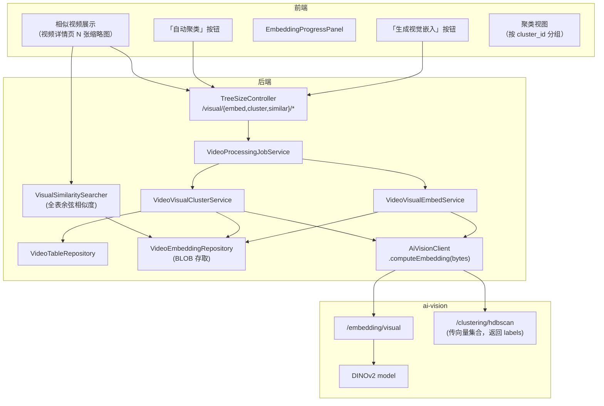
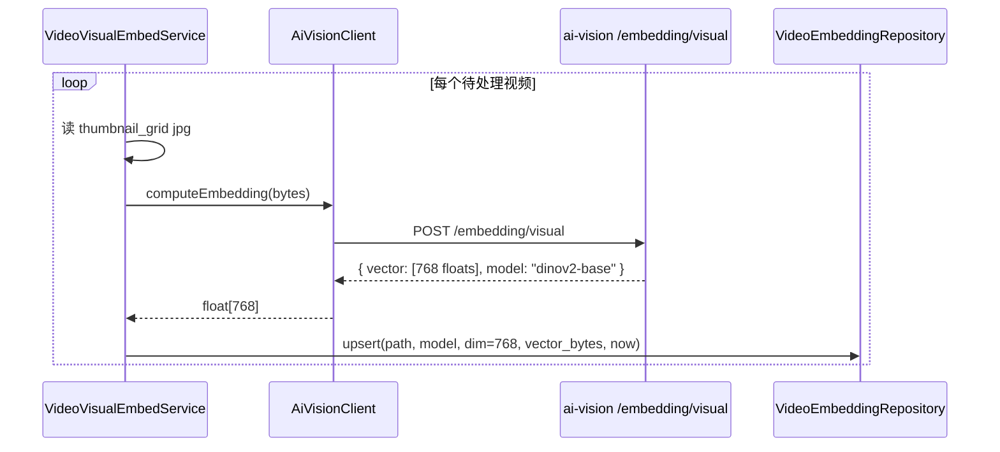
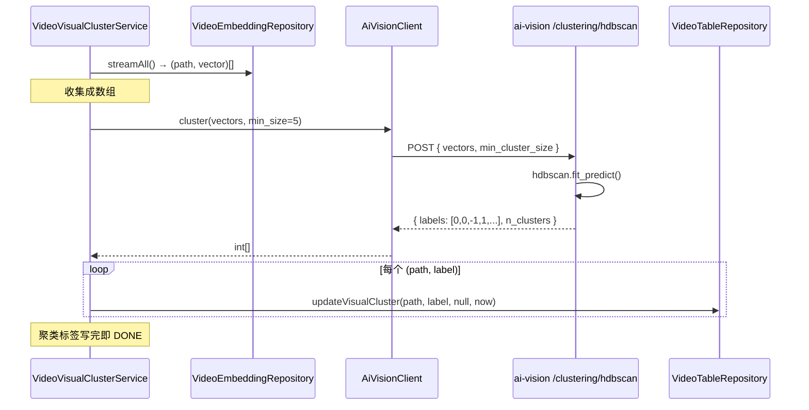
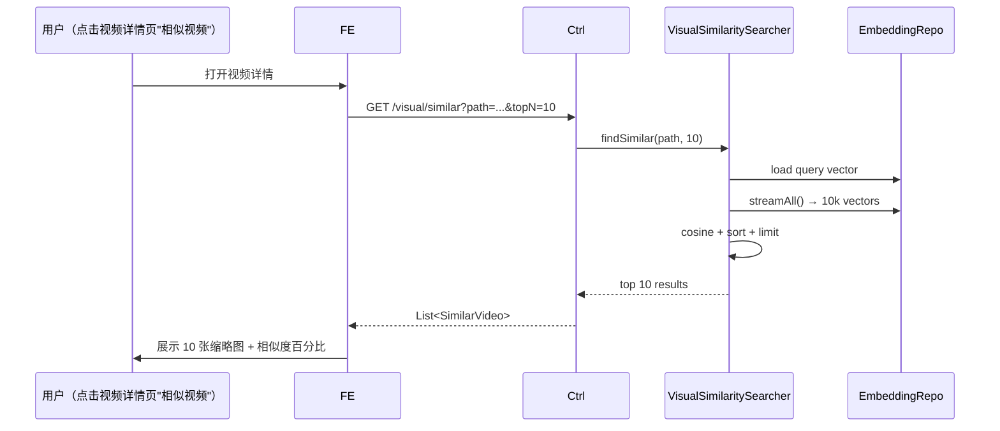

# 视频嵌入与相似聚类（技术方案）

> 最后更新：2026-05-21
> 模版：完整-技术
> 父需求：[视频库-current.md](../视频库-current.md)
> 前置：[视频表与同步功能](../视频表与同步功能/视频表与同步功能-current.md) · [视频九宫格预览图](../视频九宫格预览图/视频九宫格预览图-current.md) · [Python AI 服务架构](../../Python%20AI%20服务架构/Python%20AI%20服务架构-current.md)
> **本模块覆盖两个用户需求**：（1）视频相似分析 （2）同类型分析

## 1. 目标与边界

### 做什么

- 给每个视频生成**视觉嵌入向量**（image embedding，固定 768-D 或 1024-D float32）
- 用九宫格 jpg 作为输入（9 帧整合视图，比单帧更稳定）
- 提供两个上层能力：
  1. **相似视频检索**：给定一个视频 → 返回 top-N 相似视频（余弦相似度）
  2. **自动聚类**：把所有视频按内容分成若干簇（HDBSCAN），同簇视为"同类型"
- 模型：**SigLIP-large-patch16-384**（多模态对齐，中英文同效；图像编码器单独跑）或 **DINOv2-base**（纯视觉自监督，相似检索精度高）

### 不做什么

- 不做文字检索（"找穿黑衣服的女人" → image）—— 本期仅图→图相似；下期可扩
- 不做实时推荐（如"看了这个的人还看了"）—— 静态视频库
- 不做跨视频去重（删除完全相同的副本）—— 仅展示相似度供用户决定
- 不做向量数据库（sqlite-vec / qdrant）—— SQLite BLOB 存向量，全表余弦相似度足够（万级视频 < 100ms）

### 设计结论

| 决策 | 选择 | 原因 |
|------|------|------|
| 模型 | **DINOv2-base**（86M 参数，768-D 输出）作为本期选型 | 纯视觉相似最强；不需要文图对齐；模型小快 |
| 备选模型 | SigLIP-large（可扩文字检索时切换） | 留作下期扩展点 |
| 输入 | 九宫格 jpg（一张图代表整个视频） | 复用现成；3×3 = 9 帧足够表示视频 visual 风格 |
| 向量维度 | 768（DINOv2-base 输出） | 默认；切 SigLIP 时改 1024 |
| 存储 | SQLite BLOB 列 `video_embedding`（独立表） + path 关联 | 不上 sqlite-vec 扩展，避免新依赖 |
| 相似查询 | 全表 cosine 相似度 + LIMIT N（万级视频 ~50ms） | 简单；下期数据量大再上索引 |
| 聚类算法 | **HDBSCAN**（无需预设 K，对噪音宽容） | 视频库聚类不知道有多少类型 |
| 聚类执行 | 用户主动触发；不在 embedding 任务里自动跑（聚类需要全集，每加一个视频都跑一次浪费） | YAGNI |
| 任务类型 | `VISUAL_EMBED`（生成 embedding） + `VISUAL_CLUSTER`（跑聚类，one-shot） | 嵌入和聚类生命周期不同 |
| 前置依赖 | thumbnail_grid_path IS NOT NULL | 直接用九宫格图，零额外抽帧成本 |
| 聚类标签 | 存到 `treesize_video.visual_cluster_id`（整数；-1 = 噪声）+ `visual_cluster_label`（人类可读，从聚类内 series_signature 众数推断或留 NULL） | 让前端能按 cluster_id 分组 |

## 2. 整体架构



## 3. 模块拆分与职责

### 3.1 ai-vision 新增端点

#### `POST /embedding/visual`

- 入参：multipart `file`（jpg/png）
- 出参：`{ "vector": [0.123, -0.456, ...], "dim": 768, "model": "dinov2-base" }`
- 实现：`models/visual_embed.py`，加载 DINOv2 通过 `transformers.AutoModel`

#### `POST /clustering/hdbscan`

- 入参：JSON `{ "vectors": [[...], [...], ...], "min_cluster_size": 5 }`
- 出参：`{ "labels": [0, 0, -1, 1, 1, ...], "n_clusters": 4 }`（-1 = 噪声）
- 实现：`models/cluster.py` 用 `hdbscan` 库；不是模型加载，是无状态函数

### 3.2 `VideoVisualEmbedService`

- 任务类型：`VISUAL_EMBED`
- 流程：扫 `embedding IS NULL` 的视频 → 读九宫格 jpg → ai-vision `/embedding/visual` → 拿向量 → BLOB 存到 `video_embedding` 表

### 3.3 `VideoVisualClusterService`

- 任务类型：`VISUAL_CLUSTER`
- 流程：从 `video_embedding` 表加载全部向量 → 调 ai-vision `/clustering/hdbscan` → 拿 labels → UPDATE `treesize_video.visual_cluster_id`
- 每次都覆盖全部 cluster_id（不增量）

### 3.4 `VisualSimilaritySearcher`

```java
public List<SimilarVideo> findSimilar(String videoPath, int topN) {
    float[] query = embeddingRepo.load(videoPath);
    if (query == null) throw new NotFoundException();
    return embeddingRepo.streamAll()
        .map(other -> new SimilarVideo(other.path(),
                                        cosine(query, other.vector())))
        .filter(s -> !s.path().equals(videoPath))
        .sorted(comparingDouble(SimilarVideo::similarity).reversed())
        .limit(topN)
        .toList();
}
```

万级视频全表扫 + 余弦：768 维点积约 768 次乘加 ≈ 1μs，10000 个就是 10ms，加上 IO 总耗 < 100ms，可接受。

### 3.5 数据库

新表 `video_embedding`：

```sql
CREATE TABLE IF NOT EXISTS video_embedding (
    path           TEXT PRIMARY KEY,
    model          TEXT NOT NULL,         -- 'dinov2-base'
    dim            INTEGER NOT NULL,      -- 768
    vector         BLOB NOT NULL,         -- float32 序列化（dim * 4 bytes）
    generated_at   INTEGER NOT NULL
);
CREATE INDEX idx_video_embedding_model ON video_embedding(model);
```

`treesize_video` 加：

```sql
ALTER TABLE treesize_video ADD COLUMN visual_cluster_id INTEGER;          -- -1 = noise
ALTER TABLE treesize_video ADD COLUMN visual_cluster_label TEXT;          -- 人类可读，可 NULL
ALTER TABLE treesize_video ADD COLUMN visual_clustered_at INTEGER;
CREATE INDEX idx_video_cluster ON treesize_video(visual_cluster_id);
```

### 3.6 接口

| Method | Path | 说明 |
|--------|------|------|
| POST | `/api/treesize/videos/visual/embed/start` | 启动嵌入任务 |
| POST | `/api/treesize/videos/visual/embed/stop` | 取消 |
| GET | `/api/treesize/videos/visual/embed/status` | 状态 |
| GET | `/api/treesize/videos/visual/embed/events` | SSE 进度 |
| POST | `/api/treesize/videos/visual/cluster/start` | 启动聚类（one-shot，无 stop） |
| GET | `/api/treesize/videos/visual/cluster/status` | 状态 |
| GET | `/api/treesize/videos/visual/similar?path=...&topN=10` | 查找相似视频 |
| GET | `/api/treesize/videos/visual/clusters` | 列出所有聚类 + 每簇代表视频 |

## 4. 关键交互

### 4.1 嵌入生成（与年龄识别同模式）



### 4.2 聚类（one-shot）



### 4.3 相似检索（同步 HTTP，不通过任务）



## 5. 核心业务规则

| 规则 | 说明 |
|------|------|
| 前置 | thumbnail_grid_path IS NOT NULL 才进 embedding 任务 |
| 嵌入顺序 | `ORDER BY size DESC`（与其他任务一致） |
| 聚类全集执行 | 不增量；每次都重新聚类全表（HDBSCAN 增量不稳定） |
| 聚类阈值 | `min_cluster_size=5` 默认；少于此被划为噪声（cluster_id=-1） |
| 相似检索阈值 | 用户决定（前端可拖滑块 0.5-0.95） |
| 向量归一化 | 服务端返回前 L2 normalize；后端存归一化向量；相似度 = 点积 |
| 模型版本字段 | 万一未来换模型，old 向量留在表里不删，新任务用新 model 字符串 reload |

## 6. 编码落点

```
kai-toolbox/
├── python-services/ai-vision/models/
│   ├── visual_embed.py                       [新] DINOv2 端点
│   └── cluster.py                            [新] HDBSCAN 端点
└── tools/tool-treesize/src/main/java/com/exceptioncoder/toolbox/treesize/
    ├── api/TreeSizeController.java           [改] 8 个新端点
    ├── service/
    │   ├── VideoVisualEmbedService.java      [新]
    │   ├── VideoVisualClusterService.java    [新]
    │   └── VisualSimilaritySearcher.java     [新]
    ├── repository/
    │   ├── VideoEmbeddingRepository.java     [新] BLOB IO + 全表流式扫描
    │   └── VideoTableRepository.java         [改] 加 visual_cluster 字段读写
    ├── domain/
    │   └── SimilarVideo.java                  [新] record(path, name, gridPath, similarity)
    └── client/
        ├── AiVisionClient.java               [改] 加 computeEmbedding + cluster 方法
        └── dto/
            ├── EmbeddingResult.java          [新]
            └── ClusterResult.java            [新]
```

前端 `VideoListPanel` 顶栏加两个按钮：「生成视觉嵌入」「自动聚类」；视频详情页加"相似视频"侧栏（下期 UI）；列表项可选按聚类分组（下期 UI）。

## 7. 风险与待确认

| 风险 | 缓解 |
|------|------|
| DINOv2 模型下载墙 | start.bat 提示 HF_ENDPOINT mirror |
| ai-vision 显存：DINOv2(~340MB) + MiVOLO(~1.2GB) + 未来模型 | 配 idle_unload 30min；每次只加载本次任务用的；按需 load/unload |
| 全表余弦扩展到 10 万视频时性能 | 当前 10ms × 10 = 100ms 仍可接受；超大库下期上 sqlite-vec |
| 向量 BLOB 序列化格式不统一 | 用 little-endian float32，4×768=3072 bytes/行；用 ByteBuffer.allocate(...).order(LITTLE_ENDIAN) |
| HDBSCAN 聚类质量 | min_cluster_size 默认 5；用户可在前端调整 |
| 不同模型向量混存 | model 字段区分；聚类时 SELECT WHERE model=? 保证一致 |
| 用户换模型后旧向量怎么办 | 旧行 model 字段不变，相似/聚类自动忽略；想清理可手动 DELETE |

待确认：
- DINOv2 vs SigLIP 选哪个作为默认？**推荐 DINOv2-base**（纯视觉，相似度精度更高；本场景不需要图文对齐）
- 是否本期就做聚类 UI？**推荐不做**（先把 embedding + 相似检索落地，聚类 UI 下期）

## 8. 不在本期实现

| 项 | 推迟到 |
|---|--------|
| 文字检索（"找穿黑衣服的女人"） | 下期换 SigLIP 后扩 |
| sqlite-vec 索引加速 | 数据量到 10 万 + 再做 |
| 跨模态检索（音频 + 画面综合） | 下期 |
| 时间维度（不同时间段的视频片段相似） | 下期 |
| 在线 / 增量聚类 | 下期 |
| 自动按聚类生成"类型标签"（动漫/真人/教程等可读名） | 下期 LLM 介入 |
