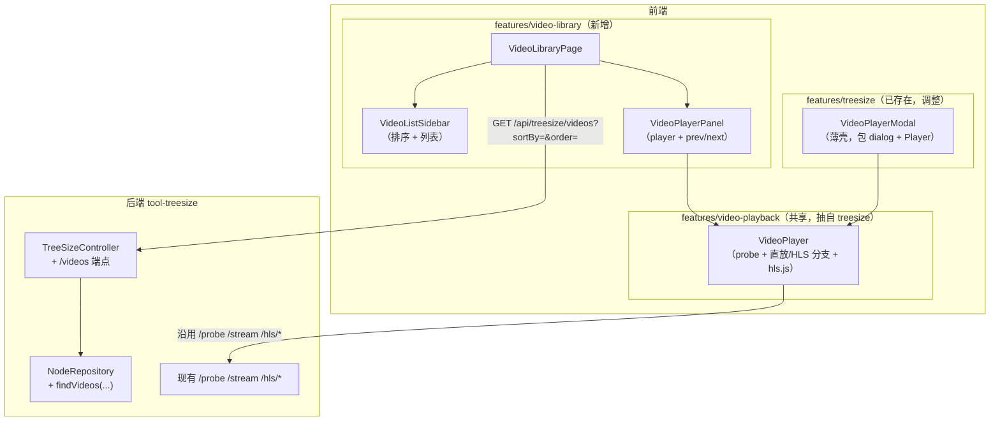
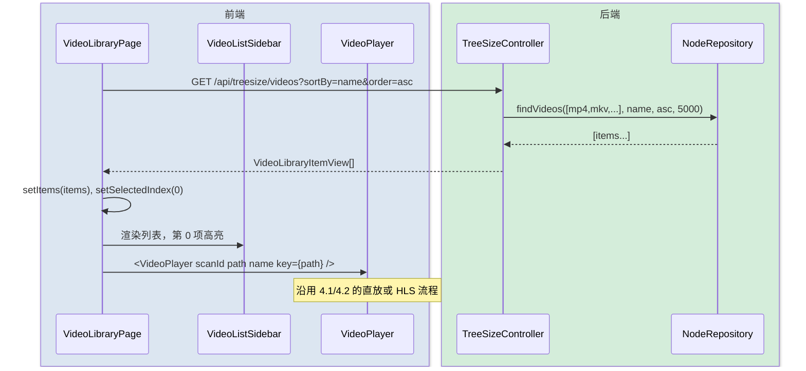
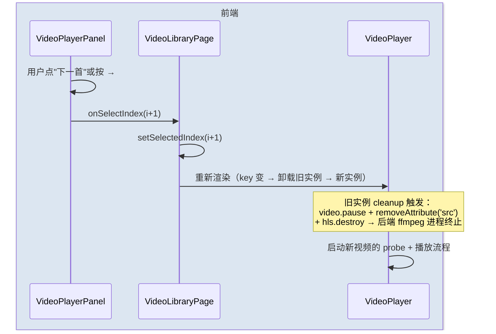
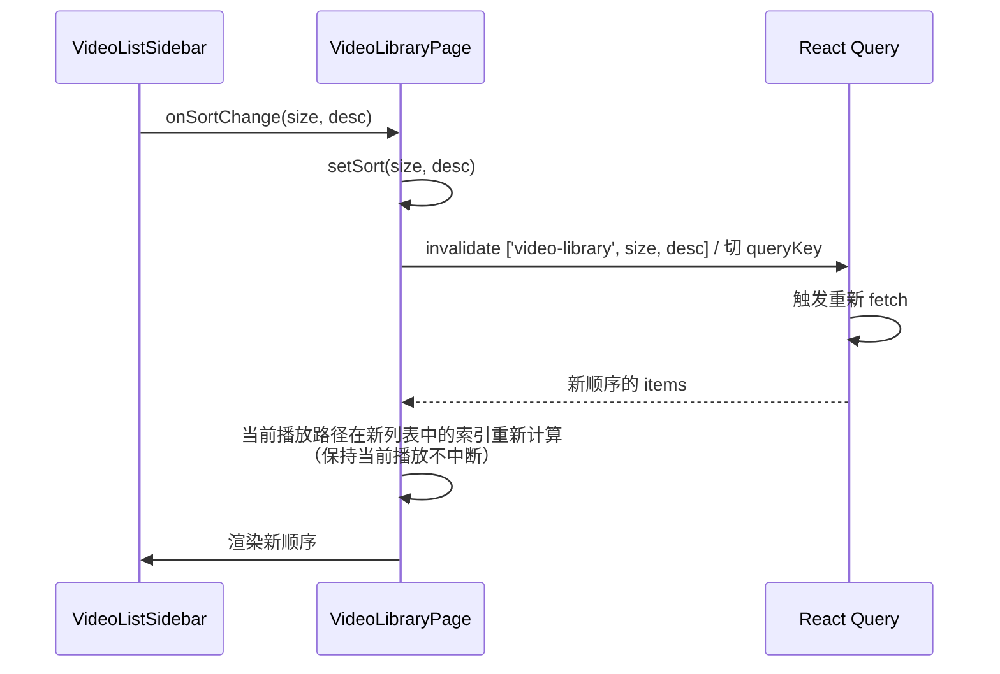

# 视频库（技术方案）

> 最后更新：2026-05-05
> 模版：完整-技术（template-tech.md）
> 前置依赖：[在线视频播放-current.md](../在线视频播放/在线视频播放-current.md)（直放 / HLS 转码已实现，本方案直接复用）

## 1. 目标与边界

### 做什么

- 把所有 TreeSize 已扫描磁盘里识别为视频的文件**汇总到一个独立菜单项**
- 提供一页式播放器：左侧/上方播放列表（按名称 / 大小排序），右侧/下方视频画面 + 上一/下一切换
- 直接复用现有 `/probe` `/stream` `/hls/*` 的播放栈，不新增播放协议

### 不做什么

- 不做独立的视频扫描器（视频清单完全来自 TreeSize 已有 scan；用户没扫过的盘看不到）
- 不持久化"播放历史 / 收藏 / 上次播到哪一秒"（v1 不存）
- 不做搜索框 / 标签 / 海报缩略图（v1 不做）
- 不做跨模块拖拽 / 多视频同屏

### 设计结论

| 决策 | 选择 | 原因 |
|------|------|------|
| **使用形态** | **移动优先**（手机为主，桌面是副产品） | 用户场景以手机访问 LAN 为主 |
| 数据来源 | 复用 `treesize_node` 表 | 已有数据，避免重复扫盘 |
| 后端归属 | 新增端点写在 TreeSize 模块 | `treesize_node` 是 TreeSize 的私有表，跨模块直查会违反 CLAUDE.md 约定 |
| 前端归属 | 新建 feature `video-library` | 独立菜单项、独立路由，符合 frontend manifest 自动注册约定 |
| 列表大小 | **分页加载，每页 200 条**，触底自动加载下一页（IntersectionObserver） | 大库（上万视频）也能用；首屏快、滚动顺 |
| 行内删除 | 列表项右侧 trash 按钮，复用 `DELETE /scans/{id}/file`（移到回收站） | 不切回 TreeSize 也能立删 |
| 批量清理 ._ 文件 | 头部按钮调 `DELETE /api/treesize/videos/junk`：扫名字以 `._` 开头 + 扩展名是视频 + 当前大小 < 10 KB 的文件，整批移到回收站 | macOS AppleDouble 缓存常误识别成视频；自动批量清理；安全阈值防误删真实视频 |
| 排序 | 后端排序（按名称 / 按大小，升降序） | SQL 排序比前端 sort 稳，列表大时也快 |
| 播放器复用 | 抽出 `VideoPlayer` 组件给 modal 和库页面共用 | 避免两套 hls.js 接入逻辑维护 |
| 上一/下一 | 前端纯客户端逻辑，按当前列表索引 ±1 | 不依赖后端 |
| 列表面板形态 | **移动 = 底部 Sheet 抽屉，桌面 = 左侧 sidebar** | 移动端列表占屏幕一定挡住视频；改成需要时滑出 |
| 主控制按键 | **大尺寸触控按钮（上一首 / 下一首 / 列表）** | 拇指可达，最小 44×44 px |
| 键盘快捷键 | 桌面 ← / → 切换上下一首；移动端不依赖 | 移动端无键盘 |
| 横屏支持 | `<video controls playsInline>` + 浏览器原生全屏 | 不自己做横屏旋转控制，让浏览器接管 |

## 2. 整体架构



## 3. 模块拆分与职责

### 3.1 NodeRepository（已存在，加方法）

- 新增 `findVideos(List<String> extensions, String sortBy, String order, int limit)`：
  - SQL：`SELECT n.scan_id, s.root_path, n.path, n.name, n.size, n.depth FROM treesize_node n JOIN treesize_scan s ON n.scan_id = s.id WHERE n.is_dir = 0 AND lower(<ext expr>) IN (...) ORDER BY <col> <order> LIMIT ?`
  - 扩展名匹配用 SQLite 的 `lower(substr(name, length(name)-N+1))`，或者 `name LIKE '%.<ext>'` 多 OR 拼接（更易读）
  - 仅返回属于 status='COMPLETED' 的 scan，避免半成品 scan 污染
  - LIMIT 由调用方传入，默认 5000

### 3.2 TreeSizeController#libraryVideos（新增端点）

- `GET /api/treesize/videos?sortBy=name|size&order=asc|desc`
- 入参校验：`sortBy` ∈ {name, size}，默认 name；`order` ∈ {asc, desc}，默认 asc
- 扩展名取自 `VideoExtensionsProperties`（与现有 `/config` 同源）
- 返回 `List<VideoLibraryItemView>`

### 3.3 VideoLibraryItemView（DTO，新增）

```java
public record VideoLibraryItemView(
    String scanId,
    String rootPath,
    String path,
    String name,
    long size
) {}
```

### 3.4 features/video-library（前端新增，移动优先）

| 文件 | 职责 |
|------|------|
| `index.tsx` | FeatureManifest（icon: `Film`，group: `媒体`，route: `/tools/video-library`） |
| `pages/VideoLibraryPage.tsx` | 页面骨架 + 选中索引 state + 排序 state + 抽屉开关 state；用 TanStack Query 拉视频列表 |
| `components/VideoListPanel.tsx` | 排序选择器 + 滚动列表 + 当前选中高亮；**两种容器形态共用**，由父组件决定外层容器（Sheet 还是固定 sidebar） |
| `components/VideoPlayerPanel.tsx` | 包 `<VideoPlayer>` + 大尺寸**上一首 / 下一首 / 列表**按钮（移动端在视频下方一行）+ 当前视频信息条 + 桌面 ← / → 键盘绑定 |
| `api.ts` | `getVideoLibrary(sortBy, order)` |
| `types.ts` | `VideoLibraryItem`、`VideoSortBy`、`VideoSortOrder` |

**布局规则（基于 Tailwind 断点 `md` = 768px）**：

- **移动（默认 < md）**：单列布局——播放器贴顶（`<video>` 16:9 + 大按钮一排）→ 当前视频名 → 列表抽屉用现有 `Sheet` 从底部滑出，全宽全高
- **桌面（≥ md）**：双列网格 `grid-cols-[320px_1fr]`，左侧固定 list panel，右侧 player；不再使用 Sheet
- 排序选择器移动端用现成原生 `<select>`，桌面用 styled dropdown

### 3.5 VideoPlayer（共享组件，新增）

抽自现有 [VideoPlayerModal](../../../../IdeaProjects/kai-toolbox/frontend/src/features/treesize/components/VideoPlayerModal.tsx) 的内层逻辑：

- 位置：`frontend/src/features/video-playback/VideoPlayer.tsx`（新建顶层 feature 目录，纯共享组件，不暴露 manifest）
- 入参：`{ scanId, path, name }`
- 内部：probe → 决定 native / hls / unsupported / error → setup `<video>` + hls.js → cleanup
- 不含 dialog chrome（modal 那层留在 VideoPlayerModal）
- 不含上下首按钮（库页面那层留在 VideoPlayerPanel）

### 3.6 VideoPlayerModal（已存在，重构）

- 删除 player 内部细节，改成：dialog 容器 + 标题/关闭按钮 + `<VideoPlayer>` 子组件
- 行为不变（modal 关闭 = component 卸载 = VideoPlayer 卸载 = ffmpeg 进程终止）

## 4. 关键交互

### 4.1 加载视频库 + 选中第一个自动播放



### 4.2 切换上下一首



### 4.3 改变排序



## 5. 核心业务规则

| 规则 | 说明 |
|------|------|
| **视频清单来源** | `treesize_node` 中 `is_dir=0` + 扩展名命中后端 `toolbox.video.extensions` 白名单 + 所属 scan `status='COMPLETED'` |
| **去重** | 不去重（不同 scan 的同一文件路径会出现两次；这是用户可观察的历史扫描状态） |
| **排序字段** | 仅支持 `name` / `size`；`order` 仅支持 `asc` / `desc`；非法值用默认（name asc） |
| **列表上限** | 5000 条；超过显示提示 "已展示前 5000 条，请用更小的扫描范围" |
| **路径校验** | 复用 `PathAccessGuard`（播放走 `/probe /stream /hls/*` 时已经过校验） |
| **切换视频时旧 ffmpeg 必须终止** | VideoPlayer 卸载 → cleanup 关流 → 后端响应 IOException → HlsService destroyForcibly |
| **当前视频被外部删除** | 切到该视频时 `/probe` 会返回 404；UI 显示"文件已不存在" + 提供"跳过到下一首"按钮 |
| **键盘快捷键** | ← 上一首，→ 下一首，空格 = 浏览器原生 `<video>` 已支持的暂停/播放（不拦截） |

## 6. 编码落点

```
tools/tool-treesize/src/main/java/com/exceptioncoder/toolbox/treesize/
├── api/
│   ├── TreeSizeController.java                       [修改] +libraryVideos 端点
│   └── dto/
│       └── VideoLibraryItemView.java                 [新增]
├── repository/
│   └── NodeRepository.java                           [修改] +findVideos

frontend/src/
├── features/
│   ├── video-library/                                [新增整个目录]
│   │   ├── index.tsx                                 [新增] FeatureManifest
│   │   ├── api.ts                                    [新增]
│   │   ├── types.ts                                  [新增]
│   │   ├── pages/VideoLibraryPage.tsx                [新增]
│   │   └── components/
│   │       ├── VideoListSidebar.tsx                  [新增]
│   │       └── VideoPlayerPanel.tsx                  [新增]
│   ├── video-playback/                               [新增共享目录，无 manifest]
│   │   └── VideoPlayer.tsx                           [新增] 抽自 VideoPlayerModal 内核
│   └── treesize/components/VideoPlayerModal.tsx      [修改] 改成 VideoPlayer 的 dialog 包装
```

## 6.5 视频九宫格缩略图（v1.1 增量）

### 接口

`GET /api/treesize/scans/{id}/thumb?path=<encoded>` — 返回 `image/jpeg`，缓存命中 sendfile，不命中现场起 ffmpeg 生成。失败返回 404，前端 `` 兜底成占位图。

### 缓存

- 路径：`${user.home}/.kai-toolbox/cache/thumbs/<sha1(absPath + "|" + mtime)>.jpg`
- 没 TTL 自动清理（v1）；改文件 mtime 后 key 自然变化，旧 key 留在盘上但未被引用
- 失败也写一个 0 字节 marker（`.failed`），避免下次重复 fork 一直炸

### 命令选择（按时长分支）

| 时长 D | 处理 |
|--------|------|
| < 5 s | 单帧：`-ss D/2 -i ... -frames:v 1 scale=320:180` |
| 5 ≤ D < 30 s | 单帧 thumbnail 滤镜：`-vf "thumbnail=200,scale=320:180:force_original_aspect_ratio=decrease,pad=..."` |
| ≥ 30 s | **九宫格**：`-ss D*0.05 -i ... -t D*0.9 -vf "fps=9/(D*0.9),scale=160:90:force_original_aspect_ratio=decrease,pad=160:90:-1:-1:color=black,tile=3x3"` |

所有分支共同尾巴：`-frames:v 1 -update 1 -q:v 4 <out>.jpg`。

### 并发控制

- `Semaphore(maxParallel = 4)` 限制同时跑的 ffmpeg 数量。`maxParallel` 通过 `application.yml` 暴露
- 同一 key 重复请求：`ConcurrentHashMap<String, CompletableFuture<Path>>` 去重，第二个请求等待第一个的结果
- 单次 ffmpeg 超时：15 s（可配置），超时强杀并缓存失败 marker

### 前端集成

- 视频库列表项加 ``，约 96×54（移动）/ 120×68（桌面）；`onError` 设为内联 SVG 占位图
- 移动端横向 queue strip 卡片同样用缩略图作为背景，文件名压在底部黑色渐变上
- 浏览器自身的 Cache-Control 让重复访问不重新打 server，server 给 `Cache-Control: max-age=86400`

### 文件大小预估

九宫格 480×270 JPEG q4 ≈ 30-50 KB；单帧 320×180 JPEG q4 ≈ 20-30 KB。1000 视频缓存 ~40 MB，10000 视频 ~400 MB，本地工具可接受。

## 7. 数据/依赖变更

| 变更 | 说明 |
|------|------|
| 数据库 | 无 |
| 后端依赖 | 无 |
| 前端依赖 | 无（hls.js 已经引入） |
| 配置 | 无 |

## 8. 移动端 UX 细化

| 项 | 规则 |
|------|------|
| 布局断点 | < md：单列；≥ md：左右双列 |
| 视频元素 | `<video controls playsInline preload="metadata">`；`playsInline` 防止 iOS Safari 自动跳全屏 |
| 视频比例 | 容器 `aspect-video`（16:9），视频 `object-contain` 居中适配 |
| 控制按钮尺寸 | 最小 `h-12 w-12`（48 px），按钮间距 `gap-3`，整组 sticky bottom 留 `safe-area-inset-bottom` |
| 上下首按钮 | 移动端始终可见在视频下方；桌面在视频下方+键盘 ← / → |
| 列表抽屉 | 用现有 `<Sheet side="bottom">`，高度 80vh；点击列表项后自动关抽屉 |
| 当前选中高亮 | 列表项左侧加竖条 + 加粗 + 底色 |
| 排序切换 | 切换后保持当前播放视频不中断；列表顺序刷新；高亮自动跟到新位置 |
| 文件名超长 | 列表项 `truncate`，hover/long-press 看 `title`；播放面板上的当前文件名也 truncate，可点开 modal 看完整路径 |
| 滚动 | 列表容器 `overscroll-contain` 防止抽屉外滚动穿透 |
| 横屏全屏 | 浏览器原生 `<video>` 全屏按钮已经够用，不自己做 |

## 9. 风险与待确认

| 风险 | 程度 | 缓解 |
|------|------|------|
| 视频清单与磁盘脱节 | 中 | 文档显式声明依赖最近一次扫描；播放 404 时给"跳过下一首"出口 |
| 5000 条上限可能被某些用户撞上 | 低 | UI 显示 "前 5000 条" 提示，让用户知道 |
| VideoPlayer 抽离改动大，影响 modal | 中 | 重构后 modal 行为通过手测覆盖：mp4 / mkv / 关闭 modal → 进程清理 |
| 多 scan 重复条目可能让用户困惑 | 低 | v2 再加去重 / scan 选择过滤 |
| iOS Safari 不支持 hls.js（无 MSE） | 中 | iOS Safari 原生支持 HLS，hls.js 内部会检测并退到 `video.src = m3u8`，VideoPlayer 已经覆盖该分支 |

待用户确认：
- [ ] feature 名称用「视频库」？或者「媒体库」/「视频播放」？
- [ ] 5000 上限够不够？
- [ ] v1 不做"上次播到哪一秒"是否可接受？
- [ ] 移动端列表用底部 Sheet 抽屉 OK？还是更想要专门的「列表 / 播放」两屏来回切？
