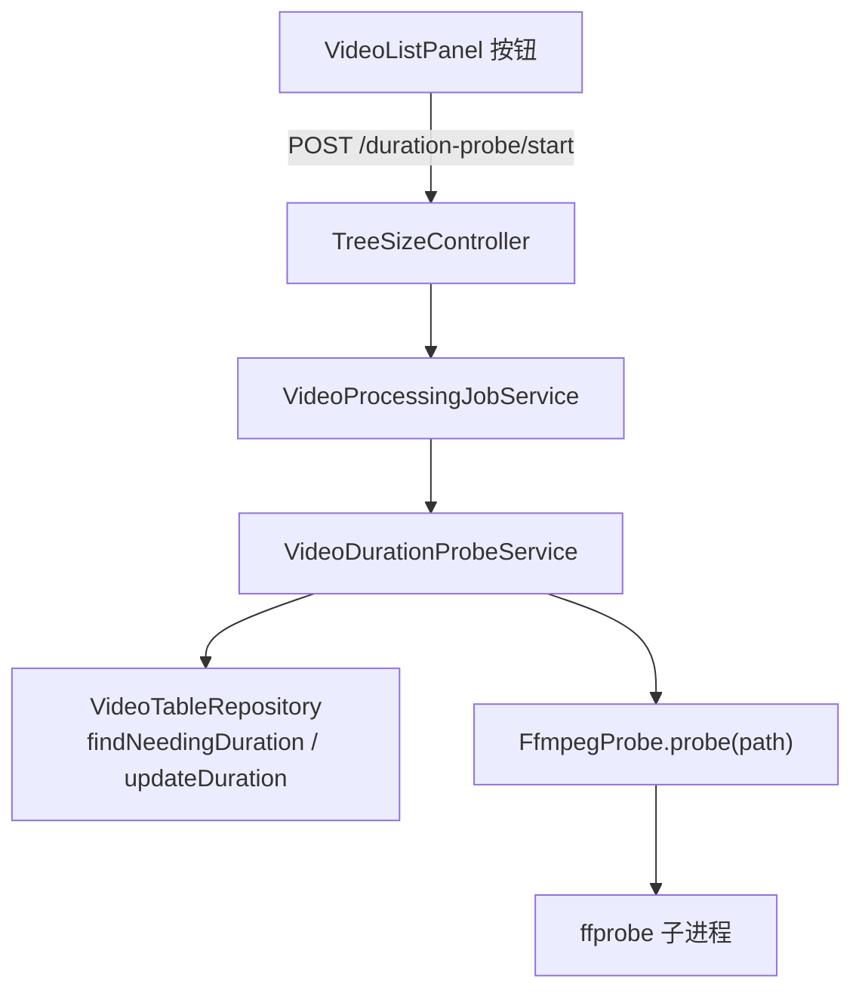
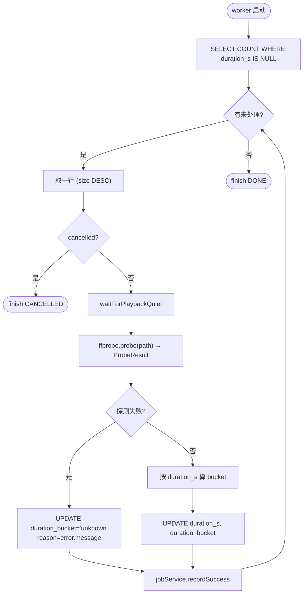

# 视频时长区间分类（技术方案）

> 最后更新：2026-05-21
> 模版：完整-技术（template-tech.md，但内容偏轻量 —— 因为流程简单，仍按完整模版走是因为新增字段 + 新增接口）
> 父需求：[视频库-current.md](../视频库-current.md)
> 前置：[视频表与同步功能](../视频表与同步功能/视频表与同步功能-current.md)

## 1. 目标与边界

### 做什么

- 调用 **ffprobe** 探测视频 `duration_s`（秒），写回 `treesize_video.duration_s`
- 同时算出**时长区间**（短 / 中 / 长 / 超长），写回 `treesize_video.duration_bucket`
- 按钮触发，后台任务，按 `size DESC` 顺序处理 `duration_s IS NULL` 的行
- 复用 `VideoProcessingJobService`

### 不做什么

- 不做完整媒体属性回填（width / height / video_codec / audio_codec 等下期）—— 本期**仅** duration
- 不做"重新探测"按钮（用户清字段即可）
- 不做高并发（虽然 ffprobe 极快，但保持与其他任务一致：单 virtual thread）

### 设计结论

| 决策 | 选择 | 原因 |
|------|------|------|
| 工具 | 项目已有的 `FfmpegProbe`（封装 ffprobe） | 复用 |
| 时长区间 | 5 段：micro(<30s) / short(30s-5min) / medium(5min-30min) / long(30min-90min) / xlong(>90min) | 覆盖短视频到电影所有场景 |
| 顺序 | `WHERE duration_s IS NULL ORDER BY size DESC` | 大文件优先；partial index |
| 容错 | ffprobe 失败 → 写 `duration_bucket='unknown'`、reason 落到任务表 errorMsg；不阻断后续 | 与同期姐妹任务一致 |
| 性能 | 单 virtual thread；ffprobe < 200ms / video；万级视频 < 1 小时 | 与其他任务模式一致；并发不必要 |

## 2. 整体架构



## 3. 核心流程



## 4. 核心业务规则

| 规则 | 说明 |
|------|------|
| 触发 | 用户主动点按钮 |
| 顺序 | `ORDER BY size DESC` |
| 区间切分 | < 30s = micro / 30s-5min = short / 5min-30min = medium / 30min-90min = long / > 90min = xlong / 探测失败 = unknown |
| 性能 | ffprobe 单次 < 200ms（项目 yml 已配 `probe-timeout-ms: 5000` 兜底坏文件） |
| 文件不存在 | 写 `duration_bucket='unknown'`, reason='file_not_found' |
| 取消 | 立即停下一行；ffprobe 进程会在 `FfmpegProbe` 已有的超时机制下回收 |

## 5. 编码落点

```
kai-toolbox/tools/tool-treesize/src/main/java/com/exceptioncoder/toolbox/treesize/
├── api/
│   └── TreeSizeController.java              [改] 4 个新端点 /duration-probe/{start,stop,status,events}
├── service/
│   └── VideoDurationProbeService.java       [新]
├── domain/
│   └── DurationBucket.java                   [新] enum + 静态 fromSeconds(double)
└── repository/
    └── VideoTableRepository.java            [改] 加 findNeedingDuration / updateDuration
```

前端 `VideoListPanel` 顶栏加一个按钮"探测时长"；组件结构与其他四个任务按钮同构。

## 6. 数据库变更

`treesize_video` 已有 `duration_s REAL` 字段（基线就预留了）。**新增** `duration_bucket TEXT` 字段：

```sql
ALTER TABLE treesize_video ADD COLUMN duration_bucket TEXT;
CREATE INDEX idx_video_duration_bucket ON treesize_video(duration_bucket);
CREATE INDEX idx_video_duration_null ON treesize_video(size DESC) WHERE duration_s IS NULL;
```

## 7. 风险与待确认

| 风险 | 缓解 |
|------|------|
| 损坏视频 ffprobe 超时 | yml 已配 5s 超时；超时计 failed=probe_timeout |
| 路径含特殊字符 | 项目里 ffprobe 调用已经处理，本模块不引入新风险 |

## 8. 不在本期实现

- width / height / video_codec / audio_codec 等其他媒体属性（下期"媒体属性回填"模块）
- 按 duration_bucket 筛选视频库 UI（下期）
