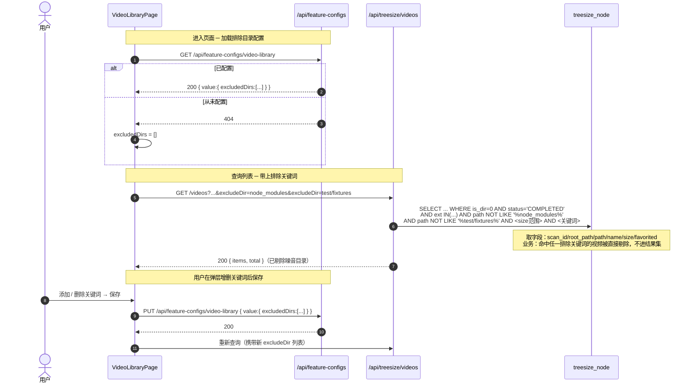

# 视频目录过滤（轻量功能设计文档）

> 归属：`视频库` 的子功能 | 模版：轻量 | 最后更新：2026-05-31
>
> 一句话：让用户配置一组「排除目录关键词」，凡路径包含任一关键词的视频都不出现在视频库列表中。把后端已写死的 `EXCLUDED_PATH_PATTERNS`（回收站/Trash）从硬编码扩展为用户可配。

---

## 变更记录

| 版本 | 日期 | 变更内容摘要 |
|------|------|--------------|
| v1 | 2026-05-31 | 初始版本：用户可配置排除目录，后端 SQL 子串过滤 |

---

## 1. 代码入口

> 编码前先标「待实现」，落地后回填真实行号。

后端（`kai-toolbox/tools/tool-treesize`）：

- **入口**：`TreeSizeController#libraryVideos` → `api/TreeSizeController.java:334`
  - 新增可选入参 `excludeDir`（可重复），透传给 repository
- **关键调用**：`NodeRepository#findVideos` / `#countVideos` → `repository/NodeRepository.java:196` / `:246`
  - 在现有 `appendExcludedPathFilters` 旁新增 `appendUserExcludedDirFilters`，把用户关键词拼成 `AND n.path NOT LIKE ?`（`%关键词%`）
  - 用户关键词必须进 count 缓存 key（`buildCountKey`，`:303`），否则切换配置后 total 不刷新
- **目的（一句话）**：把用户配置的目录关键词作为额外的 `NOT LIKE` 过滤注入视频库列表查询
- **是否写表**：否（列表查询全程只读；配置读写走 feature-config）

前端（`kai-toolbox/frontend/src/features/video-library`）：

- **配置读写**：复用「feature-config 通用配置存储」，`featureId = video-library`
  - `GET/PUT/DELETE /api/feature-configs/video-library`，value 形如 `{ "excludedDirs": ["node_modules", "test/fixtures"] }`
- **查询入口**：`api.ts#getVideoLibrary` → `api.ts:4`，新增把 `excludedDirs` 展开成重复 `excludeDir` query 参数
- **管理 UI**：`VideoLibraryPage` 工具栏新增「排除目录」管理入口（弹层增删关键词，保存即重新查询）→ `pages/VideoLibraryPage.tsx`

---

## 2. 接口契约

本功能**不新增后端接口路径**，只做两处复用 + 一处入参扩展。

### 2.1 列表查询（扩展既有接口）

- **入口**：`GET /api/treesize/videos`
- **新增入参**：
  - `excludeDir: string[]`（可选，可重复）— 排除目录关键词；后端对每个值做 `path NOT LIKE '%值%'`。未传 = 不额外过滤
- **出参**：不变（`VideoLibraryPageView`），但 `items` 与 `total` 都已剔除命中关键词的行

### 2.2 配置存储（复用 feature-config，零新增）

- `GET /api/feature-configs/video-library` → `{ value: { excludedDirs: string[] }, updatedAt }`；404 = 从未配置，前端回退空数组
- `PUT /api/feature-configs/video-library`，body `{ value: { excludedDirs: [...] } }`
- `DELETE /api/feature-configs/video-library` → 重置为「无排除目录」

---

## 3. 核心流程图（接口自身流程 / 库表读写顺序）

---

## 4. 关键过滤/写入规则

| 表 / 载体 | 操作 | 条件 / 字段规则 | 为什么 |
|----|------|---------------|-------|
| `treesize_node` | SELECT | 对每个用户关键词追加 `AND n.path NOT LIKE ?`，参数 `%关键词%` | 子串匹配：路径任意层级出现该关键词即排除（与现有 `EXCLUDED_PATH_PATTERNS` 同款 `%pattern%`） |
| `treesize_node` | SELECT | 用户关键词同时进 `findVideos` 与 `countVideos` 两条 SQL | 保证分页 `items` 与 `total` 口径一致 |
| count 缓存 | KEY | `buildCountKey` 末尾追加 `排序后关键词列表` | 切换排除配置后 total 必须失效重算，否则显示旧数量 |
| feature-config (`video-library`) | PUT | value = `{ excludedDirs: string[] }`，关键词 trim、去空、去重；空数组等价于不过滤 | 用户可随时增删，持久化到通用配置表，不新建专用表 |
| 关键词上限 | 校验 | 后端对 `excludeDir` 个数设上限（建议 ≤ 32），超出截断并忽略多余 | 防止超长关键词列表把 SQL 撑爆（参考既有 `MAX_KEYWORD_TOKENS` 思路） |

> 注意：本过滤只作用于**视频库列表**，不影响 TreeSize 磁盘占用视图、不删除任何文件、不动 `treesize_video` 同步表。

---

## 5. 失败行为

| 失败位置 | 行为 |
|---------|------|
| `excludeDir` 入参为空 / 未传 | 不追加任何 `NOT LIKE`，等价于关闭过滤（向前兼容旧前端） |
| 关键词含 `%` / `_` 等 LIKE 元字符 | 按既有约定处理：要么 ESCAPE 转义后精确子串匹配，要么文档声明「关键词按 LIKE 语义」；实现时与 `appendKeywordFilter` 的转义策略保持一致 |
| feature-config GET 返回 404 | 前端按「无排除目录」处理，正常展示全部 |
| feature-config PUT 失败（400/网络） | 前端提示保存失败、保留弹层未关闭，列表沿用上一次生效配置 |
| 关键词个数超上限 | 后端截断到上限，不报错（列表仍可用，避免因配置失误整页 500） |

---

## 6. 升级到完整模版的触发条件

编码中若出现以下任一情况，升级为 `template.md` 完整模版：

- 决定为排除目录**新建专用数据库表**（放弃复用 feature-config）
- 需要把过滤下沉到 `treesize_video` 同步阶段（影响各处理子任务的数据口径）
- 排除规则从「子串关键词」演进为「正则 / glob / 按 scan 维度」等需要新建解析层
- 需要为该配置新增独立的对外接口路径（不再复用 feature-config）

---

## 7. 修订记录

| 日期 | 修订摘要 |
|------|---------|
| 2026-05-31 | 首次设计，待落地 |
