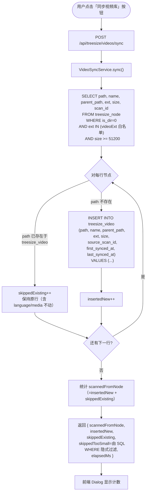
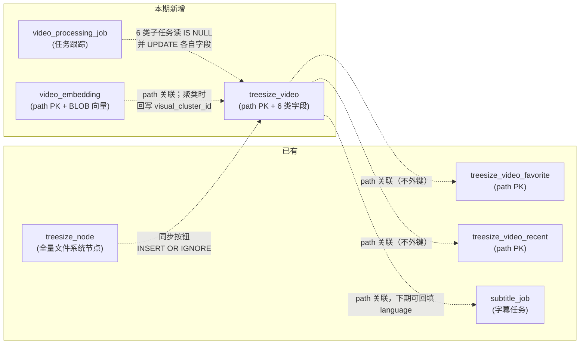

# 视频表与同步功能（业务方案）

> 最后更新：2026-05-21
> 模版：完整-业务（template.md）
> 父需求：[视频库-current.md](../视频库-current.md)（v1 直查 treesize_node 已落地；本子模块是 v2 数据层演化）
> 本期范围：①视频表 + 同步入口（本文档）；②任务跟踪表 `video_processing_job`（本文档定义 schema，行为见各子模块）
> 同期子模块：
> - [视频语言识别](../视频语言识别/视频语言识别-current.md)
> - [视频九宫格预览图](../视频九宫格预览图/视频九宫格预览图-current.md)
> - [视频人物年龄识别](../视频人物年龄识别/视频人物年龄识别-current.md)
> - [视频时长区间分类](../视频时长区间分类/视频时长区间分类-current.md)
> - [视频名称归类](../视频名称归类/视频名称归类-current.md)
> - [视频嵌入与相似聚类](../视频嵌入与相似聚类/视频嵌入与相似聚类-current.md)
>
> 项目级基础设施：[Python AI 服务架构](../../Python%20AI%20服务架构/Python%20AI%20服务架构-current.md)（ai-vision 承载 MiVOLO / DINOv2 / HDBSCAN）

## 1. 目标与边界

### 做什么

- 新建独立视频表 `treesize_video`，把"视频"从 `treesize_node` 的过滤子集**提升为一等公民**
- 表结构一次建齐 6 大类字段（详见 §5.1）：
  - **basic**（路径/大小/扩展名/同步时间戳）—— 本期同步填入
  - **media**（duration_s + duration_bucket，其它编解码器留 NULL）—— 由"视频时长区间分类"模块写入
  - **language**（语言/置信度）—— 由"视频语言识别"模块写入
  - **thumbnail_grid**（九宫格预览图路径）—— 由"视频九宫格预览图"模块写入
  - **person_age**（年龄段/性别/置信度）—— 由"视频人物年龄识别"模块写入
  - **series**（系列签名/集数）—— 由"视频名称归类"模块写入
  - **visual_cluster**（聚类 id / 标签）—— 由"视频嵌入与相似聚类"模块写入
- 提供"同步视频库"按钮：把 `treesize_node` 里 ≥50KB 的视频文件汇总到 `treesize_video`
- 同步规则：按 `path` 判重；**不存在才插入**，已存在保持不动（保护所有子模块已写入的衍生数据）
- 定义任务跟踪表 `video_processing_job`（schema 在本文档，行为在各子模块）

### 不做什么（本期）

- **不切换视频库列表数据源** —— 视频库前端依旧从 `treesize_node` 查（NodeRepository.findVideos），等数据稳定再切
- **不动扫盘流程** —— 扫盘只填 `treesize_node`，不感知 `treesize_video`；视频表完全由用户主动点同步按钮被动填充
- **不做启动时自动同步** —— 应用启动不做任何回填动作
- **不做删除/更新已有行** —— 同步是"只增不改"语义，文件移动/删除后旧行会 stale，下期再讨论清理策略
- **本文档不实现 language / thumbnail_grid 填充逻辑** —— 同步插入时这些列留 NULL；language 由"视频语言识别"子模块填，thumbnail_grid 由"视频九宫格预览图"子模块填
- **不填充 media 字段**（duration_s / codec 等）—— 下期 ffprobe 模块再做
- **不动 favorite/recent 表** —— 保持独立，与 video 表通过 `path` 关联

### 设计结论

| 决策 | 选择 | 原因 |
|------|------|------|
| 表名 | `treesize_video` | 与现有 `treesize_node` / `treesize_video_favorite` / `treesize_video_recent` 命名风格一致 |
| 主键 | `path TEXT PRIMARY KEY` | 跨 scan_id 持久化（同 favorite/recent 设计）；重扫不丢语言/媒体属性数据 |
| 字段策略 | 三类字段一次建齐（basic + media + language） | 避免下期 ALTER 多次；未填字段留 NULL |
| 同步语义 | `INSERT OR IGNORE`（path 已存在则跳过） | 保护下期填入的 language/media 数据不被覆盖 |
| 过滤阈值 | `size >= 50 * 1024`（50 KB） | 与前端 video-library 列表过滤阈值对齐，挡住缩略图/损坏样本/空壳 |
| 扩展名白名单 | 复用 `VideoExtensionsProperties.getExtensions()` | 与 `NodeRepository.findVideos` 同源，避免分裂 |
| 同步触发 | 仅手动按钮触发 | 数据演化第一步求稳，自动同步留给下期 |
| 同步执行 | 同步阻塞 + 一次性 batch insert | 万级行 SQLite batch insert 秒级完成；不上 SSE 简化前后端 |
| 出参 | 计数（scannedFromNode / insertedNew / skippedExisting / skippedTooSmall） | 用户能看到本次同步效果；不返回明细行 |
| 索引 | size / name COLLATE NOCASE / ext / language | 为下期视频库切换数据源时的排序/筛选铺路 |
| 数据回填 source_scan_id | 取该 path 最近一次出现的 scan_id | 多盘扫描时记录"最近一次同步看到该视频时所在的 scan" |
| 已有 subtitle_job.source_language | 本期不回填到 video.language | 解耦：subtitle_job 是字幕任务表，回填属于下期语言检测模块职责 |

## 2. 核心流程



> **说明：** `skippedTooSmall` 由 SQL 的 `size >= 102400` 隐式过滤掉，不需要在 Java 端再走一遍判断；返回字段保留供前端展示"过滤掉了多少噪音文件"信息（通过 `scannedFromNode_total - scannedFromNode_pass_size` 计算，或单独再跑一次 COUNT），见 §3 规则表。

## 3. 核心业务规则

### 3.1 数据源过滤规则

| 字段 | 条件 | 说明 |
|------|------|------|
| `is_dir` | `= 0` | 仅文件，排除目录 |
| `ext` | `IN (VideoExtensionsProperties)` | 视频扩展名白名单；与 NodeRepository.findVideos 同源 |
| `size` | `>= 100 * 1024` | 过滤损坏样本/空壳/缩略图等噪音 |
| `scan_id` 关联的 scan | `status='COMPLETED'` | 排除半成品扫盘；与父文档一致 |

### 3.2 同步规则

| 规则 | 行为 |
|------|------|
| `treesize_video.path` 已存在 | 跳过，不动任何字段（保护 language/media 等用户数据） |
| `treesize_video.path` 不存在 | 插入新行：basic 字段从 treesize_node 拷贝，media/language 留 NULL，`first_synced_at` / `last_synced_at` 写当前时间戳 |
| 多个 scan_id 包含同一 path | `INSERT OR IGNORE` 自然只插入第一次出现的；`source_scan_id` 记录第一次看到的 scan_id |
| 同步出错（IO / SQLite locked） | 整个同步失败回滚，HTTP 返回 500，前端弹错 dialog |

### 3.3 出参字段语义

| 字段 | 含义 |
|------|------|
| `scannedFromNode` | 实际通过 SQL 过滤后扫描到的视频节点数（已过 ext + size 阈值） |
| `insertedNew` | 本次新插入到 `treesize_video` 的行数 |
| `skippedExisting` | path 已存在于 `treesize_video` 被跳过的行数 |
| `skippedTooSmall` | < 100KB 被 SQL 过滤掉的视频文件数（用单独的 COUNT 查询获得，便于用户感知噪音规模） |
| `elapsedMs` | 同步耗时（毫秒），用户感知性能 |

### 3.4 失败行为

| 场景 | 行为 |
|------|------|
| `treesize_video` 表不存在（schema 未升级） | TreeSizeMigration 启动时自动建表，正常情况不出现 |
| `treesize_node` 中视频量为 0 | 返回 `{ scannedFromNode: 0, insertedNew: 0, ... }`，前端正常显示"未发现需要同步的视频" |
| SQLite 锁定 | 抛 SQLException，事务回滚，HTTP 500 + 错误消息原样透出 |
| 单条插入冲突（path PK 重复，理论上 IGNORE 兜底） | 计入 `skippedExisting`，不抛错 |

## 4. 编码落点

```
kai-toolbox/
├── tools/tool-treesize/
│   └── src/main/
│       ├── java/com/exceptioncoder/toolbox/treesize/
│       │   ├── api/
│       │   │   ├── TreeSizeController.java                    [改] 新增端点 POST /videos/sync
│       │   │   └── dto/
│       │   │       └── VideoSyncResult.java                   [新] 同步结果 DTO（record）
│       │   ├── service/
│       │   │   └── VideoSyncService.java                      [新] 同步业务逻辑：读 node、batch insert video
│       │   ├── repository/
│       │   │   ├── VideoTableRepository.java                  [新] treesize_video 表的 CRUD（本期仅 batch insert + COUNT）
│       │   │   └── TreeSizeMigration.java                     [改] kickOff 内加一行 ensureVideoTable()
│       │   └── domain/
│       │       └── VideoRow.java                              [新] treesize_video 行映射（record；本期只用 basic 字段，media/language 字段预留）
│       └── resources/db/
│           └── treesize-schema.sql                            [改] 末尾 append CREATE TABLE treesize_video + 4 个索引
└── frontend/
    └── src/features/video-library/
        ├── api.ts                                             [改] 新增 syncVideoLibrary()
        ├── pages/VideoLibraryPage.tsx                         [改] 顶栏加「同步视频库」按钮 + Dialog 展示结果
        └── components/VideoListPanel.tsx                      [改] 顶栏 props 增加 onSync + syncing 状态
```

## 5. 数据与依赖变更

### 5.1 新增表 `treesize_video`

```sql
CREATE TABLE IF NOT EXISTS treesize_video (
    -- ===== 标识（path 跨 scan 稳定）=====
    path                          TEXT PRIMARY KEY,

    -- ===== basic：从 treesize_node 同步而来 =====
    name                          TEXT NOT NULL,
    parent_path                   TEXT,
    ext                           TEXT,
    size                          INTEGER NOT NULL,
    source_scan_id                TEXT,
    first_synced_at               INTEGER NOT NULL,
    last_synced_at                INTEGER NOT NULL,

    -- ===== media（duration_s + duration_bucket 由"视频时长区间分类"模块写入；其它下期）=====
    duration_s                    REAL,
    duration_bucket               TEXT,         -- micro / short / medium / long / xlong / unknown
    width                         INTEGER,
    height                        INTEGER,
    video_codec                   TEXT,
    audio_codec                   TEXT,
    audio_lang_tag                TEXT,         -- 容器自带的 language 标签（jpn / chi / und 等）

    -- ===== language（由"视频语言识别"子模块写入）=====
    language                      TEXT,         -- ISO 639-1/-3 码
    language_confidence           REAL,
    language_detected_at          INTEGER,

    -- ===== thumbnail_grid（由"视频九宫格预览图"子模块写入）=====
    thumbnail_grid_path           TEXT,
    thumbnail_grid_generated_at   INTEGER,

    -- ===== person_age（由"视频人物年龄识别"子模块写入）=====
    person_main_age_group         TEXT,         -- no_person/infant/child/teen/young_adult/middle_age/senior
    person_main_age               INTEGER,
    person_main_gender            TEXT,         -- M / F / unknown
    person_age_confidence         REAL,
    person_age_detected_at        INTEGER,
    person_age_reason             TEXT,         -- NULL / no_person / low_confidence / inference_failed

    -- ===== series（由"视频名称归类"子模块写入）=====
    series_signature              TEXT,         -- 归一化后的系列签名（同 signature = 同系列）
    series_episode                INTEGER,

    -- ===== visual_cluster（由"视频嵌入与相似聚类"子模块写入）=====
    visual_cluster_id             INTEGER,      -- -1 = noise（HDBSCAN 噪声）
    visual_cluster_label          TEXT,         -- 人类可读标签，可 NULL
    visual_clustered_at           INTEGER
);
```

```sql
-- ===== 基础索引 =====
CREATE INDEX IF NOT EXISTS idx_video_size              ON treesize_video(size);
CREATE INDEX IF NOT EXISTS idx_video_name              ON treesize_video(name COLLATE NOCASE);
CREATE INDEX IF NOT EXISTS idx_video_ext               ON treesize_video(ext);

-- ===== 按字段过滤的索引 =====
CREATE INDEX IF NOT EXISTS idx_video_language          ON treesize_video(language);
CREATE INDEX IF NOT EXISTS idx_video_duration_bucket   ON treesize_video(duration_bucket);
CREATE INDEX IF NOT EXISTS idx_video_person_age_group  ON treesize_video(person_main_age_group);
CREATE INDEX IF NOT EXISTS idx_video_series_signature  ON treesize_video(series_signature);
CREATE INDEX IF NOT EXISTS idx_video_cluster           ON treesize_video(visual_cluster_id);

-- ===== partial index：加速各任务的"待处理"扫描 =====
CREATE INDEX IF NOT EXISTS idx_video_language_null
    ON treesize_video(size DESC) WHERE language IS NULL;
CREATE INDEX IF NOT EXISTS idx_video_grid_null
    ON treesize_video(size DESC) WHERE thumbnail_grid_path IS NULL;
CREATE INDEX IF NOT EXISTS idx_video_person_age_null
    ON treesize_video(size DESC) WHERE thumbnail_grid_path IS NOT NULL AND person_main_age_group IS NULL;
CREATE INDEX IF NOT EXISTS idx_video_duration_null
    ON treesize_video(size DESC) WHERE duration_s IS NULL;
CREATE INDEX IF NOT EXISTS idx_video_series_null
    ON treesize_video(size DESC) WHERE series_signature IS NULL;
```

> **partial index 的作用**：每个子任务的核心查询都是
> `WHERE {字段} IS NULL ORDER BY size DESC` —— partial index 让"待处理列表"扫描永远是 O(剩余未处理数)，
> 不需要全表扫。SQLite 3.8+ 支持。

> **`video_embedding` 表**（视频嵌入与相似聚类子模块定义）独立存放，schema 见
> [视频嵌入与相似聚类-current.md §3.5](../视频嵌入与相似聚类/视频嵌入与相似聚类-current.md#35-数据库)。

### 5.2 新增表 `video_processing_job`（任务跟踪）

```sql
CREATE TABLE IF NOT EXISTS video_processing_job (
    id              TEXT PRIMARY KEY,           -- UUID
    type            TEXT NOT NULL,              -- 'LANGUAGE_DETECT' | 'THUMBNAIL_GRID'
    status          TEXT NOT NULL,              -- 'RUNNING' | 'PAUSED' | 'DONE' | 'FAILED' | 'CANCELLED'
    total           INTEGER NOT NULL DEFAULT 0, -- 启动时快照的待处理总数
    processed       INTEGER NOT NULL DEFAULT 0, -- 已处理的视频数（成功 + 失败合计）
    succeeded       INTEGER NOT NULL DEFAULT 0,
    failed          INTEGER NOT NULL DEFAULT 0,
    current_path    TEXT,                       -- 当前正在处理的视频，便于前端展示
    error_msg       TEXT,                       -- 最近一次失败的错误，便于 debug
    started_at      INTEGER NOT NULL,
    finished_at     INTEGER                     -- DONE / FAILED / CANCELLED 时设置
);

-- 同一种类型同一时间只能有一个 RUNNING（应用层保证；SQLite 不做 partial unique）
CREATE INDEX IF NOT EXISTS idx_job_type_status ON video_processing_job(type, status);
CREATE INDEX IF NOT EXISTS idx_job_started     ON video_processing_job(started_at DESC);
```

**字段语义：**

| 字段 | 说明 |
|------|------|
| `type` | 任务类型枚举，避免两类任务混用同一行 |
| `status` | 状态机：`RUNNING` → `DONE` / `FAILED` / `CANCELLED`；本期不实现 `PAUSED` |
| `total` | 启动时快照，启动后即使新视频被同步进来也不计入本批 |
| `current_path` | 实时刷新，让前端进度面板能显示"当前处理：xxx.mp4" |
| `error_msg` | 单个视频处理失败不中断整体任务（容错继续）；这里只保留最近一次错误用于 debug |

**状态机：**

```
RUNNING ──┬── 全部处理完 ──> DONE
          ├── 用户取消 ───> CANCELLED
          └── 致命错误 ───> FAILED（如 Whisper 二进制不存在）
```

### 5.3 表关系（与现有库的位置）



### 5.4 schema 迁移

`TreeSizeMigration` 在 `run()` 内新增两个 `ensure*` 调用：

```java
private void run() {
    try {
        ensureExtColumn();
        ensureVideoTable();           // 新增：建 treesize_video 表 + 6 个索引
        ensureProcessingJobTable();   // 新增：建 video_processing_job 表 + 2 个索引
        ensureVideoIndexes();
        ensureSubtitleColumns();
        backfillExt();
        ...
    } ...
}
```

不需要数据回填 —— 本期同步要靠用户主动点按钮，启动时不动数据。

### 5.5 不涉及的依赖变更

- 不引入新 Maven 依赖
- 不引入新外部服务
- 不改既有接口（`GET /api/treesize/videos` 仍直查 treesize_node）
- 不动 `ThumbnailWarmer` / `ThumbnailService`（项目已有的单帧 thumbnail 路径不受本期影响）

## 6. 风险与待确认

### 6.1 已识别风险

| 风险 | 影响 | 缓解 |
|------|------|------|
| 用户多次点同步按钮 | `INSERT OR IGNORE` 幂等，重复点只触发额外 SELECT 扫描，无副作用 | 按钮在请求中禁用，避免误触 |
| `treesize_video` 与 `treesize_node` 数据漂移 | 用户删了某视频，node 表更新但 video 表保留旧行 → 视频库列表本期仍走 node，看不到漂移；下期切数据源时需要先解决 | 下期切数据源前增补"清理孤儿行"功能 |
| 用户在扫盘运行期间点同步 | 同步 SELECT 的 node 行可能在扫盘事务中变更 —— 但本期只做 INSERT，行被改动/删除不影响插入逻辑成功 | 不处理；记入风险表 |
| 用户期望"同步 = 镜像 node 当前状态" | 实际语义是"只增不改"，不删除孤儿、不更新 size 变化 | 文案明确："同步会新增缺失的视频，不会删除已有记录" |
| 万级视频量级下同步耗时 | SQLite batch insert + 单事务可秒级完成；超 10 万行可能需要 SSE | 本期同步执行；超规模出现后再补 |

### 6.2 待确认（编码前）

| 项 | 待确认 |
|---|--------|
| 按钮位置 | 推荐放 VideoListPanel 顶栏「清理 ._ 文件」按钮旁；可在编码前由用户确认 |
| 按钮文案 | 推荐"同步视频库"；待用户确认 |
| `skippedTooSmall` 是否单独再跑 COUNT | 推荐跑一次 `SELECT COUNT(*) WHERE is_dir=0 AND ext IN (...) AND size < 102400` 让用户知道过滤了多少噪音；额外开销 ~ms 级，可接受 |

### 6.3 本期同期子模块（独立设计文档）

| # | 子模块 | 模型/技术 | 写入字段 |
|---|--------|----------|---------|
| 1 | [视频语言识别](../视频语言识别/视频语言识别-current.md) | Whisper `-dl` | language / language_confidence / language_detected_at |
| 2 | [视频九宫格预览图](../视频九宫格预览图/视频九宫格预览图-current.md) | ffmpeg `tile=3x3` | thumbnail_grid_path / thumbnail_grid_generated_at |
| 3 | [视频人物年龄识别](../视频人物年龄识别/视频人物年龄识别-current.md) | MiVOLO（via ai-vision） | person_main_age_group / person_main_age / person_main_gender / person_age_confidence / person_age_detected_at / person_age_reason |
| 4 | [视频时长区间分类](../视频时长区间分类/视频时长区间分类-current.md) | ffprobe | duration_s / duration_bucket |
| 5 | [视频名称归类](../视频名称归类/视频名称归类-current.md) | 纯正则 + 字符串归一化 | series_signature / series_episode |
| 6 | [视频嵌入与相似聚类](../视频嵌入与相似聚类/视频嵌入与相似聚类-current.md) | DINOv2 + HDBSCAN（via ai-vision） | visual_cluster_id / visual_cluster_label / visual_clustered_at + `video_embedding` 表 |

所有子模块**共用** `VideoProcessingJobService` 任务调度抽象 + `video_processing_job` 跟踪表 + `VideoTableRepository` 数据访问层。

### 6.4 下期演化路径（不在本期范围）

1. **媒体属性回填**（width / height / video_codec / audio_codec / audio_lang_tag）—— 与时长分类共用 ffprobe 调用
2. **数据源切换**：视频库前端列表改走 `treesize_video`；扫盘完成事件触发一次自动同步；清理孤儿行
3. **subtitle_job.source_language 单向回流**：字幕生成完后把已识别的 source_language 回写到 video 表
4. **列表筛选 UI**：按语言 / 年龄段 / 时长段 / 系列 / 聚类筛选视频
5. **重新处理按钮**：清字段重跑某类任务
6. **跨模态检索**：图 + 文混合查询（待 SigLIP 接入）
