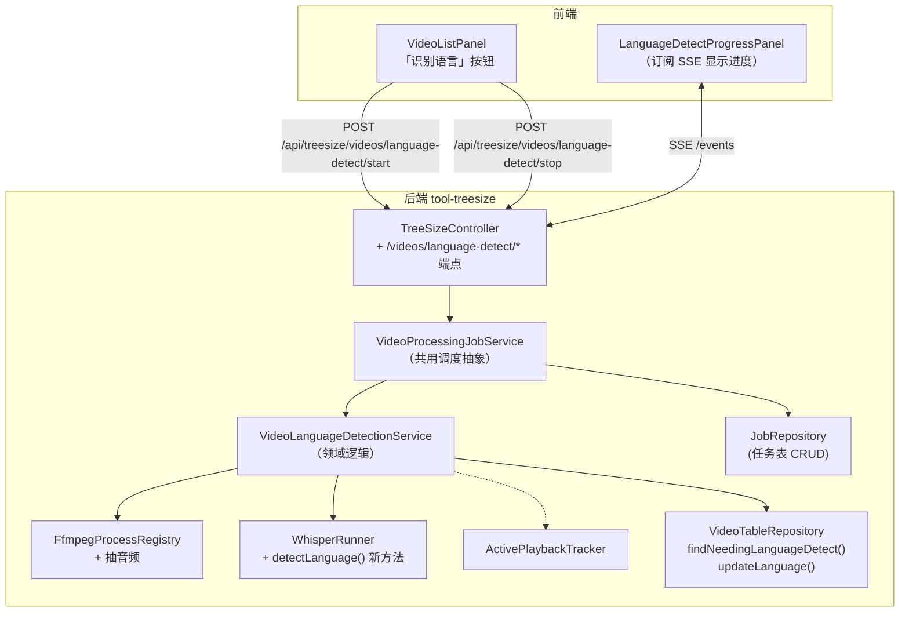
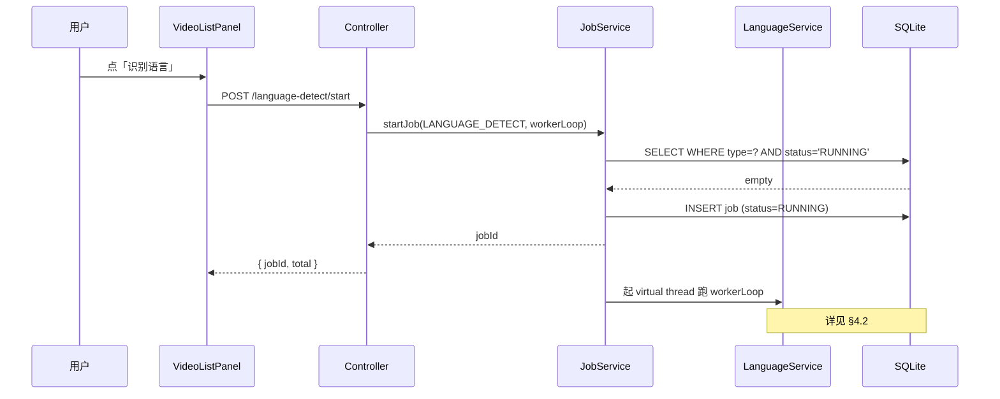
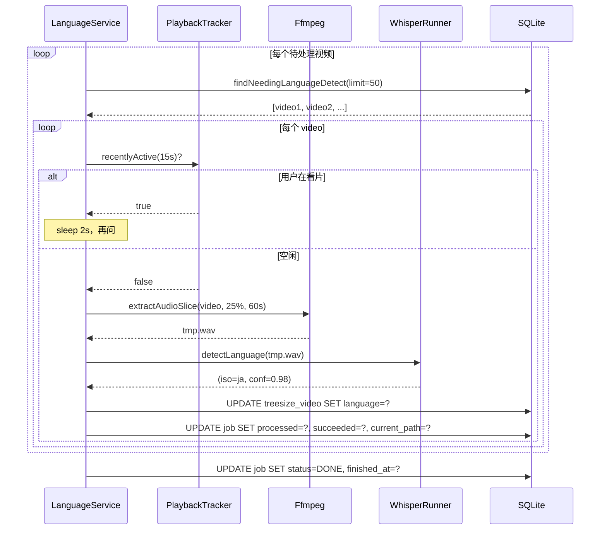
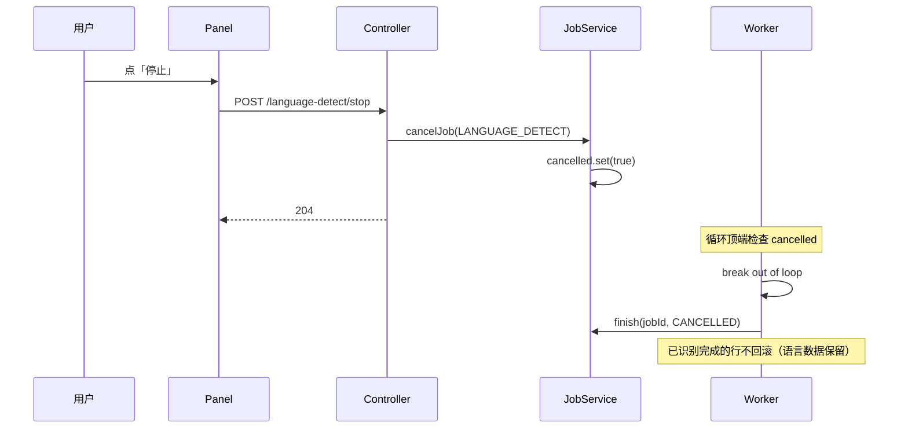

# 视频语言识别（技术方案）

> 最后更新：2026-05-21
> 模版：完整-技术（template-tech.md）
> 父需求：[视频库-current.md](../视频库-current.md)
> 前置：[视频表与同步功能-current.md](../视频表与同步功能/视频表与同步功能-current.md)（提供 `treesize_video` + `video_processing_job` 表）
> 同期姐妹模块：[视频九宫格预览图](../视频九宫格预览图/视频九宫格预览图-current.md)（共用任务调度抽象）

## 1. 目标与边界

### 做什么

- 提供"开始识别语言"按钮：扫描 `treesize_video` 中 `language IS NULL` 的视频，按 `size DESC` 顺序逐个识别语言
- Whisper 走 **`-dl` 即 `--detect-language` 模式**：只解码音频前段提取 mel-spectrogram 判语言，**不做完整转写**，单视频 1-3 秒
- 识别结果（ISO 语言码 + 置信度）写回 `treesize_video.language` / `language_confidence` / `language_detected_at`
- 后端串行后台任务（virtual thread），礼让用户播放，对应 `video_processing_job` 一行
- 前端 SSE 进度面板：实时显示当前处理视频 + 总数 / 已完成 / 失败
- 支持用户点"停止"取消任务

### 不做什么

- 不做完整字幕转写（那是已有的 `SubtitleService` 的职责，不复用其状态机）
- 不做多片段投票（单段 `-dl` 置信度高时直接落库；低置信度暂时也直接落库，加 `confidence` 字段供后续判断，**不做退避重试**）
- 不做并发 Whisper（GPU 显存 + 单卡 4060 Ti 串行最稳）
- 不做"已识别行重新识别"按钮（用户想重跑可手动 UPDATE 清 `language` 字段后再点按钮；本期不暴露 UI）
- 不做语言筛选 UI（下期）

### 设计结论

| 决策 | 选择 | 原因 |
|------|------|------|
| Whisper 模式 | `-dl` 仅检测语言，不输出 VTT | 1-3s/视频，比完整转写快 100x；本期只要语言不要字幕 |
| 抽样位置 | 视频 25% 时间点起 60s 单声道 16kHz WAV | 避开片头曲 / staff roll；60s 给 Whisper 足够语音长度 |
| 抽样工具 | `ffmpeg -ss <start> -t 60 -ac 1 -ar 16000 -vn` | 复用现有 `FfmpegProcessRegistry` |
| 任务并发 | 串行单线程 virtual thread | 与 ThumbnailWarmer 同模式；GPU 串行更稳 |
| 礼让策略 | 复用 `ActivePlaybackTracker.recentlyActive(15_000)` | 用户在看片时不抢 GPU；与 ThumbnailWarmer 同源 |
| 任务跟踪 | `video_processing_job` 表 type='LANGUAGE_DETECT' | 状态持久化、重启可恢复（本期不实现恢复，但 schema 留好） |
| 失败处理 | 单个视频失败：记 `failed++` + 写 `error_msg`，继续处理下一个 | 容错优先；坏文件不阻断整批 |
| 致命错误 | Whisper 二进制不存在 / WAV 抽不出来 | 任务整体 FAILED，不挂在 RUNNING |
| 进度推送 | SSE，每完成 1 个视频推一次 | 复用现有 `SseEmitter` 设施 |
| 输入校验 | 启动前若 `audio_lang_tag` 已是有效 ISO 码 + 用户开启 trust=true，可跳过 Whisper 直接落库 | 本期 **不实现**，但 schema 字段已留；下期优化 |
| 同时只一个任务 | 启动时 SELECT WHERE type='LANGUAGE_DETECT' AND status='RUNNING'，存在则拒绝（409） | 避免双开浪费 GPU |

## 2. 整体架构



## 3. 模块拆分与职责

### 3.1 `VideoProcessingJobService`（共用基础设施，在本文档落地）

放在 service 包下；语言识别 + 九宫格两个模块都通过它启动 / 停止 / 查状态。

- `startJob(JobType, Runnable workerLoop)`：原子检查"无 RUNNING 同类型任务"→ 新建 job 行 → 起 virtual thread → 返回 jobId
- `cancelJob(JobType)`：找到 RUNNING 行，置取消标志（AtomicBoolean），worker 在循环顶端检查并 break
- `getCurrent(JobType)`：返回当前 RUNNING 任务或最近一次 finished 任务（前端开页时显示历史结果）
- `updateProgress(String jobId, ProgressDelta delta)`：incremental update 处理数 / 当前路径 / 错误信息
- `finish(String jobId, JobStatus terminalStatus)`：写 finished_at + status

### 3.2 `VideoLanguageDetectionService`

- `start()`：调 `jobService.startJob(LANGUAGE_DETECT, this::workerLoop)`
- `stop()`：调 `jobService.cancelJob(LANGUAGE_DETECT)`
- `workerLoop(JobContext ctx)`：
  ```
  total = videoRepo.countNeedingLanguageDetect()
  jobService.setTotal(ctx.jobId, total)
  while (!ctx.cancelled):
      batch = videoRepo.findNeedingLanguageDetect(limit=50, offset=0)  -- partial index 跑得飞快
      if batch.isEmpty: break
      for video in batch:
          if ctx.cancelled: break
          while playbackTracker.recentlyActive(15s): sleep(2s)
          try:
              wav = extractAudio(video.path, startPercent=0.25, durationS=60)
              (iso, conf) = whisperRunner.detectLanguage(wav)
              videoRepo.updateLanguage(video.path, iso, conf, now())
              jobService.recordSuccess(ctx.jobId, video.path)
          catch FatalError: throw → jobService.finish(FAILED)
          catch e: jobService.recordFailure(ctx.jobId, video.path, e.message)
          finally: deleteWav(wav)
  jobService.finish(ctx.jobId, ctx.cancelled ? CANCELLED : DONE)
  ```

### 3.3 `WhisperRunner.detectLanguage`（新方法，复用现有类）

- 入参：`Path wav, AtomicBoolean cancelled`
- 命令：`whisper-cli -m <model> -f <wav> --detect-language` + 现有 GPU/Flash-Attn 配置
- stderr 解析：复用现有 `LANGUAGE_RE`（`auto-detected language: ja (p = 0.987765)`）
- 返回 `record DetectedLanguage(String iso, double confidence)`
- 不写 VTT，不解析 progress，比完整转写路径轻得多

### 3.4 `FfmpegProcessRegistry` 拓展（不新建类，加方法）

- `extractAudioSlice(Path src, double startSec, double durationSec, Path outWav)`
- 命令：`ffmpeg -ss <start> -t <dur> -i <src> -vn -ac 1 -ar 16000 -y <out.wav>`
- 单声道 + 16kHz：whisper.cpp 的标准输入格式，无需额外重采样
- 用现有 `spawn(ProcessBuilder)` + `waitFor` + timeout

### 3.5 `TreeSizeController`（接口入口）

- `POST /api/treesize/videos/language-detect/start` → `{ jobId, total }` / 409 if RUNNING
- `POST /api/treesize/videos/language-detect/stop` → 204
- `GET  /api/treesize/videos/language-detect/status` → 当前 / 最近一次 job 行
- `GET  /api/treesize/videos/language-detect/events` (SSE) → 进度事件流

### 3.6 前端 `features/video-library/`

- `api.ts` 加 4 个函数 + `LanguageDetectJob` 类型
- 新建 `components/LanguageDetectButton.tsx`：按钮组件，启停 + 显示进度数字 `(50/200)`
- 新建 `components/LanguageDetectProgressPanel.tsx`：可展开面板，订阅 SSE 显示 `当前: xxx.mp4 · 成功 50 / 失败 2 / 共 200`
- `VideoListPanel.tsx` 顶栏：「同步视频库」「识别语言」「九宫格」三个按钮并列

## 4. 关键交互

### 4.1 启动语言识别



### 4.2 单个视频识别循环（含礼让）



### 4.3 用户取消



## 5. 核心业务规则

| 规则 | 说明 |
|------|------|
| **identification trigger** | 用户主动点按钮；同步完成后**不**自动接续启动 |
| **顺序** | `SELECT path FROM treesize_video WHERE language IS NULL ORDER BY size DESC LIMIT ?` —— 大文件优先（用户最关心的内容通常体量大） |
| **抽样** | 25% 偏移 + 60s 单声道 16kHz；25% 位置由 `duration_s × 0.25` 算出；若 `duration_s` 为 NULL（媒体属性未填）则用 `ffprobe` 即时探一下 |
| **过短视频处理** | 视频 < 60s 直接从 0s 起抽完整长度；< 5s 跳过（标记 failed: too_short） |
| **wav 临时文件** | 写到 `{TMP_DIR}/lang-detect/{uuid}.wav`，识别完立删；任务结束统一清理整个目录 |
| **置信度低不丢弃** | 即使 conf < 0.5 也照样落库；下期可加 UI 让用户筛选低置信度行人工复核 |
| **language_detected_at** | 写当前 epoch ms；下期可作"距今多久"过期重检的依据，本期不读 |
| **取消语义** | 立即停止下一个视频处理；正在 Whisper 中的视频会被强杀（`process.destroyForcibly`），其结果**不写回** |

## 6. 编码落点

```
kai-toolbox/
├── tools/tool-treesize/src/main/
│   ├── java/com/exceptioncoder/toolbox/treesize/
│   │   ├── api/
│   │   │   ├── TreeSizeController.java                                   [改] 4 个新端点
│   │   │   └── dto/
│   │   │       ├── LanguageDetectStartResult.java                        [新] { jobId, total }
│   │   │       └── ProcessingJobView.java                                [新] 任务行 view（语言/九宫格共用）
│   │   ├── service/
│   │   │   ├── VideoProcessingJobService.java                            [新] 共用任务调度抽象
│   │   │   ├── VideoLanguageDetectionService.java                        [新] 领域逻辑
│   │   │   └── WhisperRunner.java                                        [改] 加 detectLanguage(wav) 方法
│   │   ├── domain/
│   │   │   ├── ProcessingJob.java                                        [新] job 行映射
│   │   │   ├── ProcessingJobType.java                                    [新] enum: LANGUAGE_DETECT / THUMBNAIL_GRID
│   │   │   ├── ProcessingJobStatus.java                                  [新] enum
│   │   │   └── DetectedLanguage.java                                     [新] record(iso, confidence)
│   │   └── repository/
│   │       ├── ProcessingJobRepository.java                              [新] job 表 CRUD
│   │       └── VideoTableRepository.java                                 [改] 加 findNeedingLanguageDetect / updateLanguage
│   └── common-media/src/main/java/com/exceptioncoder/toolbox/common/media/
│       └── FfmpegProcessRegistry.java（或邻近类）                        [改] 加 extractAudioSlice 方法
└── frontend/src/features/video-library/
    ├── api.ts                                                            [改] 新增 4 个 RPC + LanguageDetectJob 类型
    ├── components/
    │   ├── LanguageDetectButton.tsx                                      [新]
    │   ├── LanguageDetectProgressPanel.tsx                               [新]
    │   └── VideoListPanel.tsx                                            [改] 顶栏加按钮
    └── pages/VideoLibraryPage.tsx                                        [改] 状态线
```

## 7. 风险与待确认

### 7.1 风险

| 风险 | 缓解 |
|------|------|
| Whisper `-dl` 在不支持的 whisper.cpp 构建上不存在 | 启动任务前 dry-run 一次（一个已知存在的 wav 试跑），若退码非 0 → 任务整体 FAILED 不开跑 |
| 50% 视频是纯音乐 / 无人声 → confidence 低 | conf < 0.3 写 language='und' + 该 conf；用户能在结果里看出问题 |
| 用户在任务运行中点同步按钮 | 同步只是 `INSERT OR IGNORE` 不动 language 列；新插入的行下次启动任务才纳入 |
| 用户在播放完美视频时点识别 | recentlyActive(15s) 礼让，worker 不抢 GPU |
| GPU 显存爆 | Whisper 默认 base 模型 ~150MB，4060 Ti 16GB 充裕 |
| 二次启动语言识别 | 启动前查 RUNNING 行；存在则返回 409 + 当前 jobId 让前端跳过启动 |
| 任务跑了 80% 时进程崩溃 | 已识别的行已落库不丢；下次启动从 partial index 自动只挑还没识别的；job 行残留 RUNNING 但 finished_at=NULL（启动时按 type=? AND finished_at IS NULL 清理） |

### 7.2 待确认

| 项 | 待确认 |
|---|--------|
| Whisper 模型 | 复用现有 `application.yml` 的 `toolbox.whisper.model-path`（base / small / medium / large 任意） |
| WAV 临时目录 | 默认 `${java.io.tmpdir}/kai-toolbox/lang-detect/`；可后续走 application.yml 配置 |
| 单次抽样长度 | 60s（决策）；若发现 ja → 中等内容置信度低再调到 90s |

## 8. 不在本期实现

| 项 | 推迟到 |
|---|--------|
| 重新识别按钮（清 language 列再跑） | 下期 |
| 低置信度行人工复核 UI | 下期 |
| audio_lang_tag 优先（跳过 Whisper） | 下期媒体属性模块 |
| 与 subtitle_job.source_language 互相同步 | 下期 |
| 多片段投票（仅低置信度场景） | 下期 |
