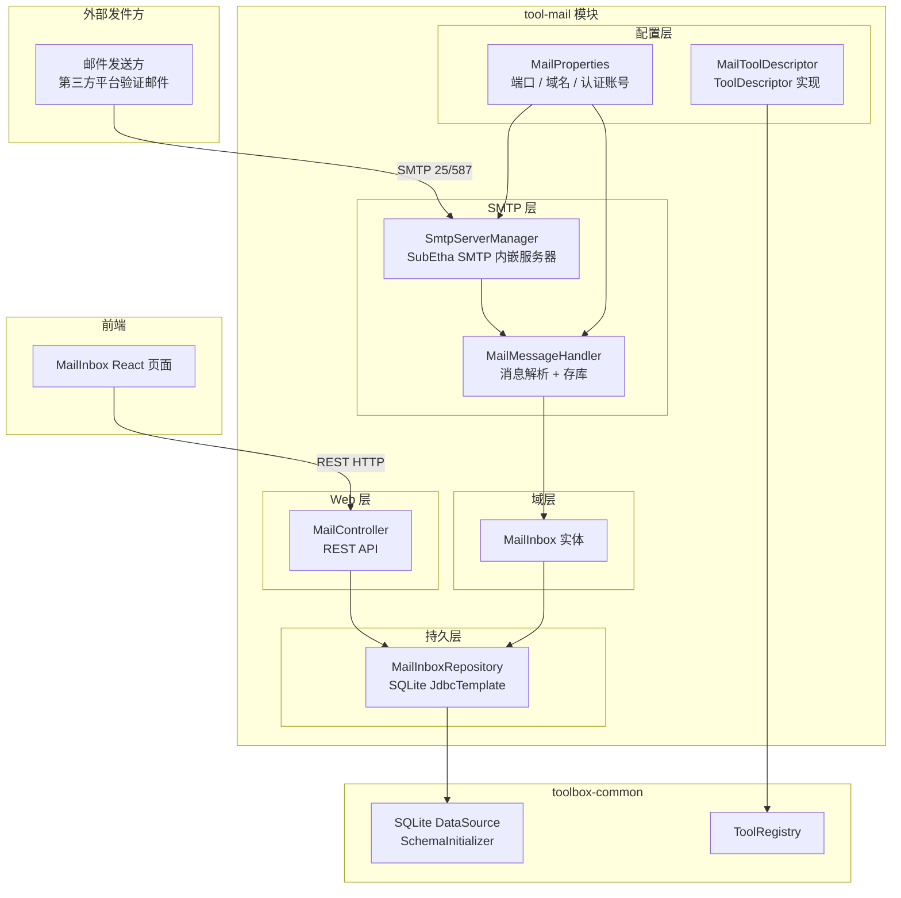
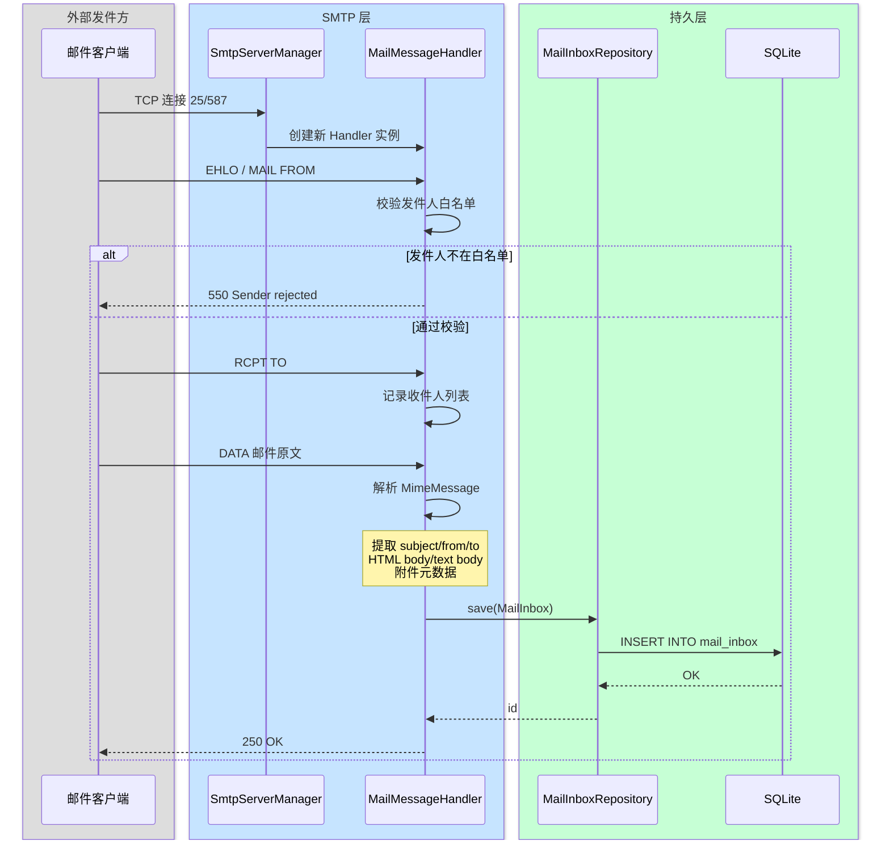
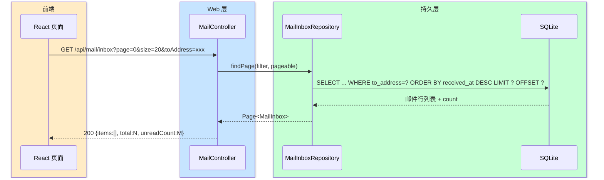
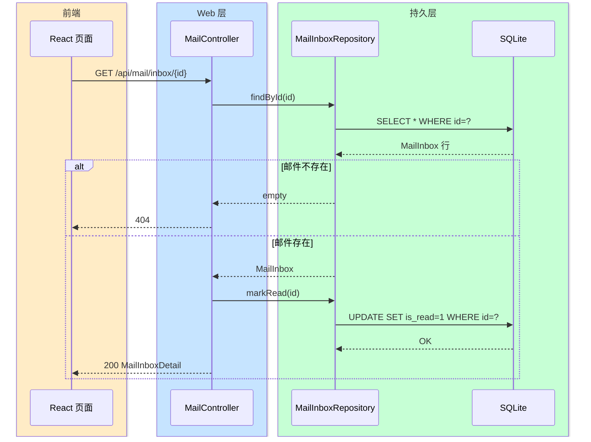

# 邮件收件服务器

> 最后更新：2026-05-06
> 模版类型：完整-技术
> 状态：设计中

本需求在 kai-toolbox 中内嵌一个轻量级 SMTP 收件服务器，统一接收指定域名的所有邮件并归档到 SQLite，供用户通过 WebUI 查看。主要场景：批量注册电商店铺后，各店铺验证邮件统一流入该收件箱，用户无需登录多个邮箱查看。

---

## 1. 目标与边界

### 1.1 目标

- 内嵌 SubEtha SMTP 服务器，监听指定端口接收邮件
- 解析邮件（主题、发件人、收件人、正文 HTML/Text、附件元数据）并持久化到 SQLite
- 提供 REST API 供前端查询收件箱列表、读取邮件详情、标记已读、删除
- 注册为 ToolDescriptor，前端侧边栏可导航到收件箱视图

### 1.2 不做的事

- **不发送邮件**：仅接收，不实现 MTA 转发或 SMTP 中继
- **不实现 TLS/STARTTLS**：初版仅支持明文 SMTP，SSL 可后续按需开启
- **不做附件下载**：附件仅记录元数据（文件名、大小、MIME 类型），不存储文件内容
- **不实现多账户隔离**：所有邮件共用一张表，按收件人地址区分

---

## 2. 整体架构



---

## 3. 模块拆分与职责

### 3.1 SmtpServerManager

- **定位**：SubEtha SMTP 服务器生命周期管理，@PostConstruct 启动，@PreDestroy 停止
- **职责**：
  1. 读取 MailProperties 构建 SMTPServer 实例
  2. 注册 MessageHandlerFactory，每次连接创建 MailMessageHandler
  3. 根据配置的 `enabled` 开关决定是否真正 start
- **上游**：Spring 容器（@PostConstruct）
- **下游**：MailMessageHandler

### 3.2 MailMessageHandler

- **定位**：SubEtha MessageHandler 实现，每个 SMTP 会话一个实例
- **职责**：
  1. `from()` — 校验发件人是否在白名单（白名单为空时放行所有）
  2. `recipient()` — 记录收件人列表
  3. `data()` — 解析 MimeMessage（主题、from、to、HTML body、text body、附件元数据）
  4. 构建 MailInbox 实体并调用 MailInboxRepository 保存
- **上游**：SmtpServerManager
- **下游**：MailInboxRepository

### 3.3 MailInboxRepository

- **定位**：SQLite 持久化，JdbcTemplate 操作
- **职责**：
  1. 分页查询收件列表（支持按 to_address、is_read、关键词过滤）
  2. 根据 id 查询详情
  3. 插入新邮件
  4. 批量标记已读
  5. 删除邮件
- **上游**：MailMessageHandler、MailController
- **下游**：toolbox-common SQLite DataSource

### 3.4 MailController

- **定位**：Spring MVC REST Controller，`/api/mail`
- **职责**：
  1. `GET /api/mail/inbox` — 分页列表
  2. `GET /api/mail/inbox/{id}` — 邮件详情（同时标记已读）
  3. `PATCH /api/mail/inbox/{id}/read` — 手动标记已读
  4. `DELETE /api/mail/inbox/{id}` — 删除单封
  5. `GET /api/mail/stats` — 未读总数 / 总数统计
- **上游**：前端 HTTP 请求
- **下游**：MailInboxRepository

### 3.5 MailProperties

- **定位**：Spring Boot ConfigurationProperties，前缀 `toolbox.mail`
- **职责**：集中管理 SMTP 端口、enabled 开关、发件人白名单、认证配置

### 3.6 MailToolDescriptor

- **定位**：ToolDescriptor 接口实现，注册到 ToolRegistry
- **职责**：声明 id=`mail`、icon=`mail`、route=`/tools/mail`、group=`网络工具`

---

## 4. 关键交互

### 4.1 邮件接收入库流程



### 4.2 前端查询收件箱



### 4.3 打开邮件详情（自动标记已读）



---

## 5. 核心业务规则

| 规则 | 说明 |
|------|------|
| 发件人白名单 | `toolbox.mail.sender-whitelist` 为空时接受所有来源；配置后只接受匹配项（支持域名前缀匹配，如 `@amazon.com`） |
| 收件人不过滤 | 不做 RCPT TO 域名校验，接受所有 to 地址（因为内嵌服务器只监听本机，由网络层隔离） |
| 同名收件人多封 | 正常按时间入库，不做去重 |
| 邮件 id | UUID 生成，非 SMTP Message-ID（SMTP Message-ID 存在但可能重复） |
| body 存储策略 | text/plain 存 body_text，text/html 存 body_html；multipart/alternative 两者都存；只有 text/plain 时 body_html 为空 |
| 附件 | 仅记录文件名、MIME 类型、大小（JSON 串存 attachments 列），不落盘文件内容 |
| 删除 | 物理删除，不做软删 |
| 分页默认值 | page=0，size=20，按 received_at 倒序 |

---

## 6. 编码落点

```
tools/tool-mail/                                     [新建 Maven 模块]
  pom.xml
  src/main/java/com/exceptioncoder/toolbox/mail/
    config/
      MailProperties.java                            [新增] ConfigurationProperties
      SmtpServerManager.java                         [新增] @PostConstruct/@PreDestroy
      MailToolDescriptor.java                        [新增] ToolDescriptor 实现
    smtp/
      MailMessageHandler.java                        [新增] SubEtha MessageHandler
    domain/
      MailInbox.java                                 [新增] 实体，对应 mail_inbox 表
      MailAttachment.java                            [新增] 附件元数据值对象
    repository/
      MailInboxRepository.java                       [新增] JdbcTemplate CRUD
    controller/
      MailController.java                            [新增] REST API
      dto/
        MailListItemDTO.java                         [新增] 列表行 DTO
        MailDetailDTO.java                           [新增] 详情 DTO
        MailStatsDTO.java                            [新增] 统计 DTO
  src/main/resources/
    db/
      mail-schema.sql                                [新增] CREATE TABLE IF NOT EXISTS

toolbox-starter/pom.xml                              [修改] 增加 tool-mail 依赖
pom.xml                                              [修改] <modules> 增加 tools/tool-mail
```

**SQLite 建表（mail-schema.sql）：**

```sql
CREATE TABLE IF NOT EXISTS mail_inbox (
    id          TEXT    PRIMARY KEY,
    message_id  TEXT,
    from_addr   TEXT    NOT NULL,
    to_addr     TEXT    NOT NULL,
    subject     TEXT,
    body_text   TEXT,
    body_html   TEXT,
    attachments TEXT,
    received_at TEXT    NOT NULL,
    is_read     INTEGER NOT NULL DEFAULT 0,
    raw_size    INTEGER
);

CREATE INDEX IF NOT EXISTS idx_mail_to_addr     ON mail_inbox(to_addr);
CREATE INDEX IF NOT EXISTS idx_mail_received_at ON mail_inbox(received_at DESC);
CREATE INDEX IF NOT EXISTS idx_mail_is_read     ON mail_inbox(is_read);
```

---

## 7. 数据与依赖变更

### 7.1 新增 Maven 依赖（tool-mail/pom.xml）

| 依赖 | 版本 | 用途 |
|------|------|------|
| `org.subethamail:subethasmtp` | 3.1.7 | 内嵌 SMTP 服务器 |
| `com.sun.mail:jakarta.mail` | 2.0.1 | MimeMessage 解析 |
| `com.fasterxml.jackson.core:jackson-databind` | 继承 Boot | 附件元数据 JSON 序列化 |

### 7.2 新增 SQLite 表

| 表 | 说明 |
|---|---|
| `mail_inbox` | 收到邮件的归档表，由 mail-schema.sql 通过 SchemaInitializer 自动建表 |

### 7.3 新增配置项（application.yml）

```yaml
toolbox:
  mail:
    enabled: true          # 是否启动 SMTP 服务器
    port: 25               # SMTP 监听端口
    hostname: localhost    # SMTP 服务器 hostname（EHLO 响应用）
    sender-whitelist:      # 发件人白名单，空则接受所有
      - "@amazon.com"
      - "@ebay.com"
```

---

## 8. 风险与待确认

| 风险 | 影响 | 处置 |
|------|------|------|
| 端口 25 在 Windows/Linux 需要管理员权限或被防火墙拦截 | SMTP 服务器无法启动 | 文档提示用户改用 1025/2525 等高位端口，或配置系统端口转发 |
| 邮件正文超大（含 base64 附件） | body_html/body_text 存储过大，SQLite 单行膨胀 | 限制 body 存储上限（建议 2 MB），超出截断并在 body_text 附说明 |
| SubEtha SMTP 3.1.7 使用 javax.mail，与 Jakarta EE 9+ 有包名冲突 | 编译/运行时报 NoClassDefFoundError | 使用 `com.sun.mail:jakarta.mail` 提供 jakarta.mail 包；pure-admin-service 同样的做法已验证可行 |
| 前端展示 HTML 邮件存在 XSS 风险 | 注入脚本执行 | 前端用 iframe sandbox 渲染 body_html，禁止 same-origin 脚本 |
| 同一 SMTP 会话 RCPT TO 多个收件人 | 每个收件人入库一行，body 共享但独立存储；实际场景极少多收件人，SQLite 冗余可接受 | **已确认**：每收件人一行，按 to_addr 索引过滤最简直接 |

---

## 9. 后续增强 TODO

### 9.1 针对性投递（C 类）防线 [2026-05-10 登记，未实现]

**背景**：当前 `recipient-domain-whitelist` 只能拦掉「不知道我们域」的盲扫（A 类开放中继扫描 + B 类字典投递），约占公网 25 端口噪音 90%。但脚本通过 DNS 查到 MX 后，可以针对性投递 `sales@/info@/admin@<我们的域>`（C 类），域过滤无效。

**触发条件**：当看到大量针对性投递（C 类）灌库时再做，目前空配置默认全收，电商验证邮件场景下问题不大。

**候选防线**（优先级从高到低）：

| # | 方案 | 复杂度 | 预期效果 |
|---|------|--------|---------|
| 1 | `recipient-domain-whitelist` 升级为 `recipient-whitelist`，支持 `@domain.com`（域匹配）+ `user@domain.com`（精确地址）混合 | 低，~30 行 | 拦死除已知账号外的所有针对性投递；电商场景注册邮箱有限可枚举 |
| 2 | Greylisting：首次连接返回 4xx 临时拒绝，记录 `(from, to, ip)`，N 分钟内重试才接受 | 中，需要 SQLite 新表 + 定时清理 | 大多数垃圾脚本不重试，正常邮件服务器会重试 |
| 3 | SPF/DKIM/DMARC 验证（拒绝伪造发件域） | 高，需要引入 `dnsjava` + DKIM 验证库 | 拦截伪造 amazon/ebay 来源的钓鱼邮件 |
| 4 | IP 黑名单接入（spamhaus / barracuda DNSBL） | 中，每次连接做 DNS 查询 | 拦已知坏 IP，但维护成本高 + 偶有误杀 |

**首选**：#1（local-part 白名单）。改动小且对电商验证邮件场景最贴合——注册邮箱是有限可枚举的。

**实现要点**（#1 为例）：
- `MailProperties.recipientDomainWhitelist` 重命名为 `recipientWhitelist: List<String>`
- `MailMessageHandler.isRecipientDomainAllowed()` 改为 `isRecipientAllowed()`：以 `@` 开头走域后缀匹配，含完整 `@xxx` 走精确地址匹配
- `application.yml` 示例同时给两种条目
- 兼容性：旧 `recipient-domain-whitelist` 配置项自动迁移成 `@xxx` 形式（或保留双字段一段时间）
