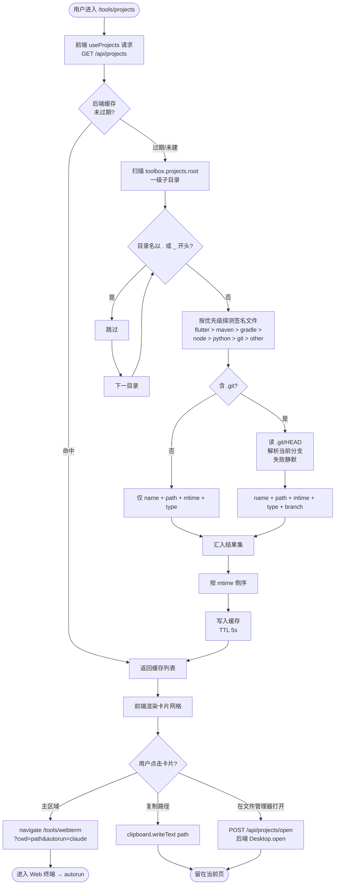
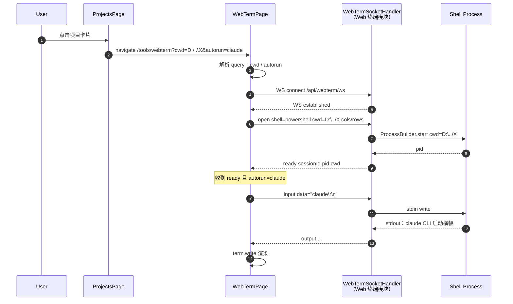

# 项目管理

> 最后更新：2026-05-11
> 模版：完整-业务（template.md）

在 kai-toolbox 中提供一个「项目入口」面板：扫描固定根目录下的所有项目，以网格形式列出，点击项目即跳转到 Web 终端，并在终端中以该项目目录为工作目录自动启动 `claude` CLI，便于在浏览器里直接对项目进行作业。

---

## 1. 目标与边界

### 1.1 做什么

- 在 kai-toolbox 前端新增「项目管理」面板（路由 `/tools/projects`），作为日常入口模块（`order=10`，靠前显示）
- 后端扫描配置项 `toolbox.projects.root` 指向的根目录（默认 `D:\Users\zhang\IdeaProjects`）下的一级子目录
- 按目录签名识别项目类型（`git` / `maven` / `gradle` / `node` / `flutter` / `python` / `other`），打 type 标签，**不过滤** `other`，全部展示
- 卡片元数据：项目名、type 徽标、绝对路径、最近修改时间、Git 当前分支（仅 git 类型读取，失败静默）
- 点击卡片跳转 `/tools/webterm?cwd=<绝对路径>&autorun=claude`；前端 Web 终端页解析 query，把 `cwd` 拼进首发 `open` 消息；收到 `ready` 后追发一条 `{type:"input", data:"claude\r\n"}`
- 卡片次要操作：「复制路径」「在文件管理器打开」（后端调用 `Desktop.open`）

### 1.2 不做什么（第一版边界）

| 不做 | 原因 |
|------|------|
| 项目分组 / 收藏 / 置顶 | 第一版收敛；未来若数量爆炸再加 |
| 新建 / 克隆 / 删除项目 | 与「项目管理」语义冲突；克隆走 git CLI 即可 |
| 项目内文件预览 / 树浏览 | `tool-doc-viewer` / `tool-treesize` 已覆盖，避免功能重叠 |
| 多根目录配置 | 第一版只支持单根；CLAUDE.md「No premature infrastructure」 |
| 持久化（SQLite 表） | 纯实时扫描；项目列表是文件系统的镜像，落库反而引入一致性问题 |
| 修改 Web 终端后端契约 | autorun 时序由前端处理，后端 `open` 消息不增字段；保持 Web 终端模块封闭 |
| 跨主机扫描 / SSH | 与 Web 终端「本机 Shell」定位一致 |

### 1.3 设计结论

- **数据获取**：HTTP GET `/api/projects`，同步返回全量列表。一级目录扫描 + 签名探测 + git 分支读取，对 50 个以内的项目延迟可忽略，无需 SSE
- **缓存**：内存级 5 秒 TTL（`ConcurrentHashMap` + 时间戳，单条目）。频繁刷新页面不重复扫描；用户感觉不到陈旧
- **跳转方式**：浏览器内 `react-router` 跳转 + URL query 携带 `cwd` / `autorun`，**不走任何后端中转**。Web 终端模块只需在前端读 query，后端 `WebTermSocketHandler` 不动
- **autorun 协议**：query 仅识别 `autorun=claude` 一种值（白名单），前端按 `claude\r\n` 字面量追发；不允许任意命令注入。未来扩展白名单（如 `cmder`、`pwsh`）再说
- **项目类型识别**：按签名文件存在性，**优先级排序检测**（`pubspec.yaml` > `pom.xml` > `build.gradle*` > `package.json` > `pyproject.toml` / `requirements.txt` > `.git`）。多签名共存时取首个命中（如「Flutter 项目同时是 git」标 `flutter` 而不是 `git`），保留 `.git` 仅用作分支读取
- **隐藏目录过滤**：以 `.` 或 `_` 开头一律跳过；不递归子目录

---

## 2. 核心流程



> 跳转后到「Web 终端中自动执行 claude」的细节见第 2.1 节时序图。

### 2.1 跳转 Web 终端 + autorun claude 时序



---

## 3. 核心业务规则

| 序号 | 规则 | 说明 |
|------|------|------|
| R1 | 扫描根仅一级深度 | 不递归。多层嵌套的子项目需要用户把根放到上一层 |
| R2 | 隐藏前缀过滤：`.` `_` | `.git`、`.idea`、`_archive` 这类辅助/归档目录不展示 |
| R3 | 类型识别按优先级首命中 | flutter > maven > gradle > node > python > git > other；多签名共存按更具体优先 |
| R4 | `.git/HEAD` 读取失败必须静默 | 子模块 / 裸库 / 损坏仓库不能让整个列表 500；分支字段返回 null |
| R5 | 后端缓存 TTL 5 秒 | 频繁导航不重复扫描；用户感知不到陈旧 |
| R6 | autorun 仅允许白名单值 `claude` | 防止 query 注入任意命令；未来扩展显式加白 |
| R7 | autorun 在前端发送，不进入 Web 终端后端契约 | Web 终端模块封闭；本模块独立演进 |
| R8 | mtime 排序 | 按 `Files.getLastModifiedTime` 倒序，最近用过的项目自动浮顶 |
| R9 | 「在文件管理器打开」必须校验路径在 root 之内 | 防 query 越权打开任意路径；`Path.startsWith(root)` 强校验 |
| R10 | 根目录不存在时返回空列表 + 错误提示 | 不抛 500；前端展示「根目录不存在：xxx，请检查 toolbox.projects.root」 |

---

## 4. 编码落点

```text
kai-toolbox/
├── pom.xml                                                            [修改] modules 增加 tool-projects；dependencyManagement 增加坐标
├── toolbox-starter/
│   ├── pom.xml                                                        [修改] dependencies 增加 tool-projects
│   └── src/main/resources/application.yml                             [修改] toolbox.projects.* 配置块
├── tools/
│   └── tool-projects/                                                 [新增] 后端工具模块
│       ├── pom.xml                                                    [新增] 依赖 toolbox-common
│       └── src/main/
│           ├── java/com/exceptioncoder/toolbox/projects/
│           │   ├── config/
│           │   │   ├── ProjectsDescriptor.java                        [新增] ToolDescriptor，id=projects，icon=folder-git-2
│           │   │   └── ProjectsProperties.java                        [新增] 绑定 toolbox.projects.* 配置
│           │   ├── api/
│           │   │   ├── ProjectsController.java                        [新增] GET /api/projects + POST /api/projects/open
│           │   │   └── dto/
│           │   │       ├── ProjectInfo.java                           [新增] record：name/path/type/branch/lastModified
│           │   │       └── OpenInExplorerRequest.java                 [新增] record：path
│           │   └── service/
│           │       ├── ProjectScanner.java                            [新增] 扫一级子目录 + 签名识别 + git HEAD 读取
│           │       ├── ProjectTypeDetector.java                       [新增] 静态方法：路径 → ProjectType 枚举
│           │       └── ProjectsCache.java                             [新增] 单条目 TTL 缓存（ConcurrentHashMap）
│           └── resources/                                             [无 db schema：本工具不持久化]
└── frontend/
    └── src/features/projects/                                         [新增] 前端工具模块
        ├── index.tsx                                                  [新增] FeatureManifest，路由 /tools/projects
        ├── pages/
        │   └── ProjectsPage.tsx                                       [新增] 网格容器 + 搜索框（按 name 过滤）
        ├── components/
        │   ├── ProjectCard.tsx                                        [新增] 单个项目卡片，含跳转 / 复制 / 在文件管理器打开
        │   └── ProjectTypeBadge.tsx                                   [新增] 7 种类型徽标（颜色 + 图标）
        ├── hooks/
        │   └── useProjects.ts                                         [新增] TanStack Query 封装 GET /api/projects
        ├── services/
        │   └── projectsApi.ts                                         [新增] axios 调用 + 类型
        └── types.ts                                                   [新增] 与后端 DTO 对齐
```

### 4.1 涉及 Web 终端模块的前端改造（轻量）

不修改 `tool-webterm` 后端，仅在前端 `frontend/src/features/webterm/` 内做兼容：

- `pages/WebTermPage.tsx` [修改]：用 `useSearchParams` 读 `cwd` 和 `autorun`；`cwd` state 初始值取 query；维护 `autorun` state，重连或用户手动改 `cwd` 时清空（避免「改路径却仍 autorun claude」的意外组合）；transparent 透传给 `Terminal`
- `components/Terminal.tsx` [修改]：新增 `autorun?: string | null` prop；通过 `useEffect` 监听 `socket.state === 'ready'`，命中且 `autorun` 非空时延后 80 ms `socket.send(autorun + '\r\n')`，避免与 PowerShell PS1 渲染竞速
- `hooks/useWebTermSocket.ts` [不修改]：现有 `onReady` 回调与 `send` 接口已满足需求

### 4.2 主要类职责

| 类（全路径） | 职责 |
|---|---|
| `com.exceptioncoder.toolbox.projects.config.ProjectsDescriptor` | 实现 `ToolDescriptor`，向 `ToolRegistry` 暴露 id=`projects`、icon=`folder-git-2` |
| `com.exceptioncoder.toolbox.projects.config.ProjectsProperties` | `@ConfigurationProperties("toolbox.projects")` — root / cacheTtlSeconds / hiddenPrefixes |
| `com.exceptioncoder.toolbox.projects.api.ProjectsController` | `GET /api/projects` 列表；`POST /api/projects/open` 在文件管理器打开（强校验路径在 root 内） |
| `com.exceptioncoder.toolbox.projects.service.ProjectScanner` | 入口：`List<ProjectInfo> scan()`；调度过滤、类型探测、git HEAD 读取、按 mtime 排序 |
| `com.exceptioncoder.toolbox.projects.service.ProjectTypeDetector` | 静态：`ProjectType detect(Path dir)`；按优先级首命中 |
| `com.exceptioncoder.toolbox.projects.service.ProjectsCache` | 单条目 TTL 缓存：`get(Supplier<List<ProjectInfo>>)`；超时即重算 |
| `frontend/src/features/projects/pages/ProjectsPage.tsx` | 网格容器、搜索框、空态提示 |
| `frontend/src/features/projects/components/ProjectCard.tsx` | 卡片：name + 徽标 + 路径 + 分支 + 三按钮 |
| `frontend/src/features/projects/hooks/useProjects.ts` | `useQuery({queryKey:['projects'], queryFn, staleTime:5_000})` |

---

## 5. 数据与依赖变更

### 5.1 数据库

无变更。本工具不持久化任何状态。

### 5.2 后端依赖

无新增第三方依赖。`tool-projects` 模块仅依赖：
- `com.exceptioncoder:toolbox-common`
- `org.springframework.boot:spring-boot-starter-web`（已由 starter 传递）

> 不需要 `pty4j`、不需要 `jsch`、不需要 SQLite schema。`Desktop.open` 走 JDK 自带 `java.awt.Desktop`。

### 5.3 前端依赖

无新增 npm 包。沿用现有 `react-router` `axios` `@tanstack/react-query` `lucide-react`。

### 5.4 配置

`toolbox-starter/src/main/resources/application.yml` 在 `toolbox:` 下新增：

```yaml
toolbox:
  projects:
    root: D:\Users\zhang\IdeaProjects   # 扫描根目录
    cache-ttl-seconds: 5                # 内存缓存 TTL
    hidden-prefixes:                    # 跳过前缀
      - "."
      - "_"
```

### 5.5 跨模块协作

- 前端跳转 `/tools/webterm?cwd=...&autorun=claude` —— `tool-webterm` 前端读 query 并在 ready 后追发 `claude\r\n`
- `tool-webterm` 后端契约（`open` / `input` / `resize` / `close`）**不变**

---

## 6. 风险与待确认

| 序号 | 风险 / 待确认 | 影响 | 处置 |
|------|------|------|------|
| RK1 | autorun 在 ready 触发瞬间发送，PowerShell 可能还没渲染完 PS1 提示符 | `claude` 命令出现在 PS1 之前，视觉略丑但不影响执行 | 第一版接受；如 PS1 与 claude 输出粘连可在前端 ready 后 setTimeout 100ms 再发 |
| RK2 | claude CLI 不在 PATH 时启动失败 | 终端报 `claude : The term ... is not recognized` | 第一版不做检测；用户自己配置 PATH。后端可考虑 `where claude` 预检（不做） |
| RK3 | 根目录不存在或权限不足 | 列表为空 | R10 兜底：返回空 + 错误码；前端友好提示 |
| RK4 | 大量项目（>200）时一次性扫描 + git HEAD 读取耗时 | 首次请求 >1s | 第一版接受；如真的慢，后续改虚拟线程并发读 HEAD |
| RK5 | `Files.getLastModifiedTime` 在 Windows 上不一定是「项目最近活动时间」 | 排序与直觉不完全一致 | 第一版用 mtime；后续可考虑 `.git/index` mtime 更准 |
| RK6 | 「在文件管理器打开」依赖桌面 GUI | 服务端无桌面环境时抛 `HeadlessException` | 后端捕获并返回 4xx + 提示「服务未在桌面会话运行」 |
| RK7 | autorun query 可能被 URL 拦截器记录到日志 | 隐私轻微 | 仅 `autorun=claude` 字面量，无敏感参数 |
| RK8 | 跳转后用户在 Web 终端切换 Shell 重新连接 | autorun 不会再触发 | autorun 只在「带 query 进入页面的首次会话」触发；重连按钮不重发，符合预期 |
| RK9 | 前端 `WebTermPage` 历史接收方式（无 query）需保持兼容 | 不能让旧入口回归 user.home 的行为变化 | 仅当 query 含 `cwd` 时覆盖默认值；无 query 时维持原行为 |

---

## 7. 后续可选演进（非本期）

- 多根目录配置（`toolbox.projects.roots: [...]`）+ 根级分组
- 项目搜索升级：模糊匹配 + 最近访问历史
- 收藏 / 置顶（用 SQLite 一张 `project_pin` 表记录路径）
- autorun 白名单扩展：`pwsh`、`cmder`、自定义命令模板
- 「在 IDE 打开」按钮：调 `idea.bat <path>` / `code <path>`
- 项目级标签（手动 / 从 git remote 自动派生 origin host）
- 接入 `tool-treesize` 在卡片显示磁盘占用
