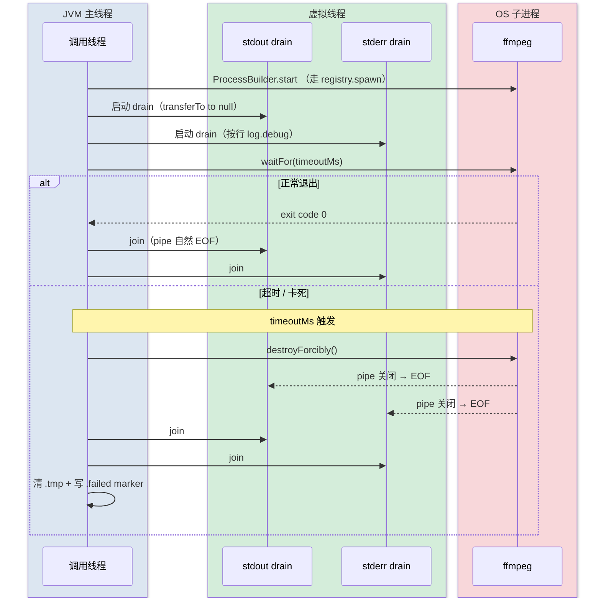

# ffmpeg 子进程编排与超时控制

## 一句话总述

后端 fork ffmpeg/ffprobe 时，**所有 stream drain 必须在后台虚拟线程**，主线程只做 `waitFor(timeout)` + `destroyForcibly`；否则 ffmpeg 卡死（损坏视频 / 罕见 codec）会让主线程在 `transferTo` 阻塞、timeout 永远到不了，进程变 0% CPU 幽灵占着 semaphore 槽。

## 适用场景

涉及任何同步等待外部 ffmpeg/ffprobe 输出的服务：缩略图生成、媒体探测、HLS 转码（部分适用，见下表）。

## 编排时序图



## 涉及类清单

| 角色 | 全路径 | 职责 |
|------|--------|------|
| 进程注册表 | `com.exceptioncoder.toolbox.common.media.FfmpegProcessRegistry` | `spawn(pb)` = start + track；`@PostConstruct` 启动期扫 `ProcessHandle.allProcesses()` 杀孤儿；`@PreDestroy` + `Runtime.addShutdownHook` 关闭时清现役 |
| 缩略图服务 | `com.exceptioncoder.toolbox.common.media.ThumbnailService#runFfmpeg` | 双虚拟线程 drain（stdout/stderr）+ 主线程 waitFor + destroyForcibly |
| 探测服务 | `com.exceptioncoder.toolbox.common.media.FfmpegProbe#runFfprobe` | stderr drain + JSON 读取也丢虚拟线程（`AtomicReference<JsonNode>` 收结果），主线程 waitFor enforce timeout |
| HLS 服务 | `com.exceptioncoder.toolbox.treesize.service.HlsService#writeSegment` | **特例**：stdout 主动转发到 HTTP response（by-design），靠客户端断开 → broken pipe 触发 destroyForcibly |
| 配置 | `FfmpegProperties` (`toolbox.ffmpeg.*`) + `ThumbnailProperties` (`toolbox.thumbnail.*`) | binary 路径、超时（默认 15s thumbnail / 5s probe）、并发上限 |
| 让位机制 | `com.exceptioncoder.toolbox.treesize.service.ActivePlaybackTracker` | 用户播放期间，warmer 暂停 fork ffmpeg，让 CPU/disk 给 HLS |

## 核心规则

| 规则 | 说明 | 来源 |
|------|------|------|
| **stream drain 必须后台** | `InputStream.transferTo` 阻塞直到 EOF，EOF 仅在子进程退出时出现。主线程 drain → `waitFor(timeout)` 变死代码 | 实战 bug：[FfmpegProbe.java](../../../../IdeaProjects/kai-toolbox/toolbox-common/src/main/java/com/exceptioncoder/toolbox/common/media/FfmpegProbe.java)、[ThumbnailService.java](../../../../IdeaProjects/kai-toolbox/toolbox-common/src/main/java/com/exceptioncoder/toolbox/common/media/ThumbnailService.java) |
| **timeout = 主线程 waitFor + destroyForcibly** | `waitFor(timeoutMs)` 返回 false → 立刻 `destroyForcibly`；2s 内若未死则记 ERROR pid，但不阻塞业务 | 同上 |
| **destroyForcibly 之后 join drain** | 强杀关掉 stream 后 drain 线程会自然 EOF 退出，主线程 join 等它退（避免线程泄漏） | 同上 |
| **JVM 退出强杀子进程** | 子进程不是 JVM 逻辑子进程，JVM 退出后会变孤儿。注册表 `addShutdownHook` + `@PreDestroy` 双重保险 | `FfmpegProcessRegistry` |
| **启动期 reaper 救上轮孤儿** | `taskkill /F` / `kill -9` 不可拦截。下次启动用 `ProcessHandle.allProcesses()` 扫绝对路径匹配的孤儿，全部 destroyForcibly | `FfmpegProcessRegistry@PostConstruct` |
| **绝对路径才 reap** | 配置成相对名（"ffmpeg"）时，无法区分自家孤儿和用户其它 ffmpeg 实例 → 跳过 reaper，避免误杀 | `absoluteOrNull()` 守门 |
| **写 .tmp + atomic move** | ffmpeg 写 jpeg 到 `.tmp`，成功后 `Files.move(ATOMIC, REPLACE_EXISTING)`；强杀留下的 `.tmp` 在 `@PostConstruct init()` 启动期清理 | `ThumbnailService.init()` |
| **失败写 .failed marker** | 任何一次 ffmpeg 失败（exit ≠ 0、超时、IO 异常）写 0 字节 marker，下次同 key 直接 NoSuchFileException → 前端 404 → onError 占位图。避免无限重试坏文件 | `ThumbnailService.generate finally 块` |
| **并发上限 + 公平 Semaphore** | `Semaphore(maxParallel, true)` 限制 ffmpeg 并发；fair 队列防 warmer 饿死 on-demand | `ThumbnailService.semaphore` |
| **warmer 让位** | 用户最近 15s 内 touch 过播放端点 → warmer 不 fork 新 ffmpeg，sleep 2s 重轮询 | `ActivePlaybackTracker` + `ThumbnailWarmer.run` |
| **inFlight 去重** | 同 cache key 的并发请求共享同一个 `CompletableFuture`，只 fork 一次 ffmpeg | `ThumbnailService.inFlight` |

## ffmpeg 命令分支（按视频时长）

| 时长 D | 命令 | 备注 |
|--------|------|------|
| < 5 s | `-ss D/2 -i ... -frames:v 1 scale=320:180 -f image2` | 单帧 |
| 5 ≤ D < 30 s | `-vf "thumbnail=200,scale=320:180,pad=...,..." -frames:v 1 -f image2` | thumbnail 滤镜挑代表 |
| ≥ 30 s | `-ss D*0.05 -t D*0.9 -vf "fps=9/(D*0.9),scale=160:90,...,tile=3x3" -frames:v 1 -f image2` | **九宫格** |

强制 `-f image2` 不让 ffmpeg 按文件名后缀（`.tmp`）猜格式。

## 失败行为对照表

| 失败场景 | 表现 | 处理 |
|---------|------|------|
| ffmpeg 卡死解码（rv40 / 损坏 mp4） | 进程 0% CPU、stdout 不 EOF | 主线程 `waitFor(15s)` → false → destroyForcibly + 写 `.failed` marker |
| 客户端中途断开（HLS） | `transferTo to HTTP response` 抛 IOException | catch 块 `process.destroyForcibly()` + reap |
| 配置错 ffmpeg.binary 路径 | `pb.start()` 抛 IOException | 启动 `FfmpegProbe.detect()` 标记 `available=false`；前端 `/config` 透传，UI 给"请安装 FFmpeg"提示 |
| ffprobe 输出不是合法 JSON | `mapper.readTree` 抛 IOException | 后台线程 catch；主线程 waitFor 超时或正常退出后取 AtomicReference，null → ProbeResult.UNKNOWN |
| JVM 被 `taskkill /F` 杀 | shutdown hook 不触发，子进程变孤儿 | 下次启动期 reaper 扫并强杀 |
| JVM 优雅退出 / Ctrl-C / IDE 红方块 | shutdown hook + `@PreDestroy` 触发 | registry 遍历现役进程 destroyForcibly |

## 已知疑点

- HLS 在 ffmpeg 启动后**完全不写第一帧**就 hang 的极端场景：当前依赖客户端 TCP timeout 触发 broken pipe 回收，没有服务端 watchdog timeout。理论上可加 first-byte timeout，**未实现**。
- Windows 上 `ProcessHandle.info().command()` 返回的路径大小写可能与配置不一致：reaper 用 `toLowerCase` 兜住，但跨盘符 / UNC 路径未测过。
- `Process.descendants()` 在 ffmpeg 不 fork 子进程的常规情况下是空的，留作防御。

## 反例（不要这样写）

```java
// ❌ 主线程 drain stdout
try (var stdout = process.getInputStream()) {
    stdout.transferTo(OutputStream.nullOutputStream());  // 阻塞直到 EOF
}
process.waitFor(15s, ...);  // 死代码：transferTo 不返回就到不了
```

```java
// ❌ 不 track 进程
Process p = new ProcessBuilder(cmd).start();   // JVM 退出 = p 孤儿
```

```java
// ❌ 配置成相对名 + 启动 reaper
binary: ffmpeg
// reaper 不能区分自家进程和用户其它 ffmpeg 工作 → 当前实现会跳过 reap
```

## 正例

```java
// ✅ 双后台 drain + 主线程 timeout
Process process = registry.spawn(pb);   // 自动 track + onExit untrack
Thread stdoutDrain = Thread.ofVirtual().start(() -> drain(process.getInputStream()));
Thread stderrDrain = Thread.ofVirtual().start(() -> drainToLog(process.getErrorStream()));

if (!process.waitFor(15_000, TimeUnit.MILLISECONDS)) {
    process.destroyForcibly();
    process.waitFor(2, TimeUnit.SECONDS);
    joinDrain(stdoutDrain);
    joinDrain(stderrDrain);
    cleanup(tmp);
    throw new IOException("timeout");
}
joinDrain(stdoutDrain);
joinDrain(stderrDrain);
if (process.exitValue() != 0) {
    cleanup(tmp);
    throw new IOException("exit code " + process.exitValue());
}
```

## 交叉引用

- `cross-project` 类需求（如本工具调外部 server 的 ffmpeg-as-a-service）走 `cross-project-locator`
- 视频识别与播放协议路由（probe → native vs HLS）见独立场景卡（**待补**）
- 视频缩略图缓存命中链路（path + mtime → SHA-1）见独立场景卡（**待补**）
- 文件路径越权防护见 `PathAccessGuard` 设计文档 [在线视频播放-current.md](../../design/在线视频播放/在线视频播放-current.md)
