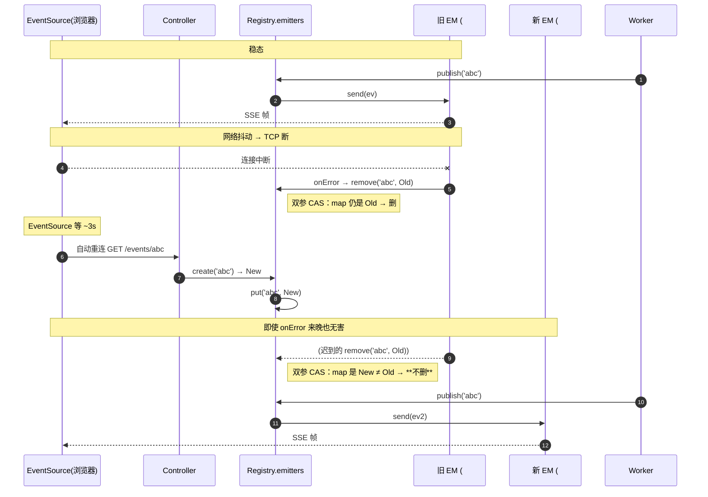
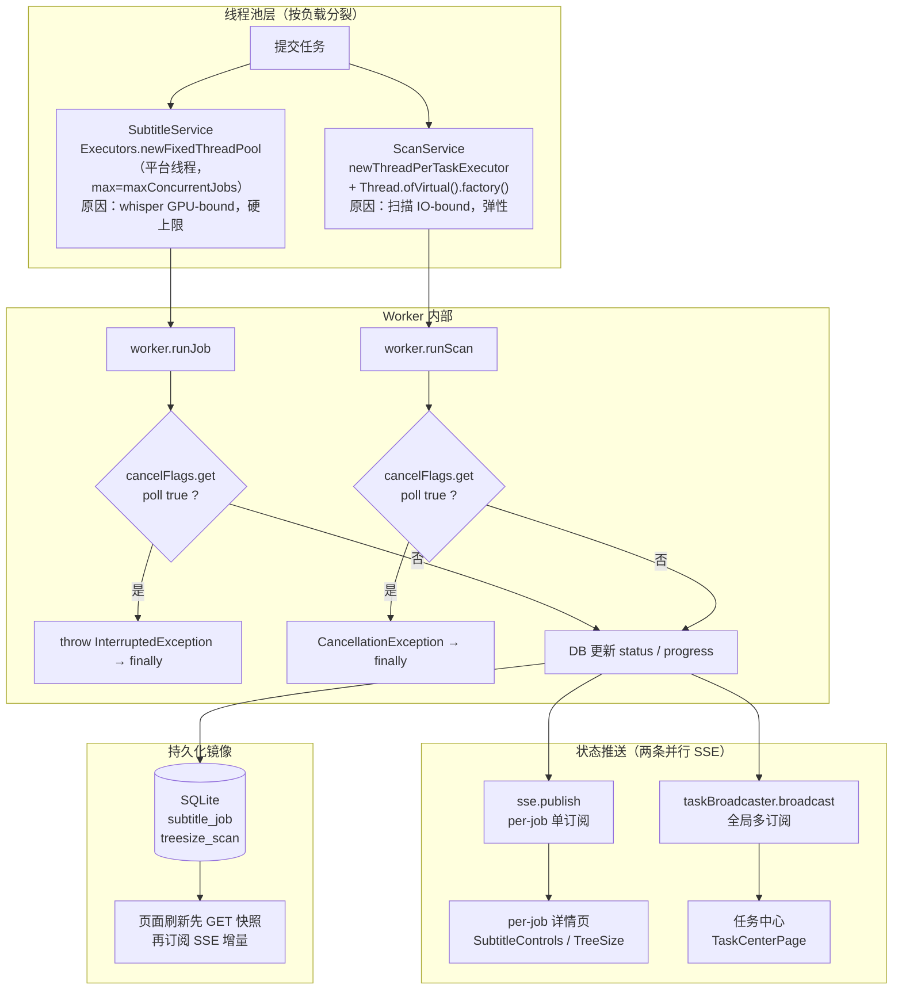
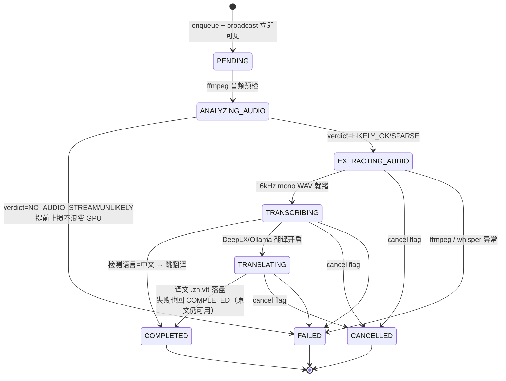

# 异步任务编排与进度推送

## 一句话总述

后端的两类异步任务（**字幕作业** = 音频抽取 → 转写 → 翻译；**目录扫描** = 本地 / SSH 走目录树）跑在**按工作负载分裂的两套线程池**上，通过 `AtomicBoolean cancelFlags + ProcessRegistry` 双层取消、`SseEmitterRegistry`（per-job 单订阅）+ `TaskBroadcaster`（全局多订阅）双 SSE 频道、SQLite 状态镜像三件套联动；前端任务中心订阅一次即可看全部，per-job 详情页订阅自己的频道互不影响。

## 快速阅览（30 秒抓住三件套）

> 详细机制看下方各章节；本节只回答三个问题：**一个任务怎么跑通**、**该用哪种 SSE 形态**、**断线怎么不丢**。

```mermaid
flowchart LR
    C[客户端] -->|① POST 启任务| API[Controller]
    API -->|② 入库 + 启 worker| DB[(SQLite<br/>状态权威)]
    API -->|③ 返 jobId| C
    C -->|④ 订阅 SSE<br/>/events/{id}| EM[SseEmitter]

    W[Worker<br/>虚拟/平台线程] -.->|⑤a 落 DB 快照| DB
    W -.->|⑤b publish 事件| EM
    EM -->|⑥ 推送| C

    C -.->|断线: EventSource 3s 自动重连<br/>新 emitter put 覆盖旧的| API
    C -.->|进页面: 先 GET /status 拿快照<br/>再接 SSE 增量| DB
```

**该用哪一种 SSE 形态？**

| 场景 | 选 | 一句话理由 |
|---|---|---|
| 看单个任务进度（详情页） | `SseEmitterRegistry` 单订阅 | 同 key 二次 `put` 覆盖前者，省广播开销 |
| 看任务列表（多 tab 都要看） | `TaskBroadcaster` 全局多订阅 | `Set<SseEmitter>` fan-out，事件名固定 `task` |
| 新增同类长任务（≥2 类共用模板） | `VideoProcessingJobService.startJob` | 自带类型互斥 / JobContext / 启动期清扫 |
| 推单例状态机（非任务，如 tunnel） | registry + 自维护 `Set<String> keys` | 见 `TunnelManager` 混合模式 |
| EventSource 不能带 body 时 | 前端 `subscribeSsePost`（fetch + ReadableStream） | 手解 `event:`/`data:` 帧，`AbortController` 当 close |

**重连不丢三件套**

1. **DB 是状态权威** —— 进页面先 GET `/status`（或 `/{id}`）拿当前快照，SSE 只推增量；断线期间发生的事件不重放
2. **EventSource 原生 ~3s 自动重连** —— 不写应用层重连；命中同一个 URL → 同一 controller 端点 → `sse.create(jobId)` 拿新 emitter
3. **双参 CAS 替换** —— `emitters.put(key, new)` 覆盖旧值；旧 emitter 自己的 `onError` 用 `remove(key, oldEmitter)` 删 —— **只在 map 里仍是 oldEmitter 时才删**，所以无论 put / remove 谁先到都不会误删新连接

终态兜底：worker 在 DB 写完 `COMPLETED/CANCELLED/FAILED` 后再 `broadcastTask` 一次 —— 客户端刚重连上也能立刻看到 done。

### 对象关联图（稳态）

> 看清「谁持有谁、谁找谁」—— 整套机制其实只有 4 个对象在交互。

```mermaid
flowchart LR
    subgraph 浏览器
        ES["EventSource<br/>url = /events/abc"]
    end
    subgraph JVM["Spring JVM（单例 Registry）"]
        Ctl["Controller.events()"]
        Reg[("SseEmitterRegistry<br/>emitters: { 'abc' → EM }")]
        EM["SseEmitter EM<br/>(绑定到 HTTP 连接)"]
        W["Worker 线程<br/>runJob('abc')"]
    end

    ES -. HTTP 长连接 .- EM
    Ctl -->|① create('abc')| Reg
    Reg -->|② put + 返回 EM| Ctl
    Ctl -->|③ 由 Spring 写响应头开流| ES
    W -->|④ publish('abc', ev)| Reg
    Reg -->|⑤ emitters.get('abc')| EM
    EM -->|⑥ send(ev)| ES
```

**关键约束**：
- **emitters 是唯一注册表** —— Controller 拿 emitter、Worker 推消息，都通过这张 map 找彼此，互不直接持有对方引用
- **EM 绑定的是 HTTP 连接，不是 jobId** —— 连接死了 EM 就废了，jobId 这个 key 在 map 里换 EM 不换 key

### 对象关联图（断开重连瞬间）



**为什么这套设计 race-free**：所有"清理旧 emitter"的操作（`onCompletion / onTimeout / onError`）一律走双参 `remove(key, oldEmitter)` —— 只有 map 里仍是 oldEmitter 时才删，所以"旧的 onError 迟到 / 新的 put 先到"任何顺序都不会误删活连接。这是 `SseEmitterRegistry` 全部 67 行代码里最微妙的一行。

---

## 适用场景

涉及任何需要"启动 → 进度可见 → 可取消 / 失败回收 → 终态归档"的后端长任务：当前两类（subtitle / scan），未来加第三类（如视频转码）按本图谱里的"扩展点"补一遍 broadcast 调用即可。

## 任务全景图



## 涉及类清单

| 角色 | 全路径 | 职责 |
|------|--------|------|
| 字幕作业池 | `com.exceptioncoder.toolbox.treesize.service.SubtitleService` | `Executors.newFixedThreadPool(maxConcurrentJobs)` 平台线程；状态机 `PENDING → ANALYZING_AUDIO → EXTRACTING_AUDIO → TRANSCRIBING →[TRANSLATING]→ COMPLETED` |
| 扫描池 | `com.exceptioncoder.toolbox.treesize.service.ScanService` | `newThreadPerTaskExecutor(Thread.ofVirtual().factory())` 虚拟线程；状态 `RUNNING → COMPLETED / CANCELLED / FAILED` |
| 字幕 cancel flag 注册表 | `SubtitleService.cancelFlags` (`ConcurrentHashMap<String, AtomicBoolean>`) | jobId → flag；worker 在 whisper progress 回调和 extract 前后各 poll 一次 |
| 扫描 cancel flag 注册表 | `ScanService.cancelFlags` | scanId → flag；`ScanEngine` 在每批 dir 结束 poll，触发 `CancellationException` |
| 子进程注册表 | `com.exceptioncoder.toolbox.common.media.FfmpegProcessRegistry` | `spawn(pb)` 把 ffmpeg/whisper 子进程登记；cancel 时不仅置 flag 还 `destroyForcibly()`，详见 [ffmpeg子进程编排与超时控制.md](ffmpeg子进程编排与超时控制.md) |
| per-job SSE | `com.exceptioncoder.toolbox.common.sse.SseEmitterRegistry` | `Map<String, SseEmitter>`；**单订阅**（最后一个 emitter 覆盖前一个）；timeout=1h，emitter IO 失败自动剔除 |
| 全局 SSE | `com.exceptioncoder.toolbox.treesize.service.TaskBroadcaster` | `Set<SseEmitter>` ConcurrentHashMap.newKeySet()；**多订阅**；事件名固定 `task`，data 为 TaskView |
| 任务装配 | `com.exceptioncoder.toolbox.treesize.service.TaskAssembler` | 把 `SubtitleJob` / `ScanRecord` 翻译成统一 TaskView；阶段中文映射集中（"分析音频/抽取音轨/转写/翻译/扫描中/已完成/失败/已取消"） |
| 字幕 DB 仓库 | `com.exceptioncoder.toolbox.treesize.repository.SubtitleJobRepository` | 每次 status / progress / language / vtt_path 变更都立即 `UPDATE` 落 SQLite，刷新页面能恢复 |
| 扫描 DB 仓库 | `com.exceptioncoder.toolbox.treesize.repository.ScanRepository` | `findAll` 限 100，按 started_at DESC；`deleteById @Transactional` 把 4 表 DELETE 合并到 1 次写锁 |
| 删除串行化 | `ScanService.deletionLock` (`ReentrantLock`) | JVM 单一互斥；多次连击删除时在 Java 层排队，避免在 SQLite busy_timeout 上轮询抢锁 |
| async 配置 | `application.yml: spring.mvc.async.request-timeout: -1` | 让 SSE 长连不被 Spring MVC framework 超时截断 |
| 虚拟线程开关 | `application.yml: spring.threads.virtual.enabled: true` | Tomcat 请求线程也走虚拟线程；与 Worker 池独立 |

## 核心规则

| 规则 | 说明 | 来源 |
|------|------|------|
| **线程池按负载分裂** | 字幕用平台线程 + 固定容量（GPU/IO 都受不了无限并行）；扫描用虚拟线程（纯 IO，受益于弹性） | [SubtitleService.java:88-94](../../../../IdeaProjects/kai-toolbox/tools/tool-treesize/src/main/java/com/exceptioncoder/toolbox/treesize/service/SubtitleService.java)、[ScanService.java:41-43](../../../../IdeaProjects/kai-toolbox/tools/tool-treesize/src/main/java/com/exceptioncoder/toolbox/treesize/service/ScanService.java) |
| **cancel 是协作式（flip flag）不打断线程** | `cancel(id)` 只置 `AtomicBoolean.set(true)`，**不调 `thread.interrupt()`**。Worker 在安全点 poll 自检（whisper progress 回调里、批写之间）→ 抛 InterruptedException → finally 清理 | 同上 |
| **子进程必须额外 destroyForcibly** | flag 只挡住 Java 层的下一步推进；whisper / ffmpeg 子进程不感知 flag，会继续吃 CPU/GPU 几分钟。所以 cancel 时还得通过 `FfmpegProcessRegistry` 主动杀子进程 | [FfmpegProcessRegistry.java](../../../../IdeaProjects/kai-toolbox/toolbox-common/src/main/java/com/exceptioncoder/toolbox/common/media/FfmpegProcessRegistry.java) |
| **删除 = cancel + 等 worker 落地 + 删 DB + 删文件** | 字幕 delete: `cancel → sleep 50ms → Files.deleteIfExists(vtt) → jobs.deleteById`；扫描 delete: `cancel → deletionLock → @Transactional 4 表删除` | `SubtitleService.delete`、`ScanService.deleteAndStop` |
| **两条 SSE 频道并行存在，互不替代** | `SseEmitterRegistry`（per-jobId 单订阅）给详情页用；`TaskBroadcaster`（全局多订阅）给任务中心用。worker 每次状态切换都"顺手"两边各推一次 | `SubtitleService.broadcastTask`、`ScanService.broadcastTaskById` |
| **per-job SSE 是单订阅** | 同 key 第二次 `create(jobId)` 会顶掉上一个 emitter（map.put）；前端如果开两个 tab 看同一个 job，后开的赢——这是 by-design，避免广播开销 | `SseEmitterRegistry.create` |
| **TaskBroadcaster 是多订阅** | `Set<SseEmitter>` 持有所有任务中心订阅者；publish 失败的 emitter 当场剔除并 `completeWithError` | `TaskBroadcaster.broadcast` |
| **事件名约定固定** | per-job: `status` / `progress` / `language` / `analysis` / `translated` / `completed` / `cancelled` / `error`；全局: 只有 `task` 一种事件，data 为 TaskView。前端 `subscribeSse` 必须显式列 `extraEvents` 才能收到非默认事件 | [api.ts:71-99](../../../../IdeaProjects/kai-toolbox/frontend/src/lib/api.ts) |
| **DB 是状态权威，SSE 是增量推送** | 每次状态/进度变化 worker 都 `jobs.updateProgress / updateStatus` 落 SQLite。前端刷新页面：先 `GET /subtitles/by-video` 拿当前快照，再 `subscribeSse` 接续——SSE 断了也能恢复 | `SubtitleService.runJob` 各阶段 |
| **`spring.mvc.async.request-timeout: -1` 是必需配置** | Spring MVC 默认会给 async response 一个超时；不关掉 SSE 长连会在 30s/10min 后被框架截掉 | `application.yml` |
| **emitter 内置 1h timeout** | SseEmitterRegistry / TaskBroadcaster 都用 `new SseEmitter(60 * 60 * 1000L)`。客户端长时间挂着也最多 1h 自动 complete，让 worker `sse.complete(id)` 有兜底回收路径 | `SseEmitterRegistry`、`TaskBroadcaster` |
| **任务完成时 `sse.complete(id)` 关闭 stream** | 不主动 close 的话，前端 `EventSource` 一直挂着；前端通过 stream 关闭触发 `onerror` 自然退出订阅。注意 TaskBroadcaster **不**在任务完成时关 stream，因为多任务共享一条全局频道 | `SubtitleService.runJob finally` |
| **`@PreDestroy` 关闭线程池前先翻所有 flag** | JVM 退出时遍历 `cancelFlags.values().forEach(f -> f.set(true))`，再 `executor.shutdown` → 5s `awaitTermination` → `shutdownNow`。让 worker 早点退出，子进程交给 `FfmpegProcessRegistry` 的 shutdown hook 收 | `SubtitleService.shutdown` |
| **进度回调高频 fan-out 不节流（单用户场景）** | whisper progress 回调 1-5 Hz 都直接广播一次 TaskView 给所有任务中心订阅者，单用户场景够用。多用户 / 公网场景需要加 500ms 节流（**未实现**） | `SubtitleService.runJob` 内嵌 ProgressListener |

## 字幕作业状态机



## SSE 事件契约

### per-job SSE（`SseEmitterRegistry`）

| 事件名 | 何时发 | data 形状 |
|---|---|---|
| `status` | 阶段切换（任一 SubtitleStatus / ScanStatus 变化） | `{ id, status, progress, sourceLanguage, vttPath, errorMsg }` |
| `progress` | whisper / ffmpeg / DeepLX progress 回调 | `{ progress: 0~1, percent: 0~100 }` |
| `language` | whisper 检测到源语言 | `{ language: "ja" }` |
| `analysis` | ffmpeg 音频预检完毕 | AudioAnalysis 全部字段 |
| `translated` | DeepLX 译文落盘 | `{ hasTranslatedVtt: true }` |
| `completed` / `cancelled` / `error` | 终态 | `statusEvent` 同 status；error 额外 `{ message }` |

### 全局 SSE（`TaskBroadcaster`，`/api/treesize/tasks/events`）

只有一种事件：`task`，data 为 `TaskView`（id / type / title / subtitle / phase / status / progress / errorMsg / createdAt / startedAt / finishedAt / active / scanId / videoPath）。

任何时候 worker 调 `broadcastTask(...)` 都 fan-out 一份。**没有 `removed` 事件**——前端删除任务时本地从 cache 摘掉行即可。

## 取消 / 删除 / 失败回收行为对照表

| 触发 | flag | 子进程 | 文件 | DB 行 | SSE | 终态 |
|---|---|---|---|---|---|---|
| 用户取消字幕 (运行中) | set(true) | whisper destroyForcibly via ProcessRegistry | tmp wav 自动 finally 删 | status=CANCELLED 入库 | publish `cancelled` + broadcast | CANCELLED |
| 用户删除字幕 (终态) | n/a | n/a | VTT + 译文 VTT `Files.deleteIfExists` | `deleteById` | 不发（任务已 complete sse stream） | 行消失 |
| 用户删除扫描（任何状态） | set(true) → `deleteAndStop` | n/a | n/a | `@Transactional` 4 表删除（node_meta / node / scan_source / scan） | 不发 | 行消失 |
| 音频预检判定无人声 | n/a | n/a | n/a | status=FAILED + errorMsg=summary | publish `error` + broadcast | FAILED |
| whisper 子进程超时 / 异常 | n/a | ProcessRegistry 处理 | tmp wav finally 删 | status=FAILED + errorMsg | publish `error` + broadcast | FAILED |
| 翻译失败（DeepLX 不可达） | n/a | n/a | 原 VTT 保留 | 直接回 COMPLETED，不卡 TRANSLATING | publish `completed` + broadcast | COMPLETED（仍可用原文） |
| JVM `@PreDestroy` | 全 flip true | ProcessRegistry shutdown hook 各自 destroyForcibly | tmp wav 留在盘上（下次启动期清） | 留在 RUNNING / 中间态 | emitter 自然 close | 重启后需手工 cleanup 或新跑覆盖 |
| JVM 被 `taskkill /F` | shutdown 不触发 | 孤儿子进程下次启动 reaper 杀，见 [ffmpeg场景卡](ffmpeg子进程编排与超时控制.md) | tmp 留盘 | DB 留在中间态 | 客户端 EventSource 自然超时 | 同上 |

## 持久化与并发约束

| 表 | 用途 | 关键索引 / 约束 |
|---|---|---|
| `subtitle_job` | 字幕作业行 | PK `id`；secondary `video_path_hash`（按视频反查复用） |
| `treesize_scan` | 扫描主行 | PK `id`；按 `started_at DESC` 排序取 100 |
| `treesize_scan_source` | 扫描来源（local / SSH） | FK `scan_id` → scan |
| `treesize_node` / `treesize_node_meta` | 扫描结果文件清单 | FK `scan_id` |

并发约束：
- SQLite WAL + FK on（`SqliteConfig`），多 worker 并发写在 WAL 模式下不阻塞读
- `ScanRepository.deleteById` 单事务合并 4 表删除，写锁抢占 4 → 1
- `ScanService.deletionLock` 在 JVM 层串行化多次删除，避免到 SQLite 层用 busy_timeout 轮询抢锁

## 关键代码坐标

| 关注点 | 入口 |
|---|---|
| 字幕作业整段流水 | `SubtitleService.runJob` |
| 字幕翻译子阶段 | `SubtitleService.runTranslationPhase` |
| 扫描整段流水 | `ScanService.runScan` / `runSshScan` |
| 任务广播 | `TaskBroadcaster.broadcast` + `SubtitleService.broadcastTask` + `ScanService.broadcastTaskById` |
| 任务中心列表 | `TreeSizeController.listTasks` (`GET /api/treesize/tasks`) |
| 任务中心 SSE | `TreeSizeController.taskEvents` (`GET /api/treesize/tasks/events`) |
| 前端 SSE wrap | `frontend/src/lib/api.ts: subscribeSse` |
| 前端任务中心页 | `frontend/src/features/task-center/pages/TaskCenterPage.tsx` |

## 已知疑点 / 暂未做

- **进度高频回调未节流**。whisper 在某些环境下 progress 回调 5-10 Hz；当前每次都 fan-out 给全部 TaskBroadcaster 订阅者。单用户局域网内毫无压力，但接公网或多用户时需要加 500ms 节流。
- **JVM 强杀（taskkill /F）会留中间态 DB 行**。`SubtitleStatus` 留在 ANALYZING_AUDIO / TRANSCRIBING / TRANSLATING，前端任务中心刷新后会看到这些"僵尸 active 任务"。当前没有启动期 reaper 把僵尸 job 一律转 FAILED——依赖用户手动重跑覆盖。可以补一个 `@PostConstruct` 扫表把 active 状态全部转 FAILED + errorMsg="JVM 异常重启"，**未实现**。
- **per-job SSE 单订阅意味着多 tab 不友好**。同一字幕作业两个 tab 同时打开看进度，后开的 emitter 顶掉前一个，前面那个 tab 进度条会停。任务中心因为是全局多订阅没这个问题。
- **TaskBroadcaster 没有"任务移除"事件**。删除靠前端 mutation 后本地从 cache 摘掉行；其他 tab 不会同步看到删除——刷一下页面才行。单用户场景可接受。
- **删除时 50ms 固定 sleep**。`SubtitleService.delete` 里写死等 50ms 让 worker 进 finally 释放文件锁，再删 VTT。极少数 worker 还卡在 IO 的场景下 50ms 不够，会留 stale tmp wav 文件——下次启动时不会清（不像 ffmpeg 的 ThumbnailService 有 init() 清理 .tmp）。**潜在小坑**。

## 扩展点：如何登记一个新的异步任务

### 第一步：选路线

| 你要加的任务长这样 | 选 | 理由 |
|---|---|---|
| 又一种**视频处理**（按 video 逐条跑，要 start/stop/status/events 4 端点） | **A. 复用 `VideoProcessingJobService.startJob`** | 类型互斥 / cancel / 启动期 reaper / progress 上报全自带，业务只写循环 |
| 一个**独立长任务**（如转码、批量重命名），形态和现有都不像 | **B. 仿 ScanService/SubtitleService 自管池** | 你要自己挑线程池、定状态机、写 cancel 协议 |
| 一个**单例状态机推送**（一个全局服务状态被多人围观，如 tunnel/某 daemon） | **C. 仿 TunnelManager 混合模式** | Registry 管 emitter 生命周期，自己维护 `Set<String> keys` fan-out |

### 路线 A · 复用 VideoProcessingJobService（默认推荐）

业务只写一个循环：

```java
public Optional<String> start() {
    return jobService.startJob(ProcessingJobType.XXX, ctx -> {
        var todo = repo.findPending();
        jobService.setTotal(ctx, todo.size());
        for (var v : todo) {
            if (ctx.cancelled().get()) break;
            try { doWork(v); jobService.recordSuccess(ctx, v.path()); }
            catch (Exception e) { jobService.recordFailure(ctx, v.path(), e.getMessage()); }
        }
    });
}
public void stop() { jobService.cancelJob(ProcessingJobType.XXX); }
```

改动点：① 新增 `XxxService` ② `ProcessingJobType` 加枚举值 ③ `VideoProcessingController` 加 4 端点转发。

**注意**：A 走的是 per-job SSE，**不会自动进任务中心** —— 想进任务中心要再做路线 B 的最后两条（接 `TaskBroadcaster` + `listTasks` 合并查询）。

### 路线 B · 自管池 + 接任务中心

照 SubtitleService / ScanService 模板：

- **建池**：GPU/CPU 敏感 → `newFixedThreadPool`；纯 IO → `newThreadPerTaskExecutor(Thread.ofVirtual().factory())`
- **cancel 注册表**：`ConcurrentHashMap<String, AtomicBoolean> cancelFlags`，worker 安全点 poll
- **`@PreDestroy`**：翻所有 flag → `shutdown` → 5s `awaitTermination` → `shutdownNow`
- **`@PostConstruct` 启动期 reaper**：扫表把上次残留的中间态一律标 FAILED（照 `VideoProcessingJobService.cleanupStaleOnStartup` 抄，强烈建议）
- **Repository** 持久化 status / progress / finishedAt / errorMsg —— DB 是状态权威
- **per-job SSE**：状态变化点 `sse.publish(jobId, "status"/"progress"/...)`，结束 `sse.complete(jobId)`
- **接任务中心**（让任务出现在 `/tasks` 列表 + `/tasks/events` 广播）：
  - `TaskAssembler` 加 `from(YourRecord)` 翻译成 `TaskView`（type + 中文 phase）
  - 每个状态变化点除 `sse.publish` 外再调 `taskBroadcaster.broadcast(taskAssembler.from(record))`
  - `TreeSizeController.listTasks` 合并新 Repository 的查询结果到结果列表
- **Controller**：至少 4 端点 start / cancel / status / events，events 用 `produces = MediaType.TEXT_EVENT_STREAM_VALUE` + `return sse.create(jobId)`

### 路线 C · 单例状态机（罕见）

- Manager 持有 `current` 状态 + `Set<String> subscribers`
- Controller `events()` 里每次生成 `key = "xxx:" + UUID.randomUUID()` → `sseRegistry.create(key)` → emitter 三个回调（completion/timeout/error）都调 `manager.unsubscribe(key)` → `manager.subscribe(key)`
- `subscribe(key)` 内立刻 publish 一次 `current` —— 新订阅者不用等下次状态切换才看到
- 状态切换：`for (k : subscribers) sseRegistry.publish(k, "status", next)`

### 前端 checklist（任意路线都要做）

- `frontend/src/features/<id>/index.tsx` 导出 `FeatureManifest`（菜单自动出现，参 `featureRegistry.ts`）
- 用 `subscribeSse(path, handlers, extraEvents)` 订阅；**非默认事件名**（`status` / `language` / `task` 等）必须显式列在 `extraEvents` 里，否则收不到
- 进页面**先 GET 快照** 再订阅 SSE，避免重连期间空白
- 接任务中心的话：`TaskRow.tsx` 加新 type 图标分支；`TaskCenterPage.handleCancel/handleDelete` 加 type 分支

## 反例（不要这样写）

```java
// ❌ 用 thread.interrupt() 取消
worker.interrupt();
// 后果：批量 DB 写中途被打断，留 partial scan 数据 / tmp wav 不清理。
```

```java
// ❌ 不广播 TaskView，只发 per-job SSE
publish(jobId, "status", payload);
// 后果：任务中心看不到这次状态变化，要等 30s 后 refetch 才能恢复。
```

```java
// ❌ 把全局任务广播也放进 SseEmitterRegistry
sse.publish("GLOBAL_TASKS", "task", view);   // 单订阅！第二个客户端订阅会顶掉第一个
```

```java
// ❌ cancel 后不杀子进程
cancelFlag.set(true);   // 只置 flag
// 后果：whisper 子进程继续吃 GPU 几分钟，flag 不可达。
```

## 正例

```java
// ✅ 状态切换 = 落 DB + 双频道推送
job.setStatus(SubtitleStatus.TRANSCRIBING);
jobs.updateStatus(job.getId(), job.getStatus(), null, null, null);
publish(job.getId(), "status", statusEvent(job));    // per-job 详情页
broadcastTask(job);                                   // 任务中心全局
```

```java
// ✅ 取消 = flag + 子进程 kill 双管齐下
public void cancel(String jobId) {
    AtomicBoolean flag = cancelFlags.get(jobId);
    if (flag != null) flag.set(true);
    // ProcessRegistry 在 whisper 子进程 wait 超时或 cancel 信号后 destroyForcibly
}
```

```java
// ✅ 进度回调三件套
runner.run(tmpWav, outputPrefix, language, prompt, new ProgressListener() {
    @Override public void onProgress(int percent) {
        double p = percent / 100.0;
        job.setProgress(p);
        jobs.updateProgress(job.getId(), p);                                   // 1. 落 DB
        publish(job.getId(), "progress", Map.of("progress", p, "percent", percent));  // 2. per-job
        broadcastTask(job);                                                     // 3. 全局
    }
}, cancelled);
```

## 交叉引用

- 子进程层面的 drain / timeout / 孤儿处理走 [ffmpeg子进程编排与超时控制.md](ffmpeg子进程编排与超时控制.md)——本卡只描述"任务"这一层，子进程具体行为见对方
- 前端任务中心实现细节见项目仓库 `frontend/src/features/task-center/`，本卡只列入口路径
- 前端 SSE wrap (`subscribeSse`) 默认事件名集合是 `progress / completed / cancelled / error`；feature-specific 事件（如字幕的 `status` / `analysis` / `language` / `task`）必须显式传 `extraEvents`，否则收不到
- 路径越权防护（`PathAccessGuard`）不在本卡范围，scan / subtitle 收到的 path 参数都在 controller 层先过 guard
