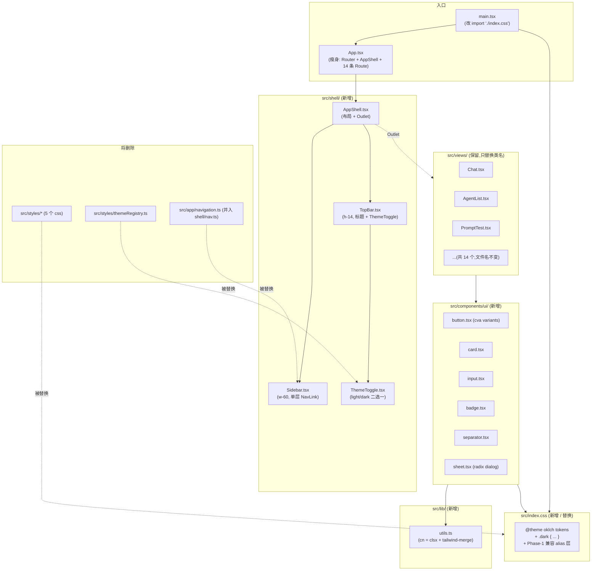
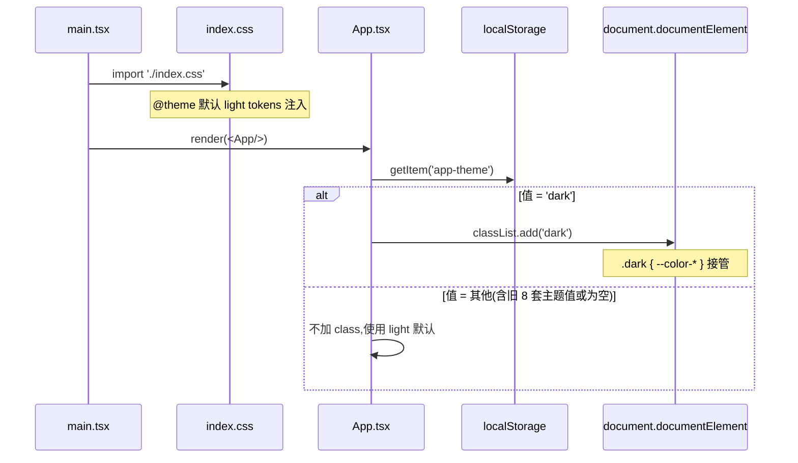
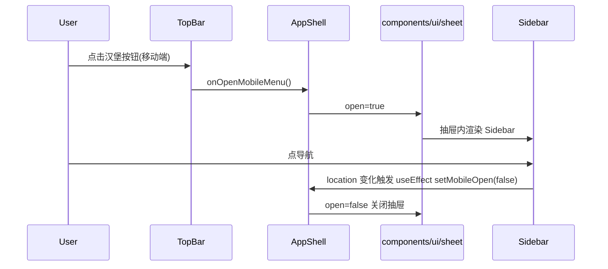

# llm-frontend 重构（参考 kai-toolbox/frontend 结构代码）

> 完整-技术模版 · 最后更新 2026-05-25

## 1. 目标与边界

### 1.1 目标
本次只重构「框架代码 / 主体样式 / 原子组件」三块，**不动业务页面的目录组织**（`views/` 保留、14 个页面文件名保留、路由 path 保留）。

参考 kai-toolbox/frontend 的**结构代码**（不是参考它怎么拆 feature）：
1. **主体清理**：删掉 8 套花哨主题（ai-clean / paper / win95 / bauhaus / aurora / dark / apple / cyber），收敛为 light + dark。
2. **CSS 收敛**：`src/styles/`（components-reset / index / markdown / themes / variables）+ `themeRegistry.ts` → 单一 `src/index.css`，用 kai-toolbox 同款 `@theme { oklch tokens }` + `.dark { ... }` 的 shadcn 范式。
3. **原子组件层**：新增 `src/components/ui/`（button / card / input / badge / separator / sheet），用 class-variance-authority；淘汰手写的 `.app-surface / .app-recess / .neo-convex / .neo-concave / .app-chip / .app-btn-primary / .app-input`。
4. **框架壳分层**：把 `App.tsx` 里塞的 260 行 sidebar + header + theme picker 拆到 `src/shell/`（AppShell / Sidebar / TopBar / ThemeToggle），`App.tsx` 瘦身到 Router + AppShell + 路由表。
5. **工具函数**：新增 `src/lib/utils.ts` 暴露 `cn(...)`（clsx + tailwind-merge），从 kai-toolbox 直接搬。

### 1.2 不做
- **不动 `views/` 目录**：14 个视图文件 (`Chat.tsx`, `AgentList.tsx`, `PromptTest.tsx`...) 文件名、位置、路由 path 全部保留。
- **不引入 `features/` 自注册结构**：保留 `App.tsx` 静态路由表，但搬到 `shell/AppShell.tsx` 之后剩 ~20 行。
- **不动业务逻辑**：14 个 view 内部的 API 调用、状态管理、React Flow 编排、Markdown 渲染、SSE 全部不动。
- **不改后端契约**。
- **不引入 `@tanstack/react-query / @codemirror/* / recharts / mermaid` 等 kai-toolbox 业务侧依赖**。

### 1.3 范围
仅 `D:\Users\zhang\IdeaProjects\llm-orchestration-platform\llm-frontend\` 目录内改动。

---

## 2. 整体架构



**核心变化**：
1. `src/styles/` 整目录 + `themeRegistry.ts` → 1 个 `src/index.css`。
2. `App.tsx` 由 ~260 行 → ~30 行。Sidebar / TopBar / ThemeToggle 三段从 App.tsx 抽出到 `src/shell/`。
3. 新增 `src/components/ui/` + `src/lib/utils.ts`，对齐 kai-toolbox 的 shadcn 命名空间。
4. `src/views/` 目录、文件名、路由 path **完全保留**。

---

## 3. 模块拆分与职责

### 3.1 `src/shell/`（新增）
| 文件 | 职责 | 行数预估 |
|---|---|---|
| `AppShell.tsx` | 布局壳：左侧 Sidebar（桌面常驻）+ 移动端 Sheet 抽屉、右侧 TopBar + `<Outlet>`；同步 `visualViewport.height` 到 CSS 变量 `--app-vh` | ~60 |
| `Sidebar.tsx` | 单层分组导航，读取 `nav.ts` 的 menuGroups；折叠态 w-16，展开 w-60；当前路由高亮 | ~80 |
| `TopBar.tsx` | h-14；显示当前 view 的 title（来自 `nav.ts` 的 `pageMetaMap`，仅 title 不带 subtitle）+ ThemeToggle | ~30 |
| `ThemeToggle.tsx` | 单按钮 light ↔ dark；持久化 `localStorage('app-theme')`；启动兜底：旧值（'ai-clean' 等）一律视为 light | ~30 |
| `nav.ts` | 从原 `src/app/navigation.ts` 简化搬入：保留 `menuGroups` + `pageMetaMap`（仅 title），删除 subtitle | ~50 |

### 3.2 `src/components/ui/`（新增）
对齐 kai-toolbox `src/components/ui/`：
- `button.tsx` —— class-variance-authority 驱动 variants（`default | outline | ghost | destructive`）+ sizes（`sm | md | lg | icon`）
- `card.tsx` —— Card / CardHeader / CardTitle / CardContent / CardFooter
- `input.tsx` —— 单行输入
- `badge.tsx` —— 标签
- `separator.tsx` —— 分隔线
- `sheet.tsx` —— 移动端侧栏抽屉，`@radix-ui/react-dialog` 包装

### 3.3 `src/lib/utils.ts`（新增）
从 kai-toolbox 搬：
```ts
import { clsx, type ClassValue } from 'clsx'
import { twMerge } from 'tailwind-merge'
export function cn(...inputs: ClassValue[]) {
  return twMerge(clsx(inputs))
}
```

### 3.4 `src/index.css`（新增，替换 `src/styles/` 整目录）
单一 oklch token 文件，对齐 kai-toolbox：
- `@theme { --color-background / --color-foreground / --color-primary / --color-card / --color-popover / --color-muted / --color-border / --color-sidebar / --color-sidebar-accent / --radius / --font-sans }`
- `@layer base { :root { color-scheme: light } .dark { 全套覆盖 } * { border-color: var(--color-border) } body { ... } .no-scrollbar }`
- `@keyframes` 仅保留业务实际用到的（SSE 闪烁等，从原 styles 里筛）
- **Phase-1 兼容 alias 层**：把 14 个 view 里仍引用的 `.app-surface / .app-recess / .neo-convex / .neo-concave / .app-chip / .app-btn-primary / .app-input / .app-shell / .app-sidebar / .app-header` 映射到新 token，Phase-3 末删除
- 删除 `data-theme=*` 全部分支（8 套主题）
- 删除装饰性 radial-gradient / backdrop-filter blur 等

### 3.5 `src/App.tsx`（重写，~30 行）
```tsx
import { BrowserRouter, Route, Routes } from 'react-router-dom'
import { AppShell } from '@/shell/AppShell'
import Chat from '@/views/Chat'
import AgentList from '@/views/AgentList'
// ...其余 12 个 view import 不变

export default function App() {
  return (
    <BrowserRouter>
      <Routes>
        <Route element={<AppShell />}>
          <Route path="/" element={<Placeholder />} />
          <Route path="/chat" element={<Chat />} />
          <Route path="/doc-viewer" element={<DocViewer />} />
          {/* ...14 条,path 与现在完全一致 */}
        </Route>
      </Routes>
    </BrowserRouter>
  )
}
```

### 3.6 `src/views/*`（保留，仅做类名替换）
- 文件名不变，路由 path 不变。
- 内部用到的 `.app-surface / .app-recess / .neo-convex / .neo-concave / .app-btn-primary / .app-input` 等类名在 Phase 1 通过 alias 兜底；Phase 2 逐文件迁到 `<Card>` / `<Button>` / `<Input>` / `<Badge>` 等新组件。
- 内部业务逻辑、API 调用、framer-motion 局部动画、@xyflow/react 流程图全部保留。

---

## 4. 关键交互

### 4.1 启动 → 主题应用



### 4.2 路由切换（删除 AnimatePresence）

```mermaid
sequenceDiagram
    participant User
    participant Nav as Sidebar NavLink
    participant Router as React Router
    participant Outlet as AppShell Outlet
    participant View as views/ChatView

    User->>Nav: 点击
    Nav->>Router: navigate('/chat')
    Router->>Outlet: 渲染 Chat
    Outlet->>View: 直接挂载
    Note over Outlet,View: 不再用 AnimatePresence + motion.div<br/>包裹路由切换;view 内部需要的动效自留
```

### 4.3 移动端 Sidebar 抽屉



---

## 5. 核心业务规则

| 编号 | 规则 | 理由 |
|---|---|---|
| R1 | 主题仅保留 light + dark | 8 套主题装饰资产,无业务价值;每改一个组件要在 8 套 `[data-theme=...]` 分支里同步,维护成本极高 |
| R2 | 侧栏 w-60 / collapsed w-16, TopBar h-14 | 对齐 kai-toolbox;原 w-80 + h-24 浪费首屏面积 |
| R3 | 删 TopBar 中的 Bell / Search / "System Online" 假状态 / dicebear 假 avatar | 纯装饰,无业务对接,首屏视觉降噪 |
| R4 | 路由顶层不再用 AnimatePresence + motion.div 包裹切换 | view 内部局部动画(GraphOrchestration 等)保留 |
| R5 | `src/views/` 文件名 + 路由 path 一字不改 | 本次只重构主体/框架/原子组件,不动业务侧组织 |
| R6 | LocalStorage `app-theme` 兜底:非 `'dark'` 一律降级为 light | 用户当前可能存了 'ai-clean'/'cyber' 等旧值 |
| R7 | Phase 1 完成后 14 个 view 视觉不破:靠 `@layer components` alias 兜底 | 14 个 view 类名一次性硬切风险大 |
| R8 | 删除装饰性 radial-gradient / 多层 backdrop-filter | 性能 + 美学双胜 |
| R9 | 保留业务依赖(@xyflow/react / framer-motion / marked / highlight.js / html2canvas) | 它们服务于 Graph 可视化、Markdown 渲染、图片导出 |

---

## 6. 编码落点

### 6.1 改造后目录树（只列变化点）
```
llm-frontend/
  package.json                  (+class-variance-authority,+@radix-ui/react-dialog,+@radix-ui/react-slot)
  src/
    main.tsx                    (改: import './index.css' 替换 './styles/index.css')
    App.tsx                     (重写: ~30 行)
    index.css                   (新建: 单一 oklch token + Phase-1 alias)
    shell/                      (新增)
      AppShell.tsx
      Sidebar.tsx
      TopBar.tsx
      ThemeToggle.tsx
      nav.ts
    components/
      ui/                       (新增)
        button.tsx
        card.tsx
        input.tsx
        badge.tsx
        separator.tsx
        sheet.tsx
      graph/                    (保留,业务组件)
    lib/                        (新增)
      utils.ts                  (cn helper)
    views/                      (保留全部 14 文件,仅 Phase 2 替换类名)
    api/                        (保留不动)
    hooks/                      (保留)
    composables/                (保留)
    utils/                      (保留)
    router/                     (保留)
    styles/                     (Phase 3 删除整目录)
    app/navigation.ts           (Phase 3 删除,内容已并入 shell/nav.ts)
```

### 6.2 分阶段执行

| 阶段 | 内容 | 完工标准 |
|---|---|---|
| **Phase 1：主体落地 + 兼容兜底** | 1) 新建 `src/index.css`(含 alias 层) 2) 新建 `src/lib/utils.ts` 3) 新建 `src/components/ui/{button,card,input,badge,separator,sheet}.tsx` 4) 新建 `src/shell/{AppShell,Sidebar,TopBar,ThemeToggle,nav}.tsx` 5) 重写 `App.tsx` 6) 改 `main.tsx` 引用 7) 装新依赖 `class-variance-authority @radix-ui/react-dialog @radix-ui/react-slot` | 14 个 view 仍可访问、视觉不破(靠 alias)、light/dark 切换正常、移动端抽屉正常 |
| **Phase 2：14 个 view 内类名迁移** | 逐个 view 把 `<div className="app-surface ...">` → `<Card>`、`.app-btn-primary` → `<Button>`、`.app-input` → `<Input>` 等;同时清理冗余装饰 className | grep 项目源码 `'app-surface\|app-recess\|neo-convex\|neo-concave\|app-chip\|app-btn-primary\|app-input'` 零命中 |
| **Phase 3：清理收尾** | 1) 删除 `src/styles/` 2) 删除 `src/app/navigation.ts`(已并入 shell/nav.ts) 3) 删除 `src/index.css` 内的 Phase-1 alias 层 4) grep 兜底 `data-theme=` 零命中 | `tree src/` 干净,build 通过,所有页面正常 |

---

## 7. 数据与依赖变更

### 7.1 新增 npm 依赖
| 包 | 版本 | 用途 |
|---|---|---|
| `class-variance-authority` | ^0.7.1 | button variants |
| `@radix-ui/react-dialog` | ^1.1.x | sheet 抽屉 |
| `@radix-ui/react-slot` | ^1.1.x | button asChild 模式 |

### 7.2 不变更
- 不动 react / react-router-dom / axios / lucide-react / @xyflow/react / framer-motion / marked / highlight.js / html2canvas / @tailwindcss/vite / tailwindcss / clsx / tailwind-merge
- 不动后端 API 路径与契约
- LocalStorage 键名 `app-theme` 保留，值域从 8 个枚举收敛为 `'light' | 'dark'`，启动时做一次性兜底

---

## 8. 风险与待确认

| 风险 | 缓解 |
|---|---|
| 14 个 view 类名引用复杂，alias 兜底可能漏覆盖 | Phase 1 末逐页 smoke test；漏掉的类名补进 alias 层；alias 层注释明示「Phase 3 删除」防遗忘 |
| 14 个 view 内可能直接出现 `data-theme=*` 硬编码 | Phase 1 末 grep 一次 `data-theme=`，定点处理 |
| `useResponsive` / `composables` 可能读取旧的 `--sidebar-width / --header-height` JS 变量 | Phase 1 时 grep 检查；必要时在 `index.css` 保留这两个变量名 |
| GraphVisualization / GraphOrchestration 用 framer-motion 做 React Flow 节点动效 | 仅删 App.tsx 顶层 `AnimatePresence + motion.div`；view 内 framer-motion 全部保留 |
| 改完发现 dark 主题色阶在某些 view 下对比度不够 | dark token 直接抄 kai-toolbox 同款，已实战验证；如个别页面有问题局部调 |

### 8.1 待确认
1. 是否保留旧 8 套主题中的任意一套作为可选项？**默认全删，只 light + dark。**
2. Phase 2 类名迁移是否一次性 14 个全做，还是分批？**默认按视图重要度分批：核心(Chat / DocViewer / NoteCapture) → Prompt 工程(3) → 管理(3) → 编排(2) → 工具(2)。**
3. TopBar 是否保留 page subtitle？**默认仅显示 title，删 subtitle。**
4. Sidebar 是否保留每条菜单下的 description 小字？**默认删，与 kai-toolbox 对齐，纯 icon + name。**
