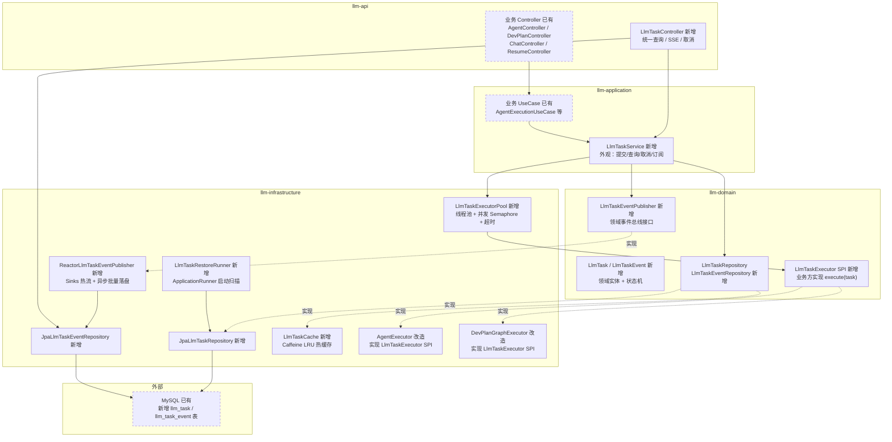
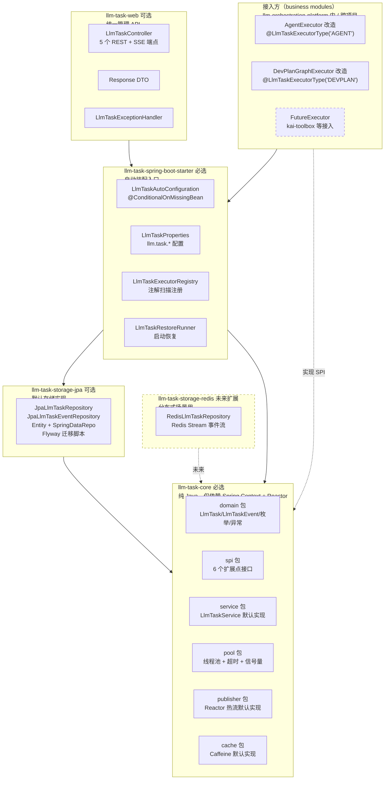
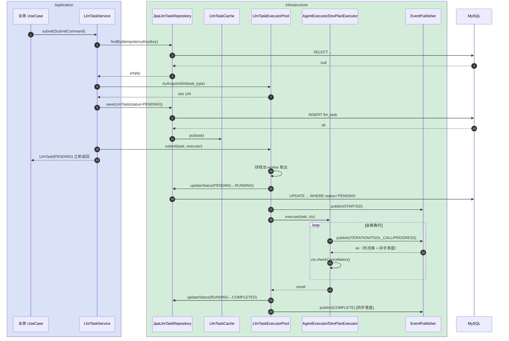
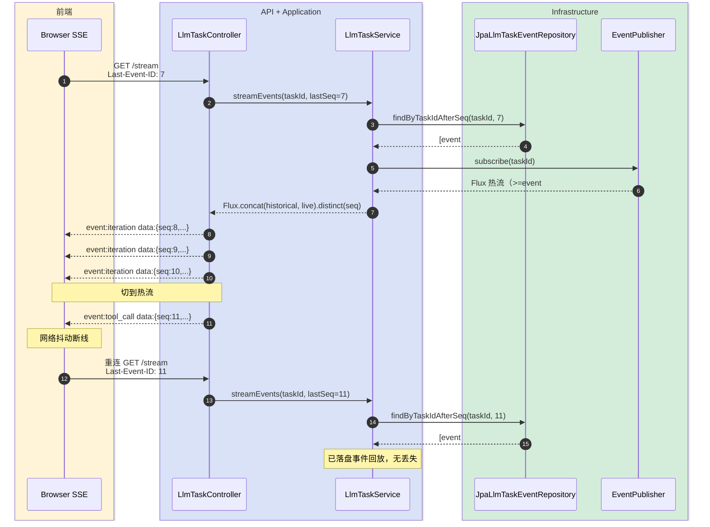
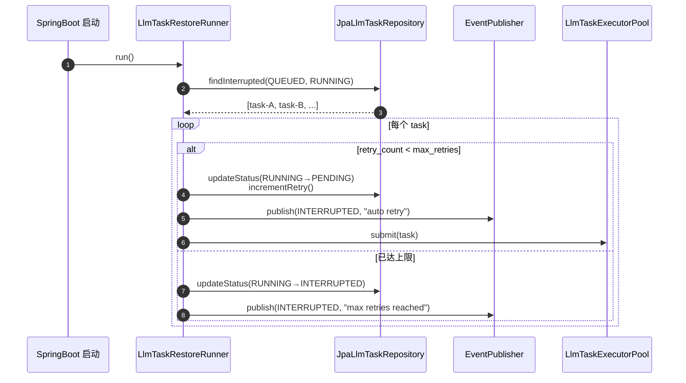
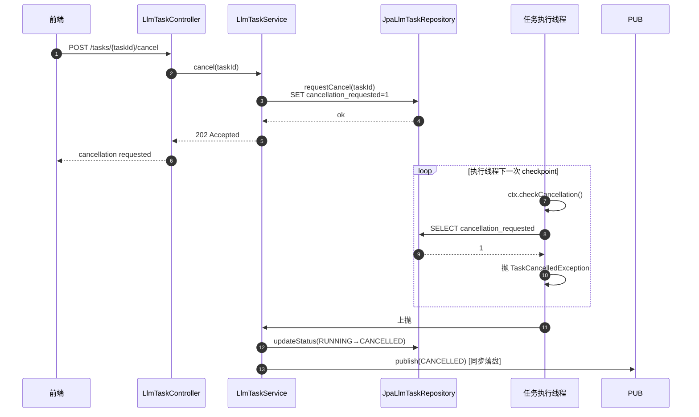
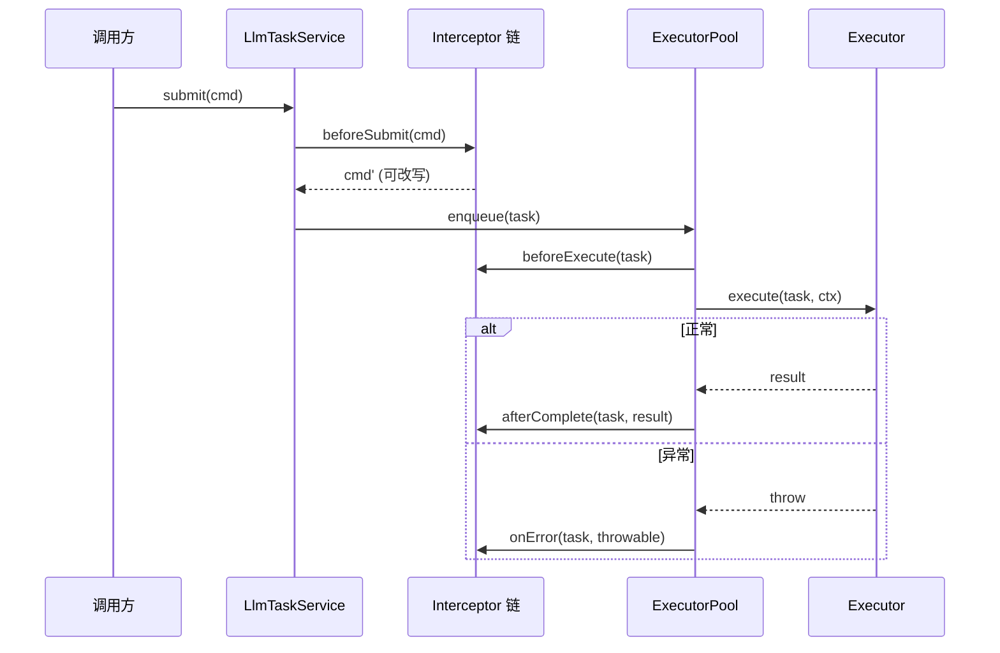

# 技术方案设计文档

## 变更记录

| 版本 | 日期 | 修改人 | 变更内容摘要 |
|------|------|--------|--------------|
| v1 | 2026-05-25 | zhangkai | 初始版本，DB write-through + 内存热缓存 + 事件双写 + 断线重连 + 重启恢复 |
| v2 | 2026-05-25 | zhangkai | 升级为可插拔独立模块：Maven 模块拆分（core/storage-jpa/spring-boot-starter/web）+ 6 个 SPI 扩展点 + 自动装配 + 默认实现可替换矩阵 |

---

## 1. 目标与边界

- **要解决的问题**：
  1. 任务状态只在 `ConcurrentHashMap`（`AgentTaskStore`、`InMemoryDevPlanTaskRepository`），进程重启全丢，违反"任务不能丢"
  2. 过程事件只在 Reactor Sinks 热流，SSE 断线后无法回放，用户刷新页面就丢失整段执行历史
  3. `AgentTask`（Agent 异步机制）和 `DevPlanTask`（DevPlan 控制平面）两套独立 manager / store / repository，重复代码、API 形态不一致
  4. 没有取消、没有重试、没有幂等、没有进度字段、没有 user_id

- **本次目标**：
  1. 统一 `LlmTask` 抽象，所有异步 LLM 任务（Agent / DevPlan / Resume / 未来的 ChatLong / Content 等）共用一套生命周期、查询、SSE 推送
  2. DB 是 source of truth，活跃任务和粗粒度事件 100% 落盘
  3. 内存做热缓存（活跃任务 + 最近终态任务），SSE 热流推送
  4. SSE 支持 `Last-Event-ID` 断线重连：先回放 DB 历史事件 → 再切到内存热流
  5. 启动时扫描 `RUNNING/QUEUED` 任务，标记为 `INTERRUPTED`，可选自动重试
  6. 支持取消（协作式）、重试（指数退避）、幂等（idempotency_key）

- **不做什么**：
  1. 分布式任务调度（一期单机，依赖 Spring `@Scheduled` + 进程内线程池；MQ / Redis Stream 留作后续扩展）
  2. token 级事件落库（数据量大、ROI 低，token 流只走内存热流，断线就放弃 token 级回放，保留迭代级回放）
  3. 不一次性删除 `AgentTask` / `DevPlanTask` 两套现有实现，而是逐步迁移（先共存、后迁库、最后下线旧实现）
  4. 不引入新的中间件（不用 Redis Stream / RabbitMQ / Kafka）

- **设计结论（一句话）**：
  抽出独立 Maven 模块 `llm-task-core` + `llm-task-storage-jpa` + `llm-task-spring-boot-starter` + `llm-task-web`，提供 6 个 SPI 扩展点（Executor / Interceptor / IdGenerator / CancellationStrategy / RetryPolicy / AuditLogger）和默认实现（JPA 持久化 / Caffeine 缓存 / Reactor 热流），通过 Spring Boot Starter 自动装配，业务方只需实现 `LlmTaskExecutor` SPI + `@LlmTaskExecutorType` 注解即可接入；llm-orchestration-platform 内的 Agent / DevPlan / Resume 是首批接入方，新表 `llm_task` + `llm_task_event`，SSE 按 `Last-Event-ID` 先 DB 回放再切热流，启动扫 INTERRUPTED 兜底。

---

## 2. 整体架构

### 2.1 分层依赖视图

> 本次新增模块 = 实线，已有模块 = 虚线，外部依赖单独成组。



**关键依赖方向**：

- `API → Application → Domain ← Infrastructure`，保持现有 DDD 分层规则
- 业务 UseCase 通过 `LlmTaskService` 提交任务，**不**直接操作 `LlmTaskRepository`
- `AgentExecutor` / `DevPlanGraphExecutor` 改为实现 domain 层 `LlmTaskExecutor` SPI，由 `LlmTaskExecutorPool` 调度
- SSE 历史事件回放：API 直接读 `JpaLlmTaskEventRepository`（跨层调用受 application 转发，避免 API 直依赖 infra）

### 2.2 Maven 模块边界视图（可插拔单元）

> 本模块设计为**可被任何 Spring Boot 项目引入的独立组件**。把 llm-orchestration-platform 内部分层重新切成 4 个独立 Maven 模块发布到内部 Nexus，未来 kai-toolbox、job-interview-log 等需要异步 LLM 任务的项目可直接依赖。



**模块发布约定**：

| 模块 | groupId:artifactId | 是否必选 | 主要内容 |
|------|---------------------|---------|---------|
| `llm-task-core` | `com.exceptioncoder:llm-task-core` | 必选 | 领域模型、SPI 接口、默认逻辑（service / pool / cache / publisher） |
| `llm-task-storage-jpa` | `com.exceptioncoder:llm-task-storage-jpa` | 可选（默认推荐） | JPA 持久化实现 + Flyway 脚本 |
| `llm-task-storage-redis` | `com.exceptioncoder:llm-task-storage-redis` | 可选（未来） | Redis Stream 持久化（分布式场景） |
| `llm-task-spring-boot-starter` | `com.exceptioncoder:llm-task-spring-boot-starter` | 必选 | 自动装配 + 配置 + 启动恢复 |
| `llm-task-web` | `com.exceptioncoder:llm-task-web` | 可选 | 统一管理 REST/SSE 端点（不需要内置 API 的项目可不引） |

**典型依赖组合**：

```xml
<!-- 一般业务项目 -->
<dependency>
    <groupId>com.exceptioncoder</groupId>
    <artifactId>llm-task-spring-boot-starter</artifactId>
</dependency>
<!-- 自动传递依赖 core + storage-jpa；如需 REST 接入再加 -->
<dependency>
    <groupId>com.exceptioncoder</groupId>
    <artifactId>llm-task-web</artifactId>
</dependency>
```

---

## 3. 模块拆分与职责

### 3.1 LlmTask（domain 实体）

- **定位**：所有异步 LLM 任务的统一生命周期载体
- **职责**：
  - 承载任务元数据（task_id / task_type / biz_ref / user_id / request_json / status / progress / retry_count / timeout / idempotency_key / last_event_seq）
  - 定义状态机：`PENDING → QUEUED → RUNNING → COMPLETED | FAILED | CANCELLED | TIMED_OUT | INTERRUPTED`
  - 提供 `withStatus()` / `withProgress()` / `incrementRetry()` 等不可变变换方法
- **关键设计点**：
  - record + Builder，与现有 `AgentTask` / `DevPlanTask` 风格一致
  - 状态机迁移在领域层校验，违法迁移抛 `IllegalTaskStateException`
  - `task_id` 格式：`{task_type_short}-{yyyyMMdd}-{seq}`（如 `ag-20260525-001`、`dp-20260525-007`）

### 3.2 LlmTaskEvent（domain 实体）

- **定位**：任务执行过程中的离散事件，可持久化、可回放
- **职责**：
  - 承载粗粒度过程事件（`STARTED / ITERATION / TOOL_CALL / TOOL_RESULT / PROGRESS / COMPLETE / ERROR / TIMEOUT / CANCELLED`）
  - 通过 `(task_id, event_seq)` 唯一定位，event_seq 任务内单调递增从 1 起
- **关键设计点**：
  - 只承载粗粒度事件，**token 流不入此实体**（token 走 `Flux<String>` 独立通道，断线不可回放）
  - `event_data` 为 JSON 文本，由发布方自行决定载荷结构
  - 事件不可变，永不更新，只追加

### 3.3 LlmTaskRepository / LlmTaskEventRepository（domain 接口）

- **定位**：任务与事件的持久化访问契约
- **职责**：
  - `LlmTaskRepository`：`save / findById / updateStatus / incrementRetry / requestCancel / findInterrupted / findByIdempotencyKey`
  - `LlmTaskEventRepository`：`appendBatch / findByTaskId / findByTaskIdAfterSeq / countByTaskId`
- **关键设计点**：
  - `updateStatus` 必须用乐观锁（`WHERE task_id=? AND status IN (?)`）保证状态机不被并发覆盖
  - `findByTaskIdAfterSeq(taskId, lastEventSeq)` 是断线重连的核心读接口
  - 事件追加用 batch insert（每秒一批 / 攒满 50 条触发）

### 3.4 LlmTaskService（application 外观）

- **定位**：业务方提交、查询、取消、订阅任务的唯一入口
- **职责**：
  - `submit(LlmTaskSubmitCommand)`：幂等检查 → 并发槽位 → 持久化 PENDING → 异步执行 → 立即返回
  - `getTask(taskId)`：先查内存缓存，未命中查 DB
  - `cancel(taskId)`：写 `cancellation_requested=1`，executor 协作式响应
  - `streamEvents(taskId, lastEventSeq)`：DB 历史回放 → 切热流，返回 `Flux<LlmTaskEvent>`
- **上游**：API Controllers、业务 UseCases
- **下游**：`LlmTaskRepository`、`LlmTaskEventRepository`、`LlmTaskEventPublisher`、`LlmTaskExecutorPool`
- **关键设计点**：
  - 提交流程的"持久化 PENDING"必须在线程池 submit 之前完成（write-through 保证）
  - 内存缓存与 DB 写一致性：所有写操作先写 DB，DB 成功后才更新缓存
  - SSE 流的 DB → 热流切换使用 `Flux.concat(historical, live).distinct(seq)`，避免重复事件

### 3.5 LlmTaskExecutor SPI（domain）

- **定位**：业务方注入到任务调度的执行契约
- **职责**：
  - 定义 `execute(LlmTask task, LlmTaskContext ctx)` 方法
  - `ctx` 提供 `publish(event)` / `checkCancellation()` / `updateProgress(percent, step)` 工具
  - 实现方：`AgentExecutor`、`DevPlanGraphExecutor`、未来的 `ResumeOptimizeExecutor` 等
- **关键设计点**：
  - `checkCancellation()` 在每个长操作前主动调用，触发 `TaskCancelledException`
  - `publish()` 由 `LlmTaskEventPublisher` 转发，业务方无需感知 DB / 热流细节
  - SPI 注册：实现类标注 `@LlmTaskExecutorType("AGENT")`，由 `LlmTaskExecutorRegistry` 按 `task_type` 路由

### 3.6 LlmTaskCache（infrastructure）

- **定位**：活跃任务 + 最近终态任务的内存热缓存
- **职责**：
  - 维护 `Map<taskId, LlmTask>` 的 LRU 缓存（基于 Caffeine）
  - 活跃任务（status IN PENDING/QUEUED/RUNNING）永驻
  - 终态任务（COMPLETED/FAILED/CANCELLED/TIMED_OUT/INTERRUPTED）保留 `task.retain-minutes`（默认 30 分钟）后自动淘汰
  - 提供 `getActiveSnapshot()` 用于监控
- **关键设计点**：
  - **DB 写成功后再 put cache，DB 失败不污染缓存**
  - 启动时不主动加载，按需 lazy load
  - 缓存 miss → 查 DB → put 回缓存

### 3.7 LlmTaskEventPublisher / ReactorLlmTaskEventPublisher

- **定位**：事件双写 —— 热流即时推送 + 异步批量落盘
- **职责**：
  - `publish(taskId, event)`：原子递增 `last_event_seq` → 投递 Reactor Sinks 热流 → 追加到异步落盘队列
  - `subscribe(taskId)`：返回 `Flux<LlmTaskEvent>` 热流（订阅时点之后的事件）
  - 后台 worker 定时批量 flush 落盘队列到 `llm_task_event` 表
- **关键设计点**：
  - **event_seq 必须串行化分配**：用 DB 行锁 `UPDATE llm_task SET last_event_seq=last_event_seq+1 WHERE task_id=? RETURNING last_event_seq`（MySQL 8 用 `SELECT ... FOR UPDATE` + `UPDATE`，或加 application 内部 task 维度锁）
  - 热流推送失败不影响落盘；落盘失败记 error 日志 + metrics 告警，但任务执行继续（事件丢失视为可容忍降级）
  - 终态事件（COMPLETE/ERROR/TIMEOUT/CANCELLED）**同步落盘**，不进异步队列，确保终态可追溯

### 3.8 LlmTaskExecutorPool

- **定位**：异步执行调度器
- **职责**：
  - 维护按 `task_type` 分组的 `ExecutorService`（不同业务隔离线程池）
  - 维护按 `task_type` 分组的 `Semaphore`（并发槽位）
  - 执行时启动超时 watcher 线程，超时自动 `failTask(TIMED_OUT)` + interrupt 线程
- **关键设计点**：
  - 线程池配置走 `application.yml`：`llm.task.executors.{type}.{poolSize,maxConcurrency,queueCapacity}`
  - 拒绝策略 = `CALLER_RUNS_POLICY` 退化为同步执行 + 告警，避免任务丢失
  - 超时 watcher 用守护线程，进程退出不阻塞

### 3.9 LlmTaskRestoreRunner

- **定位**：进程启动时的任务恢复机制
- **职责**：
  - 实现 `ApplicationRunner`，启动时扫描 `status IN (QUEUED, RUNNING)` 的任务
  - 全部标记为 `INTERRUPTED`，写一条 `event_type=INTERRUPTED` 事件
  - 根据 `retry_policy`（任务可选携带）决定是否自动重试：未达 `max_retries` 则重置为 `PENDING` 重新调度
- **关键设计点**：
  - 恢复阶段 SSE 接入仍可读出 INTERRUPTED 事件，前端可识别"上次执行被中断"
  - 默认不自动重试（避免重复消费副作用），由调用方在提交时显式声明 `max_retries`
  - 扫描带 `LIMIT 1000` 分页，避免一次性加载过多

---

## 4. 关键交互

### 4.1 任务提交与执行

> 触发：业务 UseCase 调用 `LlmTaskService.submit()`
> 参与方：UseCase / Service / Repository / Cache / Pool / Executor / Publisher / DB



### 4.2 SSE 接入与断线重连

> 触发：前端首次 `GET /tasks/{taskId}/stream` 或断线后带 `Last-Event-ID` 重连
> 参与方：前端 / API / Service / EventRepo / Publisher



### 4.3 重启恢复

> 触发：JVM 启动，`ApplicationRunner` 执行
> 参与方：Runner / Repo / Publisher



### 4.4 取消

> 触发：用户在前端点击取消，调用 `POST /tasks/{taskId}/cancel`
> 参与方：API / Service / Repo / Executor



---

## 5. 核心业务规则

| 规则 | 说明 |
|------|------|
| R1 write-through | 任务状态变更必须先写 DB 成功，再更新内存缓存；DB 失败时缓存保持旧值，调用方收到异常 |
| R2 状态机单向 | 状态迁移合法集：`PENDING→QUEUED→RUNNING→{COMPLETED, FAILED, CANCELLED, TIMED_OUT}`、`RUNNING→INTERRUPTED`（仅重启恢复路径）；任何反向迁移抛 `IllegalTaskStateException` |
| R3 事件序号 | `event_seq` 任务内单调递增从 1 起，由 `UPDATE llm_task SET last_event_seq=last_event_seq+1 RETURNING` 串行分配；`(task_id, event_seq)` 唯一索引保证不重复 |
| R4 重启恢复 | 启动扫 `status IN (QUEUED, RUNNING)` 的任务，写 INTERRUPTED 事件；按 `max_retries` 决定是否自动重新调度 |
| R5 协作式取消 | 取消是写标志位 + executor 主动 `checkCancellation()`，**不**用 `Thread.interrupt()` 强制中断；executor 必须在每个长操作前调用 checkpoint |
| R6 缓存淘汰 | 活跃任务永驻；终态任务保留 `task.retain-minutes`（默认 30）后从 cache 淘汰；DB 保留 `task.retain-days`（默认 30 天）后由 `@Scheduled` 清理 |
| R7 事件双写策略 | 过程事件异步批量落盘（攒满 50 条 / 每秒一批触发 flush）；终态事件（COMPLETE / ERROR / TIMEOUT / CANCELLED）同步落盘 |
| R8 事件粒度 | 入库的是粗粒度事件（迭代、工具调用、进度、终态）；token 流不入库，只走独立 `Flux<String>` 通道，断线放弃 token 回放 |
| R9 业务侧禁直连 Repository | 业务 UseCase 不允许直接注入 `LlmTaskRepository` / `LlmTaskEventRepository`，必须通过 `LlmTaskService` 提交与查询 |
| R10 幂等 | 提交时携带 `idempotency_key`，重复提交返回已存在任务；不携带则不去重 |

---

## 6. 编码落点

> **一期落地位置**：以 llm-orchestration-platform 现有多模块 Maven 项目为容器，包路径以 `com.exceptioncoder.llm.{domain,application,infrastructure,api}.task` 为根，与既有代码同库共存，开发节奏最快。
>
> **未来抽取映射**（参见 10.7）：当 SPI 稳定后，按以下规则迁出到独立 Git 仓库的 4 个 Maven 模块：
>
> | 当前包路径前缀 | 抽取后归属 |
> |--------------|----------|
> | `llm-domain/.../domain/task/model + repository + service(SPI) + exception` | `llm-task-core` |
> | `llm-application/.../application/task` + `llm-infrastructure/.../infrastructure/task/{cache,publisher,pool}` | `llm-task-core` |
> | `llm-infrastructure/.../infrastructure/task/repository`（JPA 部分） | `llm-task-storage-jpa` |
> | `llm-infrastructure/.../infrastructure/task/restore` + 启动自动装配类 | `llm-task-spring-boot-starter` |
> | `llm-api/.../api/controller/management/LlmTaskController` + DTO | `llm-task-web` |
>
> 包根名抽取后改为 `com.exceptioncoder.llmtask.{core,storage.jpa,starter,web}`，**保持与 llm-orchestration-platform 业务包零交叉**。

```text
llm-domain/src/main/java/com/exceptioncoder/llm/domain/task/
├── model/
│   ├── LlmTask.java                            [新增] 统一任务实体 record + Builder + 状态机校验
│   ├── LlmTaskStatus.java                      [新增] 枚举：PENDING/QUEUED/RUNNING/COMPLETED/FAILED/CANCELLED/TIMED_OUT/INTERRUPTED
│   ├── LlmTaskEvent.java                       [新增] 事件实体 record
│   ├── LlmTaskEventType.java                   [新增] 枚举：STARTED/ITERATION/TOOL_CALL/TOOL_RESULT/PROGRESS/COMPLETE/ERROR/TIMEOUT/CANCELLED/INTERRUPTED
│   ├── LlmTaskSubmitCommand.java               [新增] 提交命令对象（task_type/biz_ref/user_id/request_json/idempotency_key/max_retries/timeout）
│   └── LlmTaskContext.java                     [新增] 执行上下文（publish/checkCancellation/updateProgress）
├── repository/
│   ├── LlmTaskRepository.java                  [新增] 任务仓储接口
│   └── LlmTaskEventRepository.java             [新增] 事件仓储接口
├── service/
│   └── LlmTaskEventPublisher.java              [新增] 事件总线接口
├── spi/                                        [新增] 6 个对外扩展点（v2）
│   ├── LlmTaskExecutor.java                    [新增] SPI 1 - 业务执行（必选）
│   ├── LlmTaskExecutorRegistry.java            [新增] task_type → executor 路由
│   ├── LlmTaskExecutorType.java                [新增] @LlmTaskExecutorType 注解
│   ├── LlmTaskInterceptor.java                 [新增] SPI 2 - beforeSubmit/beforeExecute/afterComplete/onError 钩子
│   ├── LlmTaskIdGenerator.java                 [新增] SPI 3 - task_id 生成策略
│   ├── LlmTaskCancellationStrategy.java        [新增] SPI 4 - 取消时机判定
│   ├── LlmTaskRetryPolicy.java                 [新增] SPI 5 - 失败重试策略
│   └── LlmTaskAuditLogger.java                 [新增] SPI 6 - 审计日志写入
└── exception/
    ├── IllegalTaskStateException.java          [新增]
    ├── TaskNotFoundException.java              [新增]
    ├── TaskCancelledException.java             [新增]
    └── TaskTimeoutException.java               [新增]

llm-application/src/main/java/com/exceptioncoder/llm/application/task/
├── LlmTaskService.java                         [新增] 统一外观（submit/getTask/cancel/streamEvents/listTasks）
└── LlmTaskQueryService.java                    [新增] 分页查询、按用户/类型/状态过滤

llm-infrastructure/src/main/java/com/exceptioncoder/llm/infrastructure/task/
├── repository/
│   ├── JpaLlmTaskRepository.java               [新增] JPA 实现 + 乐观锁更新
│   ├── JpaLlmTaskEventRepository.java          [新增] JPA 实现 + 批量 insert
│   ├── entity/
│   │   ├── LlmTaskEntity.java                  [新增] JPA 实体
│   │   └── LlmTaskEventEntity.java             [新增] JPA 实体
│   └── jpa/
│       ├── LlmTaskJpaSpringRepository.java     [新增] Spring Data 接口
│       └── LlmTaskEventJpaSpringRepository.java [新增] Spring Data 接口
├── cache/
│   └── LlmTaskCache.java                       [新增] Caffeine LRU + 活跃永驻 + 终态过期
├── publisher/
│   ├── ReactorLlmTaskEventPublisher.java       [新增] Sinks 热流 + 批量落盘 worker
│   └── EventFlushWorker.java                   [新增] 后台 flush 调度（@Scheduled）
├── pool/
│   ├── LlmTaskExecutorPool.java                [新增] 按 task_type 分组线程池 + Semaphore
│   ├── LlmTaskTimeoutWatcher.java              [新增] 超时守护
│   └── LlmTaskAsyncConfig.java                 [新增] 配置 + Bean 装配
├── spi/                                        [新增] 6 个 SPI 的默认实现（v2）
│   ├── DefaultTaskIdGenerator.java             [新增] {type_short}-{yyyyMMdd}-{seq}
│   ├── CooperativeCancellationStrategy.java    [新增] 写标志位 + executor 主动检查
│   ├── ExponentialBackoffRetryPolicy.java      [新增] 指数退避，默认不重试
│   ├── Slf4jAuditLogger.java                   [新增] SLF4J llm.task.audit logger
│   └── LlmTaskInterceptorChain.java            [新增] 多 Interceptor 链式组合
├── autoconfigure/                              [新增] Spring Boot 自动装配（v2）
│   ├── LlmTaskAutoConfiguration.java           [新增] 主自动装配类
│   ├── LlmTaskWebAutoConfiguration.java        [新增] Web 端点装配（独立条件）
│   ├── LlmTaskProperties.java                  [新增] @ConfigurationProperties("llm.task")
│   ├── LlmTaskCoreBeansRegistrar.java          [新增] Service/Pool/Publisher/Cache Bean 注册
│   ├── LlmTaskInterceptorRegistrar.java        [新增] 收集 Interceptor 链
│   └── LlmTaskExecutorRegistrar.java           [新增] 扫描 @LlmTaskExecutorType 注解
└── restore/
    ├── LlmTaskRestoreRunner.java               [新增] ApplicationRunner 启动恢复
    └── LlmTaskCleanupScheduler.java            [新增] @Scheduled 定时清理终态过期任务

llm-infrastructure/src/main/resources/META-INF/spring/
└── org.springframework.boot.autoconfigure.AutoConfiguration.imports
    [新增] 列出 LlmTaskAutoConfiguration / LlmTaskWebAutoConfiguration 两行，启用自动装配

llm-api/src/main/java/com/exceptioncoder/llm/api/controller/management/
├── LlmTaskController.java                      [新增] GET /api/v1/tasks/{taskId} / GET .../events / GET .../stream / POST .../cancel / GET /api/v1/tasks (listing)
└── dto/
    ├── LlmTaskStatusResponse.java              [新增]
    ├── LlmTaskEventResponse.java               [新增]
    └── LlmTaskListResponse.java                [新增]

# 现有业务方改造（实现 LlmTaskExecutor SPI）
llm-infrastructure/src/main/java/com/exceptioncoder/llm/infrastructure/agent/
├── AgentExecutor 现有                          [修改] 改为实现 LlmTaskExecutor，task_type=AGENT
└── task/AgentTaskManagerImpl.java              [修改] 改造为薄壳，内部委托 LlmTaskService
                                                       （过渡期可双轨保留，最终下线）

llm-infrastructure/src/main/java/com/exceptioncoder/llm/infrastructure/devplan/
├── control/DevPlanTaskManagerImpl.java         [修改] 改造为薄壳，委托 LlmTaskService
└── graph/DevPlanGraphExecutor.java             [修改] 改为实现 LlmTaskExecutor，task_type=DEVPLAN

llm-starter/src/main/resources/
├── application.yml                             [修改] 新增 llm.task.* 配置块
├── config/dev/datasource.yml                   [修改] 确认 MySQL 表初始化路径
└── db/migration/V20260525__llm_task.sql        [新增] Flyway 迁移脚本（建表 + 索引）
```

### 调用关系说明

- `LlmTaskController` → `LlmTaskService` → `LlmTaskRepository` (`JpaLlmTaskRepository` + `LlmTaskCache` 装饰)：所有状态读写经 cache，cache miss 回源 DB
- `LlmTaskController#stream` → `LlmTaskService#streamEvents` → `LlmTaskEventRepository#findByTaskIdAfterSeq` + `LlmTaskEventPublisher#subscribe`：DB 历史 ⨁ 热流，按 seq 去重
- 业务 UseCase → `LlmTaskService#submit` → `LlmTaskExecutorPool#submit` → 异步线程池 → `LlmTaskExecutor#execute` → `LlmTaskContext#publish` → `LlmTaskEventPublisher`：业务无需感知持久化细节

---

## 7. 数据与依赖变更

| 类型 | 是否变化 | 说明 |
|------|----------|------|
| 数据库表 / 字段 / 索引 | **有** | 新增 `llm_task`（17 字段，含 idempotency_key UK / status+created_at idx / user_id+status idx）+ `llm_task_event`（5 字段，含 task_id+event_seq UK）；现有 `agent_task` / `dev_plan_task` 不删除，过渡期共存 |
| DTO / VO / 枚举 | **有** | 新增 `LlmTaskStatus` / `LlmTaskEventType` 枚举；API 层新增 4 个 Response DTO；现有 `AgentTask` / `DevPlanTask` 保留过渡 |
| 下游接口 / 外部依赖 | **无新增** | 仍用 Spring Data JPA + Reactor Core，已存在依赖 |
| 缓存 / 消息 / 锁 / 事务 | **有** | 新增 Caffeine 缓存（已在 Spring AI 依赖中传递引入，无需新增 pom）；`UPDATE llm_task SET last_event_seq=...` 用行锁串行化 seq 分配；事件批量落盘用进程内异步队列，不引入 MQ |

### 表结构

```sql
CREATE TABLE llm_task (
    id BIGINT PRIMARY KEY AUTO_INCREMENT,
    task_id VARCHAR(64) NOT NULL UNIQUE COMMENT '业务可读 ID',
    task_type VARCHAR(32) NOT NULL COMMENT 'AGENT/DEVPLAN/CHAT/RESUME/...',
    biz_ref VARCHAR(128) COMMENT '业务关联键，如 agent_id/project_path',
    status VARCHAR(16) NOT NULL COMMENT 'PENDING/QUEUED/RUNNING/COMPLETED/FAILED/CANCELLED/TIMED_OUT/INTERRUPTED',
    user_id VARCHAR(64),
    request_json TEXT COMMENT '请求快照，用于重试与审计',
    result_json LONGTEXT COMMENT '执行结果',
    error_message TEXT,
    progress INT DEFAULT 0 COMMENT '0~100',
    current_step VARCHAR(128),
    retry_count INT NOT NULL DEFAULT 0,
    max_retries INT NOT NULL DEFAULT 0,
    timeout_seconds INT NOT NULL DEFAULT 600,
    cancellation_requested TINYINT NOT NULL DEFAULT 0,
    last_event_seq BIGINT NOT NULL DEFAULT 0,
    idempotency_key VARCHAR(128),
    trace_id VARCHAR(64),
    created_at DATETIME NOT NULL,
    started_at DATETIME,
    finished_at DATETIME,
    expires_at DATETIME,
    UNIQUE KEY uk_idempotency (idempotency_key),
    KEY idx_status_created (status, created_at),
    KEY idx_user_status (user_id, status, created_at),
    KEY idx_type_status (task_type, status)
) COMMENT 'LLM 异步任务主表';

CREATE TABLE llm_task_event (
    id BIGINT PRIMARY KEY AUTO_INCREMENT,
    task_id VARCHAR(64) NOT NULL,
    event_seq BIGINT NOT NULL,
    event_type VARCHAR(32) NOT NULL,
    event_data LONGTEXT,
    created_at DATETIME NOT NULL,
    UNIQUE KEY uk_task_seq (task_id, event_seq),
    KEY idx_task_created (task_id, created_at)
) COMMENT 'LLM 任务过程事件流';
```

### 配置项

```yaml
llm:
  task:
    retain-minutes: 30                # 内存终态缓存保留时长
    retain-days: 30                   # DB 终态保留天数（清理任务）
    event:
      batch-size: 50                  # 异步落盘批量阈值
      flush-interval-ms: 1000         # 异步落盘时间阈值
    executors:
      AGENT:
        pool-size: 8
        max-concurrency: 16
        queue-capacity: 64
      DEVPLAN:
        pool-size: 4
        max-concurrency: 4
        queue-capacity: 16
      RESUME:
        pool-size: 4
        max-concurrency: 8
        queue-capacity: 32
    restore:
      auto-retry: false               # 默认不自动重试 INTERRUPTED
```

---

## 8. 风险与待确认

| 风险 / 待确认点 | 影响 | 处理方式 |
|----------------|------|----------|
| 事件落盘延迟丢失 | 进程崩溃时未 flush 的批量事件丢失（最多 50 条 / 1 秒） | 终态事件强制同步落盘（R7）；过程事件丢失视为可容忍降级，可观测性靠 metrics 暴露 |
| seq 分配的串行化瓶颈 | `UPDATE ... SET last_event_seq` 行锁可能成为高 QPS 瓶颈 | 一期单机 QPS 远不及 MySQL 行锁极限（约 5k/s/行），可接受；后续若有压力可改为应用层 task 维度 ReentrantLock + 批量预分配 seq 段 |
| AgentTask / DevPlanTask 迁移成本 | 现有两套实现要在过渡期与新 LlmTask 双轨运行 | 分两阶段：阶段一新写入只走 LlmTask，旧任务读旧表；阶段二脚本迁移历史 + 下线旧表。先确保新代码路径稳定 |
| Caffeine 内存占用 | 活跃任务永驻 + 事件不入缓存（事件直接走 DB / 热流）情况下风险低；最坏假设 1000 个活跃任务 x 10KB = 10MB，无压力 | 监控暴露 cache size，设上限 5000 条触发告警 |
| `idempotency_key` 唯一约束并发提交 | 高并发同 key 提交，DB 抛 `DataIntegrityViolationException` | catch 后转为查询返回已存在任务，保持幂等语义 |
| 取消请求与任务完成的竞态 | 任务正好完成时收到取消请求 | `requestCancel` 不改 status，executor 在 checkpoint 主动判断；任务已 COMPLETED 时再取消视为 no-op |
| 启动恢复扫描慢 | 任务量大时 `findInterrupted` 扫描慢 | 分页 LIMIT 1000 + 状态索引 `idx_status_created`；如有积压可异步后台扫，不阻塞启动 |

---

## 9. 验证要点

- **正常路径**：
  - 提交 AGENT 任务 → 立即返回 PENDING → 后台执行 → SSE 收到 ITERATION/TOOL_CALL/COMPLETE → DB 状态 COMPLETED + 事件流完整
  - 提交 DEVPLAN 任务 → 同上，验证 task_type 路由正确
  - 携带 `idempotency_key` 重复提交 → 第二次返回同一 task_id

- **异常路径**：
  - 任务执行抛业务异常 → DB 状态 FAILED + error_message 落库 + ERROR 事件入库
  - 任务超时 → 状态 TIMED_OUT + TIMEOUT 事件 + watcher 释放并发槽位
  - 提交时并发槽位已满 → 立即返回 429（HTTP），不阻塞调用方
  - DB 写入失败 → 抛异常，cache 不污染
  - 事件批量 flush 失败 → 记日志 + metrics，不中断任务

- **边界条件**：
  - SSE 客户端带 `Last-Event-ID=0`（首次接入）：从 seq=1 开始全量回放
  - `Last-Event-ID > last_event_seq`（客户端超前，理论不应发生）：返回空历史，直接接热流
  - 任务完成后客户端再次接入 SSE：终态事件回放完毕 → 流自动 complete
  - 取消已是终态的任务：返回 409 Conflict，不修改 DB
  - 重启时无 INTERRUPTED 任务：runner 静默通过

- **回归范围**：
  - 现有 `POST /api/v1/agents/{agentId}/execute` 行为不变（内部走新 LlmTaskService）
  - 现有 `POST /api/v1/dev-plan/submit` 行为不变
  - SSE 流式响应字段名向后兼容（`event:iteration data:{...}` 格式保持）
  - 性能：单任务提交 P99 < 50ms（落盘 + 槽位获取）；SSE 历史回放 100 条事件 < 200ms

---

## 10. 可插拔架构与模块化设计（v2 新增）

> 本节定义本模块作为**独立可复用组件**的设计契约：业务方接入只需 1 个 SPI + 1 个注解 + 1 段配置；默认实现可全部替换；跨项目复用零侵入。

### 10.1 SPI 扩展点矩阵

模块对外暴露 **6 个 SPI 接口**，业务方按需实现。默认实现都在 `llm-task-core` 内，通过 Spring `@ConditionalOnMissingBean` 允许覆盖。

| SPI | 包路径 | 必选 | 职责 | 默认实现 |
|-----|--------|------|------|---------|
| `LlmTaskExecutor` | `core.spi.LlmTaskExecutor` | **必选** | 业务实际执行逻辑；按 `task_type` 路由 | 无（业务必须实现至少一个） |
| `LlmTaskInterceptor` | `core.spi.LlmTaskInterceptor` | 可选 | 提交前 / 启动前 / 完成后 / 异常前的横切；可链式注册多个 | 无（默认空链） |
| `LlmTaskIdGenerator` | `core.spi.LlmTaskIdGenerator` | 可选 | 生成 task_id 字符串 | `DefaultTaskIdGenerator`：`{type_short}-{yyyyMMdd}-{seq}` |
| `LlmTaskCancellationStrategy` | `core.spi.LlmTaskCancellationStrategy` | 可选 | 决定何时 / 是否允许取消 | `CooperativeCancellationStrategy`：仅写标志位，executor 主动检查 |
| `LlmTaskRetryPolicy` | `core.spi.LlmTaskRetryPolicy` | 可选 | 失败后是否重试 + 重试延迟 | `ExponentialBackoffRetryPolicy`：默认不开启，需 `max_retries>0` |
| `LlmTaskAuditLogger` | `core.spi.LlmTaskAuditLogger` | 可选 | 关键节点的审计日志写入（合规场景） | `Slf4jAuditLogger`：写 SLF4J `llm.task.audit` logger |

**Interceptor 钩子时序**：



### 10.2 默认实现可替换矩阵

| 抽象 | 默认实现 | 替换条件 | 典型替换场景 |
|------|---------|----------|-------------|
| `LlmTaskRepository` | `JpaLlmTaskRepository`（`storage-jpa` 模块） | 业务方定义自己的 `@Primary LlmTaskRepository` Bean | 用 MongoDB / DynamoDB；本地嵌入式 H2 测试 |
| `LlmTaskEventRepository` | `JpaLlmTaskEventRepository` | 同上 | 大数据量场景换 ClickHouse |
| `LlmTaskEventPublisher` | `ReactorLlmTaskEventPublisher`（Sinks 热流 + 异步批量落盘） | 业务方提供 `@Primary` Bean | 接入 Kafka / RabbitMQ 跨进程广播 |
| `LlmTaskCache` | `CaffeineLlmTaskCache` | 同上 | 集群部署换 Redis 共享缓存 |
| `LlmTaskExecutorPool` | `ThreadPerTypeExecutorPool` | 同上 | 用 virtual thread (JDK 21+) / 接入 Spring Cloud TaskExecutor |
| `LlmTaskIdGenerator` | `DefaultTaskIdGenerator` | 提供自己的 Bean | 分布式雪花 ID / 业务编码前缀 |

### 10.3 注解驱动注册

业务方实现 SPI 后，仅需注解声明：

```java
@Component
@LlmTaskExecutorType("AGENT")
public class AgentExecutor implements LlmTaskExecutor {
    @Override
    public String execute(LlmTask task, LlmTaskContext ctx) {
        ctx.publish(LlmTaskEventType.STARTED, "{...}");
        // 业务逻辑
        ctx.checkCancellation();
        ctx.updateProgress(50, "执行第一阶段");
        return finalOutputJson;
    }
}
```

启动时 `LlmTaskExecutorRegistry` 扫描所有 `@LlmTaskExecutorType` 注解的 Bean，建立 `task_type → executor` 路由表。同 type 多个实现抛 `DuplicateExecutorTypeException`。

### 10.4 Spring Boot 自动装配

`llm-task-spring-boot-starter` 模块 `META-INF/spring/org.springframework.boot.autoconfigure.AutoConfiguration.imports`：

```
com.exceptioncoder.llmtask.starter.LlmTaskAutoConfiguration
com.exceptioncoder.llmtask.starter.LlmTaskWebAutoConfiguration
```

`LlmTaskAutoConfiguration` 装配条件：

```java
@AutoConfiguration
@ConditionalOnProperty(prefix = "llm.task", name = "enabled", havingValue = "true", matchIfMissing = true)
@EnableConfigurationProperties(LlmTaskProperties.class)
@Import({
    LlmTaskCoreBeansRegistrar.class,        // 注册默认 Service / Pool / Publisher / Cache
    LlmTaskInterceptorRegistrar.class,       // 收集所有 LlmTaskInterceptor 形成链
    LlmTaskExecutorRegistrar.class          // 扫描 @LlmTaskExecutorType 建路由表
})
public class LlmTaskAutoConfiguration { ... }
```

每个 Bean 都用 `@ConditionalOnMissingBean(XxxRepository.class)` 保护，允许业务方完全替换。

### 10.5 业务方接入步骤（5 步零侵入）

```text
Step 1：pom 引入
  <dependency>llm-task-spring-boot-starter</dependency>
  <dependency>llm-task-web</dependency>  <!-- 需要内置 REST 才引 -->

Step 2：实现 LlmTaskExecutor
  @Component
  @LlmTaskExecutorType("RESUME_OPTIMIZE")
  public class ResumeOptimizeExecutor implements LlmTaskExecutor { ... }

Step 3：application.yml 配置线程池
  llm:
    task:
      executors:
        RESUME_OPTIMIZE:
          pool-size: 4
          max-concurrency: 8
          queue-capacity: 32

Step 4：提交任务
  @Autowired LlmTaskService llmTaskService;
  LlmTask task = llmTaskService.submit(
      LlmTaskSubmitCommand.builder()
          .taskType("RESUME_OPTIMIZE")
          .bizRef(resumeId)
          .userId(currentUserId)
          .requestJson(...)
          .timeoutSeconds(300)
          .idempotencyKey(...)
          .build()
  );

Step 5：前端订阅 SSE（开箱即用，无需业务方再写 Controller）
  GET /api/v1/tasks/{taskId}/stream
  Last-Event-ID: 0
```

### 10.6 跨项目复用能力

- **零绑定 LLM Provider**：本模块不依赖 Spring AI / Qdrant / 任何 LLM SDK，纯任务调度框架
- **零绑定业务领域**：不预设 Agent / Graph / Chat 等概念，由 `task_type` 字符串 + `requestJson` 任意 JSON 承载
- **零绑定存储**：JPA 是默认推荐，业务可换任何 KV / 文档库 / Stream
- **零绑定 Web 框架**：核心模块不依赖 spring-web，web 端点拆到独立 `llm-task-web` 模块

未来 kai-toolbox（如视频转码异步任务）、job-interview-log（如题目生成）可直接复用，只需实现自己的 `LlmTaskExecutor`。

### 10.7 与 llm-orchestration-platform 的当前关系

- 一期模块物理位置仍在 llm-orchestration-platform 多模块 Maven 项目内（`llm-task-core` 等作为新的子模块加入），保持开发节奏快
- 二期评估稳定后，**抽取到独立 Git 仓库** `llm-task-management/` 发布到内部 Nexus，本平台改为远程依赖
- 抽取前必须保证：6 个 SPI 接口稳定 1 个迭代周期、零反向依赖（grep 验证 `import com.exceptioncoder.llm.*` 在 `llm-task-*` 模块内出现 = 0）

---

## 关联文档

- 前序设计：`通用智能体架构/Agent异步执行机制/Agent异步执行机制-current.md`（一期内存版本，本设计是其"后续扩展：执行结果落库 + 断线重连"）
- 上游架构：`通用智能体架构/通用智能体架构-current.md`
- 接口契约：`llm-task-management-api-current.md`（同目录）
- 编码摘要：`llm-task-management-coding.md`（同目录，编码前生成）
