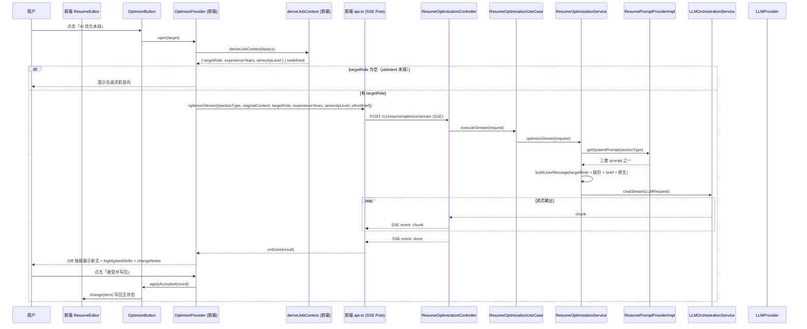
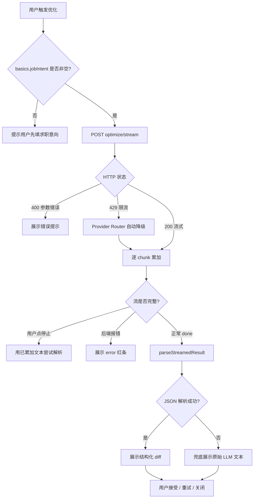
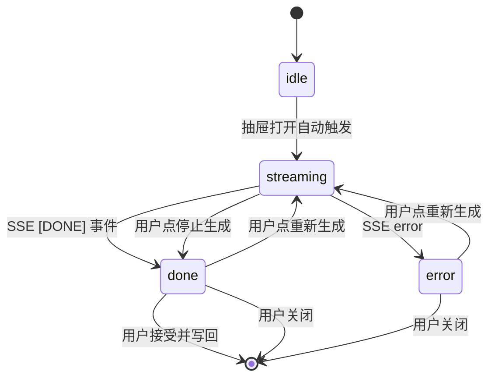
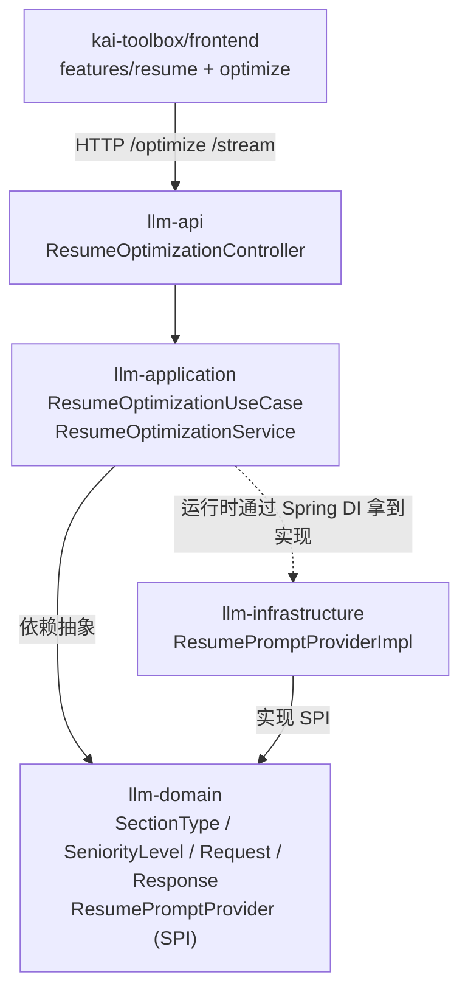

# 功能设计文档

## 1. 基本信息

| 项目 | 内容 |
|---|---|
| 功能名称 | 个人简历优化智能体（Resume Optimization Agent） |
| 所属系统 | LLM Orchestration Platform |
| 所属模块 | llm-domain / llm-application / llm-infrastructure / llm-api |
| 上游消费方 | kai-toolbox/frontend `features/resume` 模块 |
| 需求来源 | 个人求职简历工具内置 AI 优化能力 |
| 负责人 | zhangkai |
| 版本号 | v1.1.0 |
| 创建日期 | 2026-05-22 |

---

## 2. 背景与目标

- **背景**：kai-toolbox 上线了在线个人简历编辑器，工作经历 / 项目经历 / 个人优势三大段落需要 AI 改写质量。
- **v1.0 的问题**：要求用户每次粘贴 JD 才能优化，体验割裂；JD 也未必是用户当下手头有的（同一份简历投十家公司，每次都填 JD 太重）。
- **目标**：去掉 JD 输入，改写定位完全由「简历自带的求职意向 + 工作年限派生的能力层级」驱动。让一次配置覆盖大多数投递场景。
- **设计边界**：
  - 仅做"逐段优化"路径（用户在每条工作经历 / 项目经历 / 个人优势上独立触发），不做整篇 Graph 编排
  - 不持久化优化历史
  - 不引入 Tool / Graph 框架，直接 ChatModel 单步调用
  - 后端强制要求 `targetRole` 非空，`experienceYears / seniorityLevel` 可选（缺失时 LLM 仅靠岗位推断深度）

---

## 3. 功能范围

### 3.1 本次包含

- 三类 section 的 AI 改写能力：`WORK` / `PROJECT` / `SELF_INTRO`
- 同步接口 `POST /api/v1/resume/optimize`
- SSE 流式接口 `POST /api/v1/resume/optimize/stream`（前端打字效果）
- 三套 SystemPrompt：强制按能力层级分档写作（初级 / 中级 / 高级 / 资深各自有写法范式）
- 工作年限 → 岗位级别的自动推断（前端做映射，后端只接级别枚举）
- LLM 返回结构化 JSON：`optimizedContent` + `changeNotes` + `highlightedSkills`
- 跨段一致性提示：通过请求中的 `otherSectionsBrief` 注入其他段落摘要

### 3.2 本次不包含

- 外部 JD 输入与匹配（v1.0 已删除）
- 数据库持久化优化历史
- 多版本候选生成
- 整篇简历的 Graph 编排
- 用户偏好学习

### 3.3 后续扩展

- **重新引入"JD 模式"**：作为可选输入项，覆盖默认的「岗位 + 级别」定位
- **全篇润色 Graph**：在导出前调用，跨段联动改写 + 一致性校对
- **Prompt 改读数据库**：替换 `ResumePromptProviderImpl` 为 `prompt_template` 表实现

---

## 4. 业务流程设计

### 4.1 正常流程（SSE 流式）



### 4.2 异常流程



### 4.3 状态流转



---

## 5. 接口设计

### 5.1 接口清单

| 方法 | 路径 | 说明 |
|---|---|---|
| POST | `/api/v1/resume/optimize` | 同步优化，返回完整 JSON |
| POST | `/api/v1/resume/optimize/stream` | SSE 流式优化 |

### 5.2 请求参数

```json
{
  "sectionType": "WORK",
  "originalContent": "{\"company\":\"广州应奥科技\",\"role\":\"高级 Java 开发\",\"period\":\"2018.04-至今\",\"responsibilities\":[\"负责 OMS 模块开发\"],\"achievements\":[\"系统稳定上线\"]}",
  "targetRole": "Java 开发",
  "experienceYears": 9,
  "seniorityLevel": "SENIOR",
  "otherSectionsBrief": "【项目经历】共 3 个：订单中心；统一安全网关；企业级 RBAC\n【个人优势】独立架构设计能力",
  "model": null
}
```

**字段约束**：

| 字段 | 类型 | 必填 | 校验 |
|---|---|---|---|
| `sectionType` | String | ✓ | 枚举 `WORK` / `PROJECT` / `SELF_INTRO` |
| `originalContent` | String | ✓ | 1 - 8000 字符 |
| `targetRole` | String | ✓ | 1 - 100 字符（来自简历 basics.jobIntent） |
| `experienceYears` | Integer | - | ≥ 0；缺失时仅靠 seniorityLevel 推断深度 |
| `seniorityLevel` | String | - | 枚举 `JUNIOR` / `INTERMEDIATE` / `SENIOR` / `EXPERT`；前端基于年限自动推断 |
| `otherSectionsBrief` | String | - | ≤ 2000 字符 |
| `model` | String | - | 不传走平台默认路由 |

### 5.3 返回参数

**同步接口**：

```json
{
  "optimizedContent": "{\"company\":\"广州应奥科技\",\"role\":\"高级 Java 开发\",\"period\":\"2018.04-至今\",\"responsibilities\":[\"基于 Spring Cloud Gateway 重构 OMS 网关层 ...\"],\"achievements\":[\"建议补充：核心接口 P99 从 X ms 优化到 Y ms\"]}",
  "changeNotes": [
    "按高级层级强化系统设计语气",
    "业绩条补全量化前缀以提示用户后续填写"
  ],
  "highlightedSkills": ["Spring Cloud Gateway", "分布式调度", "Redis 限流"],
  "tokenUsage": {
    "promptTokens": 1240,
    "completionTokens": 380,
    "totalTokens": 1620
  }
}
```

**流式接口**（SSE 格式）：

```
event: chunk
data: {"content":"{\""}

event: chunk
data: {"content":"opti"}

...

event: done
data: [DONE]
```

### 5.4 工作年限 → 级别映射规则

| `experienceYears` | `seniorityLevel` | 显示名 | 改写语气 |
|---|---|---|---|
| 0 - 2 | `JUNIOR` | 初级 | 参与 / 跟随 / 学习 / 完成 |
| 3 - 5 | `INTERMEDIATE` | 中级 | 独立完成 / 负责模块 / 推动上线 |
| 6 - 9 | `SENIOR` | 高级 | 主导设计 / 跨模块编排 / 性能优化 / 技术决策 |
| 10+ | `EXPERT` | 资深 | 整体架构 / 平台化 / 跨系统统筹 / 团队带教 |

前端在 `deriveJobContext(basics)` 时调用 `parseExperienceYears + inferSeniorityLevel` 自动推断，用户不需要显式选级别。

### 5.5 错误码设计

| HTTP 状态码 | 场景 | 错误信息 |
|---|---|---|
| 200 | 正常 | — |
| 400 | sectionType 非法 / 必填缺失 | `非法的 sectionType: XXX` / `目标岗位名称不能为空` |
| 400 | 长度超限 | `originalContent 最长 8000 字符` |
| 400 | seniorityLevel 非枚举值 | `非法的 seniorityLevel: XXX` |
| 429 | LLM 平台限流 | Provider Router 自动降级 |
| 503 | LLM 全平台不可用 | Spring AI 异常透传 |

---

## 6. 类设计

### 6.1 分层设计（依赖方向严格单向）



### 6.2 核心类清单

| 类 | 所属模块 | 职责 |
|---|---|---|
| `SectionType` | llm-domain | WORK / PROJECT / SELF_INTRO 枚举 |
| `SeniorityLevel` | llm-domain | JUNIOR / INTERMEDIATE / SENIOR / EXPERT 枚举，含 displayName / yearsRange / capabilityFocus |
| `ResumeOptimizationRequest` | llm-domain | 请求领域模型（targetRole + experienceYears + seniorityLevel） |
| `ResumeOptimizationResponse` | llm-domain | 响应（含 highlightedSkills 替代旧 matchedKeywords） |
| `ResumePromptProvider` | llm-domain | SystemPrompt SPI |
| `ResumeOptimizationService` | llm-application | 编排：构建 user message + 调 LLM + 解析 JSON |
| `ResumeOptimizationUseCase` | llm-application | 入参校验 + 委派 |
| `ResumePromptProviderImpl` | llm-infrastructure | 三套 SystemPrompt 静态实现，含按级别分档的写作范式 |
| `ResumeOptimizationController` | llm-api | HTTP 入口 + SSE 流式编排 |
| `ResumeOptimizationRequestDTO` | llm-api | 请求 DTO |
| `ResumeOptimizationResponseDTO` | llm-api | 响应 DTO |

### 6.3 关键服务行为

**ResumeOptimizationService.buildUserMessage**

按以下顺序拼装 user message：
1. `### 目标岗位` + `targetRole`
2. `### 工作年限` + `experienceYears 年`（可选）
3. `### 应呈现的能力层级` + 「级别 + 年限区间 + 重点能力维度」（可选）
4. `### 简历其他段落摘要`（可选）
5. `### 当前要优化的 {section}` + `originalContent`
6. `### 任务` 严格 JSON 输出指令

**ResumePromptProviderImpl 三套 prompt 的共同强约束**：
- 严格 JSON 输出，schema 各 section 自定义
- 不准凭空捏造数据，量化字段缺失用「建议补充：X」前缀
- 必须返回 `highlightedSkills`
- 语气与深度匹配 `seniorityLevel`（初级 / 中级 / 高级 / 资深各有写作范式）

---

## 7. 数据库设计

**本期不涉及数据库**。简历内容、求职意向、优化历史均在前端 SQLite（kai-toolbox 侧的 `resume_kv` 表，由 tool-resume 模块管理）；LLM 平台侧无任何持久化。

---

## 8. 核心业务规则

| 编号 | 规则 | 落地位置 |
|---|---|---|
| R1 | `targetRole` 必填且 ≤ 100 字符 | `UseCase.validate` + DTO `@NotBlank` `@Size` 双层防护 |
| R2 | `sectionType` 必须是已知枚举值 | `Controller.toDomain` |
| R3 | 原始内容长度上限 8000 字符 | `RequestDTO` `@Size` + `UseCase.validate` 双层 |
| R4 | LLM 必须输出严格 JSON，含 `optimizedContent` / `changeNotes` / `highlightedSkills` | 三套 SystemPrompt 强约束 |
| R5 | 不准编造数据，量化字段缺失用 `建议补充：X` 前缀 | 三套 SystemPrompt 强约束 |
| R6 | `optimizedContent` 必须保留原始 `company` / `role` / `period` / `name` 等元数据字段不变 | WORK / PROJECT prompt 强约束 |
| R7 | 流式路径在 `done` 后由前端做一次性 JSON 解析；后端不做增量解析 | `Service.optimizeStream` + 前端 `parseStreamedResult` |
| R8 | JSON 解析失败容错降级：LLM 原始文本作为 `optimizedContent` | `Service.parseResponse` catch 分支 |
| R9 | 跨段一致性仅通过 `otherSectionsBrief` 摘要注入，不传其他段全文 | 前端 `buildOtherSectionsBrief` |
| R10 | 写作语气必须匹配 `seniorityLevel`：初级不用资深语气，资深不用初级语气 | 三套 SystemPrompt 「改写原则 2」强约束 |
| R11 | `experienceYears` 缺失时，LLM 仅靠 `targetRole` 推断深度，不报错 | `Service.buildUserMessage` 用 if 跳过年限段 |
| R12 | SSE 超时 120 秒 | `Controller.SSE_TIMEOUT_MS` |
| R13 | LLM 默认 `temperature=0.6`，简历优化需要稳定 | `Service.TEMPERATURE` |
| R14 | 不调用 Tool 也不走 Graph，直接 ChatModel 单步 | `Service` 整体设计 |

---

## 9. Prompt 设计要点

三套 SystemPrompt 共享同一骨架：
1. 角色定义
2. 改写原则（5-6 条强约束，**含按级别分档的写作语气要求**）
3. 输入 schema 说明
4. 输出 schema 示例（严格 JSON）

### 9.1 WORK Prompt 关键约束（v1.1 变化）

- 语气与深度按 `seniorityLevel` 分档：
  - 初级：突出参与 / 跟随 / 学习 / 完成
  - 中级：突出独立完成 / 负责模块 / 推动上线
  - 高级：突出主导设计 / 跨模块编排 / 性能优化 / 技术决策
  - 资深：突出整体架构 / 平台化 / 跨系统统筹 / 团队带教
- 严格 STAR 法则；量化数据缺失用 `建议补充：XXX`
- 保留 `company / role / period` 不动

### 9.2 PROJECT Prompt 关键约束

- description 改写成「业务背景 + 技术选型 + 个人贡献 + 产出」四段式
- responsibilities 改写成「技术决策 / 关键实现 / 难点突破」分类
- 项目角色深度匹配级别：中级以下不写"主导整体架构"

### 9.3 SELF_INTRO Prompt 关键约束

- 浓缩 1-3 句话，≤ 80 字
- 第一句必须呼应目标岗位 + 能力层级（例如「6 年 Java 后端开发，擅长高并发分布式系统设计」）
- 不堆砌、不"我"字开头、不写"具有丰富经验"空话

---

## 10. 前端集成（kai-toolbox/frontend）

### 10.1 子模块结构（v1.1）

```
features/resume/optimize/
├── types.ts              # SectionType / SeniorityLevel / JobContext / OptimizationResult
│                         # + parseExperienceYears / inferSeniorityLevel / deriveJobContext
│                         # + buildOtherSectionsBrief
├── api.ts                # optimize() 同步 + optimizeStream() SSE 封装
├── resultParser.ts       # 流结束后 JSON 解析 + 容错降级
├── OptimizeContext.tsx   # Provider：消费 data.basics → 派生 JobContext，控制抽屉
├── OptimizeButton.tsx    # 极薄按钮
├── OptimizeDiffSheet.tsx # Diff 抽屉（原文 / 新文 / highlightedSkills / changeNotes）
└── index.ts              # 子模块对外门面
```

**v1.0 → v1.1 删除的文件**：
- `JobTargetSheet.tsx` — JD 配置抽屉，整体删除
- `jobTargetStore.ts` — JD localStorage 持久化，整体删除

### 10.2 与主模块的解耦

- `optimize/` 是独立子目录；主模块（`ResumePage` / `ResumeEditor` / `BasicsForm`）只 import `OptimizeProvider` / `OptimizeButton` 两个门面
- 主模块不感知 SSE 协议、不感知 JSON schema、不感知 prompt、**不感知岗位级别推断**
- `OptimizeProvider` 在每次 open 时调 `deriveJobContext(data.basics)` 派生当次请求所需的 `targetRole + experienceYears + seniorityLevel`，避免 prop 传递扩散

### 10.3 接入方式（5 行模板）

```tsx
<OptimizeButton
  target={{
    sectionType: 'WORK',
    itemTitle: `${item.company} · ${item.role}`,
    buildOriginal: () => JSON.stringify({ company, role, period, responsibilities, achievements }),
    applyAccepted: (result) => change({ ...item, ...JSON.parse(result.optimizedContent) }),
  }}
  label="AI 优化本段"
/>
```

---

## 11. 测试要点

| 类别 | 测试点 |
|---|---|
| 入参校验 | sectionType 非枚举值 / 内容空 / targetRole 空 / 超长 — 都应返回 400 |
| 级别推断 | experienceYears = 0 / 2 / 3 / 5 / 6 / 9 / 10 / 15 → JUNIOR / JUNIOR / INTERMEDIATE / INTERMEDIATE / SENIOR / SENIOR / EXPERT / EXPERT |
| 年限字符串解析 | "9 年工作经验" → 9；"应届" → undefined；"经验 3 年" → 3 |
| 写作语气 | targetRole=Java 开发 + seniorityLevel=JUNIOR 时，输出不应包含「主导架构」「平台化」等高级语气 |
| Prompt 输出 | 三类 section 各跑一次，验证 LLM 返回 JSON 含三顶层字段 |
| JSON 解析容错 | LLM 返回带 markdown 围栏 / 非法 JSON — 应分别走 fence 剥离 / 兜底 |
| 流式聚合 | chunk 多次到达 + done — 累加文本应完整还原同步路径结果 |
| Provider 降级 | 主 Provider 429 时自动降级到 fallback |
| 前端写回 | WORK / PROJECT 接受后，原条目的 company / role / period 不被覆盖 |

---

## 12. 与现有架构的关系

| 现有组件 | 本特性如何复用 | 是否新增依赖 |
|---|---|---|
| `LLMOrchestrationService` | 直接调 `chat()` / `chatStream()` | 否 |
| `LLMRequest / LLMResponse / Message / TokenUsage` | 全部复用 | 否 |
| `LLMProvider`（Zhipu/Qwen/Ollama） | 复用 | 否 |
| `PromptTemplateRepository` | **本期不依赖**，prompt 硬编码 | 否 |
| `ToolRegistry / AgentExecutor / GraphExecutor` | **本期不依赖**，单步 ChatModel 足够 | 否 |
| `SseEmitter` 模式 | 复用 `ChatController.streamChat` 范式 | 否 |
| 前端 `subscribeSsePost` 工具 | 复用 | 否 |

---

## 13. 风险与权衡

| 风险 | 应对 |
|---|---|
| LLM 不按 JSON schema 输出 | Prompt 中强约束 + 示例；后端兜底解析；前端 diff 区也兜底 |
| Prompt 硬编码导致调优需要重新发版 | 短期接受；后续切换 `PromptTemplateRepository` 方案，已留 SPI 抽象 |
| 用户求职意向（jobIntent）填得太宽（如"开发"）→ 改写定位不准 | 前端在 OptimizeButton 上提示「先把求职意向填具体些」；后端不报错 |
| 工作年限字符串多样（"应届"「半年」「3+ 年」）→ 解析失败 | `parseExperienceYears` 返回 undefined；LLM 仅靠 targetRole 推断深度 |
| 跨段一致性靠摘要不靠全文 | 接受；token 成本权衡 |
| 流式过程中用户编辑了原文 | `OptimizeDiffSheet` 关闭时 abort SSE；接受时基于 `applyAccepted` 闭包写回 |
| 用户跨岗位投递（同一份简历投不同岗位）| 由用户切换 `basics.jobIntent` 后重跑优化即可；不强制保留多版本 |

---

## 14. 变更记录

| 版本 | 日期 | 作者 | 主要变更 |
|---|---|---|---|
| v1.0.0 | 2026-05-22 | zhangkai | 初版：三类 section 单步优化 + SSE 流式 + 前端 Diff 抽屉 + JD 输入 |
| v1.1.0 | 2026-05-22 | zhangkai | **去 JD 化**：删除外部 JD 输入，改为「targetRole（来自简历 jobIntent）+ experienceYears 派生的 seniorityLevel」驱动改写。前端删除 JobTargetSheet / jobTargetStore；Prompt 引入「按级别分档的写作范式」；响应字段 `matchedKeywords` 改名 `highlightedSkills` |
