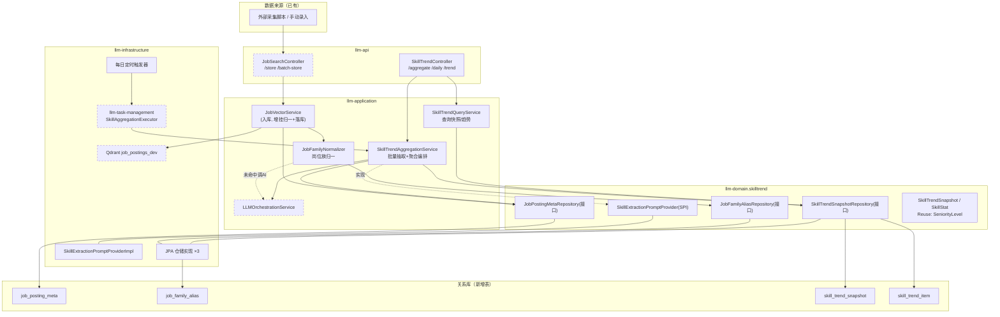
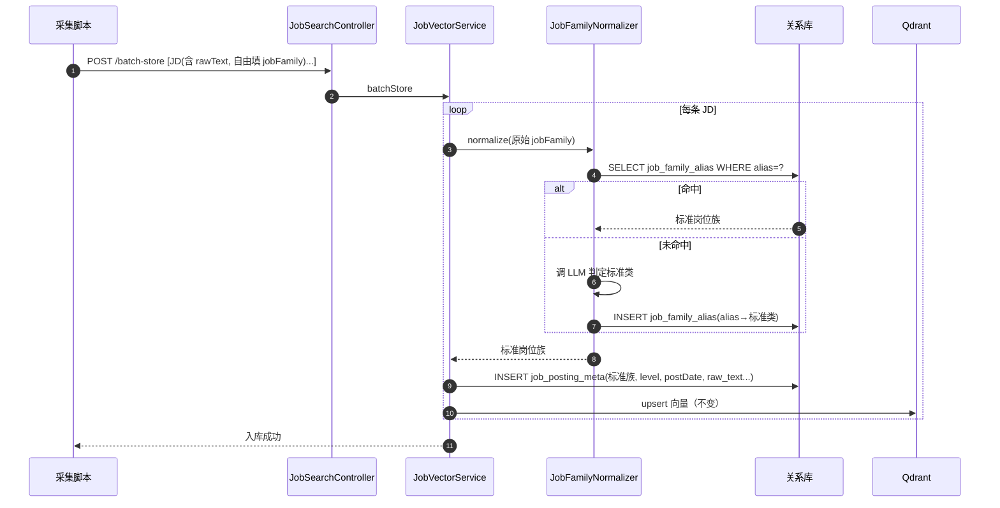
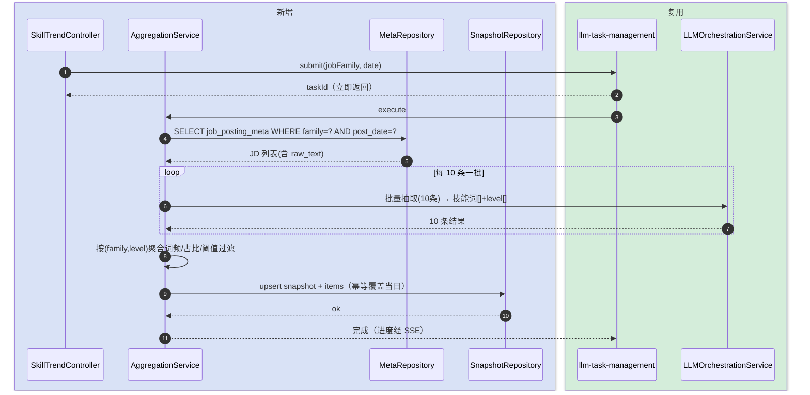
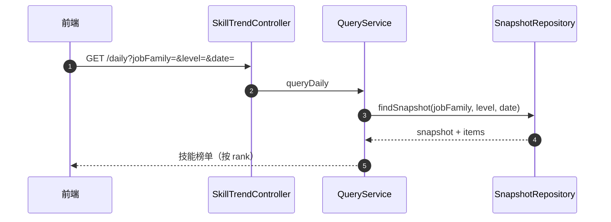

# 岗位技能趋势聚合 — 技术方案设计文档

> **定位**：技术/架构主导。讲清「JD 持续入库（归一+落库） → LLM 批量抽取归一 → 按级别聚合 → 每日技能快照落库 → 查询/趋势」这条子系统的模块拓扑与协作。
> **最后更新**：2026-06-03

---

## 变更记录

| 版本 | 日期 | 修改人 | 变更内容摘要 |
|------|------|--------|--------------|
| v1 | 2026-06-03 | zhangkai | 初始版本（草稿） |
| v2 | 2026-06-03 | zhangkai | 确认 4 决策：入库落关系表枚举、存 JD 原文、岗位族"自由填+入库归一"、LLM 一次 10 条批量抽取 |

---

## 1. 目标与边界

- **要解决的问题**：用户持续采集某类岗位的 JD，希望基于汇总结果，**按岗位级别动态产出"当日该级别所需的主流可靠技能"**，并能回看技能随时间的变化趋势。
- **本次目标**：
  1. JD 入库时同步**归一岗位族**并**落一张关系表**，使 JD 可按 `(岗位族, 日期)` 快速枚举
  2. 以 LLM **一次 10 条批量**对 JD **抽取标准化技能词 + 推断岗位级别**（SeniorityLevel）
  3. 按 `(标准岗位族 jobFamily, 级别 level)` 聚合技能词频/占比，按可靠性阈值筛出"主流可靠技能"
  4. 每日生成技能快照落库，支持「查当日榜单」「查历史趋势」
  5. 聚合任务可手动触发（返回 taskId + SSE 进度）+ 每日定时自动跑
- **不做什么**：
  - 不建 JD 爬虫（数据由现有 `/api/job-search/store`、`/batch-store` 推入）
  - 不做技能推荐给个人简历（与简历优化模块的对接留作后续）
  - 不做实时计算（一律走每日快照，不在查询时重算）
- **设计结论（一句话）**：新增 `skilltrend` 子系统 —— 入库路径增挂"岗位族归一 + JD 元数据落库"，聚合复用 `llm-task-management` 异步 + `LLMOrchestrationService` 批量抽取，产出落 `skill_trend_snapshot` / `skill_trend_item` 两表；岗位族用 `job_family_alias` 别名映射表做"自由填+入库归一"。

### 四个关键决策（已确认）

| # | 决策 | 落地方式 |
|---|------|---------|
| 1 | JD 枚举走关系表 | 入库时同步写 `job_posting_meta`（含 jobFamily/level/postDate），聚合按 `(标准岗位族, 日期)` 直接 SQL 扫；Qdrant 仍负责相似检索，不用于枚举 |
| 2 | 存 JD 原文 | `job_posting_meta.raw_text` 保存完整 JD 文本，供 LLM 抽取；`JobPosting` / 入库 DTO 增 `rawText` 字段 |
| 3 | 岗位族自由填 + 入库归一 | 入库先查 `job_family_alias`：命中→直接归标准类（零成本）；未命中→调 1 次 LLM 判定标准类并把别名回写映射表，下次免费命中 |
| 4 | LLM 批量抽取 | 聚合时按 10 条 JD 一批拼进一次 prompt，输出 10 条的技能词+级别，降低调用次数与 token |

---

## 2. 整体架构



虚线框 = 已有模块复用；`JobVectorService` 为已有但本次增挂逻辑。

---

## 3. 模块拆分与职责

### 3.1 入库增强：JobVectorService + JobFamilyNormalizer（llm-application）

- **定位**：在既有 JD 入库流程上增挂"岗位族归一 + 元数据落库"。
- **职责**：
  - 接收 JD（含 rawText）→ 调 `JobFamilyNormalizer` 得到标准岗位族 → 写 `job_posting_meta`
  - 仍按原逻辑写 Qdrant（相似检索能力不变）
- **上游**：`JobSearchController`
- **下游**：`JobFamilyNormalizer`、`JobPostingMetaRepository`、Qdrant
- **关键设计点**：归一失败/LLM 不可用时**降级**——直接用原始 jobFamily 文本入库并标记 `normalized=false`，绝不阻断入库。

### 3.2 JobFamilyNormalizer（llm-application，新增）

- **定位**：把自由填的岗位族归一到标准分类。
- **职责**：查 `job_family_alias`（命中即返回标准类）；未命中调 LLM 判定标准类 + 回写别名映射。
- **下游**：`JobFamilyAliasRepository`、`LLMOrchestrationService`、`SkillExtractionPromptProvider`（归一 prompt）
- **关键设计点**：映射表是缓存层，AI 成本只在"新写法"首次出现时付一次；并发回写按别名唯一键幂等。

### 3.3 SkillTrendAggregationService（llm-application，新增）

- **定位**：聚合编排核心。
- **职责**：
  - 按 `(标准岗位族, 日期)` 从 `job_posting_meta` SQL 枚举 JD（含 rawText）
  - **每 10 条一批**拼 prompt 调 LLM，抽取标准化技能词 + 推断级别
  - 按 `(jobFamily, level)` 分组算词频/占比，阈值标记 reliable，组装 `SkillTrendSnapshot` 落库
- **上游**：`SkillTrendController`、`SkillAggregationExecutor`（定时）
- **下游**：`JobPostingMetaRepository`、`LLMOrchestrationService`、`SkillExtractionPromptProvider`、`SkillTrendSnapshotRepository`
- **关键设计点**：批次内单条失败不拖垮整批（记失败计数）；并发受 Provider RateLimiter 约束；幂等覆盖当日快照。

### 3.4 SkillTrendQueryService（llm-application，新增）

- **定位**：只读查询。
- **职责**：按 `(jobFamily, level, date)` 查当日榜单；按 `(jobFamily, level, 时间窗 [, skill])` 查趋势序列。
- **下游**：`SkillTrendSnapshotRepository`
- **关键设计点**：纯读快照，不触发任何 LLM。

### 3.5 domain.skilltrend（llm-domain，新增）

- **定位**：领域模型 + 抽象接口，隔离 application 与 infrastructure。
- **职责**：模型（`SkillTrendSnapshot`/`SkillStat`/`SkillExtractionResult`，复用 `SeniorityLevel`）；仓储接口（`SkillTrendSnapshotRepository`/`JobPostingMetaRepository`/`JobFamilyAliasRepository`）；`SkillExtractionPromptProvider`（抽取+归一 Prompt SPI）。
- **关键设计点**：application 依赖接口，infrastructure 实现，禁止反向 import。

### 3.6 infrastructure（llm-infrastructure，新增 + 复用）

- **定位**：落地实现。
- **职责**：`SkillExtractionPromptProviderImpl`（抽取 + 归一两套 prompt）；3 个 JPA 仓储实现 + 4 个实体。
- **关键设计点**：仅依赖 domain，不依赖 application。

### 3.7 异步执行器 + 定时器（llm-application，新增）

- **定位**：承载异步聚合与每日触发。
- **职责**：`SkillAggregationExecutor`（实现 domain SPI `LlmTaskExecutor`，`@LlmTaskExecutorType("SKILL_AGGREGATION")`）调用聚合服务；`SkillTrendDailyScheduler` 按 cron 提交任务。
- **关键设计点**：**放 application 层而非 infrastructure** —— 执行器需调用 application 层聚合服务，而架构方向只允许 application/infrastructure → domain，infrastructure 不能依赖 application。异步执行复用既有 `llm-task-management`，不另造调度/SSE。

---

## 4. 关键交互

### 4.1 JD 入库（增挂归一 + 落关系表）

> 触发：采集脚本调入库接口；参与方：采集方、入库服务、归一器、关系库、Qdrant。



### 4.2 触发聚合并落每日快照（核心路径，批量抽取）

> 触发：手动 POST /aggregate 或每日定时；参与方：触发方、聚合服务、LLM、仓储。



### 4.3 查询当日榜单 / 趋势

> 触发：前端查询；参与方：Controller、查询服务、仓储。



---

## 5. 核心业务规则

| 规则 | 说明 |
|------|------|
| R1 数据来源单一 | JD 仅经现有 `/store` `/batch-store` 入库；本子系统不新建采集 |
| R2 岗位族归一 | 入库先查 `job_family_alias`，命中归标准类；未命中调 LLM 判定并回写别名映射，幂等 |
| R3 归一降级 | 归一 LLM 不可用/失败时，用原始文本入库并标 `normalized=false`，绝不阻断入库 |
| R4 存原文 | `job_posting_meta.raw_text` 保存完整 JD，抽取以原文为准 |
| R5 技能归一 | LLM 抽取阶段输出归一化技能词（同义合并、统一大小写），避免 `k8s/K8s/Kubernetes` 分裂 |
| R6 级别推断 | LLM 从 JD 文本推断到 SeniorityLevel 四档；无法判定归"未知级别"桶，不强行分配 |
| R7 批量抽取 | 聚合时每 10 条 JD 一批调 LLM；批内单条失败跳过并计数，不拖垮整批 |
| R8 可靠性阈值 | 技能在某 `(family,level)` 当日占比 ≥ 阈值（默认 30%，可配）且样本量 ≥ 最小 JD 数（默认 5）才 reliable=true |
| R9 快照幂等 | 同 `(family, level, snapshot_date)` 重复聚合覆盖更新，不追加重复行 |
| R10 查询零重算 | 查询只读快照表，绝不在查询时触发 LLM 或重算 |
| R11 并发限速 | LLM 调用并发受 Provider RateLimiter 约束，429 按既有降级链处理 |

---

## 6. 编码落点

```text
llm-domain/src/main/java/com/exceptioncoder/llm/domain/skilltrend/
├── model/
│   ├── SkillTrendSnapshot.java        [新增] 某(family,level,date)技能快照聚合根
│   ├── SkillStat.java                 [新增] 单技能统计项(skill/frequency/ratio/reliable/rank)
│   ├── SkillExtractionResult.java     [新增] 单条JD抽取产物(skills[]+inferredLevel)
│   └── JobPostingMeta.java            [新增] JD元数据(family/level/postDate/rawText/normalized)
├── repository/
│   ├── SkillTrendSnapshotRepository.java [新增] 快照仓储接口
│   ├── JobPostingMetaRepository.java     [新增] JD元数据仓储(按family+date枚举)
│   └── JobFamilyAliasRepository.java     [新增] 岗位族别名映射仓储
└── service/
    └── SkillExtractionPromptProvider.java [新增] 抽取+归一Prompt SPI

llm-application/src/main/java/com/exceptioncoder/llm/application/skilltrend/
├── SkillTrendAggregationUseCase.java  [新增] 聚合用例接口
├── SkillTrendAggregationService.java  [新增] 批量抽取+聚合编排
├── SkillTrendQueryUseCase.java        [新增] 查询用例接口
├── SkillTrendQueryService.java        [新增] 当日榜单/趋势查询
├── JobFamilyNormalizer.java           [新增] 岗位族归一(查映射/调LLM/回写)
├── SkillAggregationExecutor.java      [新增] 实现 domain SPI LlmTaskExecutor，@LlmTaskExecutorType("SKILL_AGGREGATION")
└── SkillTrendDailyScheduler.java      [新增] 每日定时提交聚合任务(默认关闭)

llm-application/src/main/java/com/exceptioncoder/llm/application/service/
└── JobVectorService.java              [修改] 入库增挂归一+写job_posting_meta

llm-infrastructure/src/main/java/com/exceptioncoder/llm/infrastructure/skilltrend/
├── SkillExtractionPromptProviderImpl.java [新增] 抽取+归一SystemPrompt静态实现(含默认标准岗位族清单)
└── persistence/
    ├── SkillTrendSnapshotRepositoryImpl.java [新增] JPA实现(快照+技能项)
    ├── JobPostingMetaRepositoryImpl.java      [新增] JPA实现
    ├── JobFamilyAliasRepositoryImpl.java      [新增] JPA实现
    ├── 4×JpaRepository (Spring Data 接口)     [新增]
    └── entity/ (SkillTrendSnapshotEntity / SkillTrendItemEntity / JobPostingMetaEntity / JobFamilyAliasEntity) [新增]

llm-api/src/main/java/com/exceptioncoder/llm/api/controller/
├── skilltrend/SkillTrendController.java   [新增] /api/v1/skill-trend 入口
├── skilltrend/dto/                        [新增] 请求/响应DTO
├── dto/JobPostingDTO.java                 [修改] 增 rawText 字段
└── controller/jobsearch/JobSearchController.java [不变] 入口签名不变(rawText 走 DTO)
```

### 调用关系说明

- 入库：`JobSearchController` → `JobVectorService`（→ `JobFamilyNormalizer` → `JobFamilyAliasRepository`/LLM）→ `JobPostingMetaRepository` + Qdrant
- 聚合：`SkillTrendController` →（提交）`llm-task-management` → `SkillAggregationExecutor` → `SkillTrendAggregationService` →（`JobPostingMetaRepository` 枚举 + `LLMOrchestrationService` 批量抽取）→ `SkillTrendSnapshotRepository`
- 查询：`SkillTrendController` → `SkillTrendQueryService` → `SkillTrendSnapshotRepository`

---

## 7. 数据与依赖变更

| 类型 | 是否变化 | 说明 |
|------|----------|------|
| 数据库表 | 有（4 张新表） | `job_posting_meta`（family/level/post_date/raw_text/normalized，索引 family+post_date）、`job_family_alias`（alias 唯一键→standard_family）、`skill_trend_snapshot`（唯一键 family+level+snapshot_date）、`skill_trend_item`（FK snapshot_id，索引 skill_name） |
| DTO / VO / 枚举 | 有 | `JobPostingDTO` 增 `rawText`；新增 skilltrend DTO；复用 `SeniorityLevel`，新增"未知级别"占位 |
| 下游接口 / 外部依赖 | 有（复用） | 复用 `LLMOrchestrationService`、`llm-task-management`；Qdrant 仅做相似检索（不再用于枚举） |
| 缓存 / 消息 / 锁 / 事务 | 有 | 快照 upsert、meta 写入走事务；别名回写按唯一键幂等；聚合任务幂等键 = family+level+date |

---

## 8. 风险与待确认

| 风险 / 待确认点 | 影响 | 处理方式 |
|----------------|------|----------|
| 入库性能（每条可能触发归一 LLM） | 批量入库变慢 | 别名映射命中后零 LLM；未命中才调用且结果缓存；可异步化归一（先落原始，后台补归一）作为后续优化 |
| 标准岗位族分类表初始内容 | 归一目标依据 | 需提供一份初始标准分类清单（如后端/前端/算法/测试/产品…）作为 LLM 归一候选集 |
| 批量 prompt 10 条的输出对齐 | 解析风险 | prompt 强约束输出 JSON 数组、与输入顺序/索引对齐；解析失败按条降级单抽 |
| 历史 JD（meta 表上线前入库的）无 meta 记录 | 早期数据缺失 | 提供一次性回填脚本：扫 Qdrant 或重新入库补 meta；或仅统计上线后数据 |
| 阈值（30%/最小样本 5） | 榜单稳定性 | 设为可配置项，灰度调参 |
| 前端页面 | 范围 | 本文档定后端 + 接口；前端另开子需求 |

---

## 9. 验证要点

- **正常路径**：批量入库含 rawText 的 JD（jobFamily 写成"Java后端"等别名）→ 归一为"后端开发"并落 meta → 触发聚合 → `/daily` 得到按级别分组、按 rank 排序、带 reliable 标记的技能榜单
- **异常路径**：归一 LLM 失败 → 原文入库标 normalized=false 不阻断；批量抽取单条失败跳过计数；429 降级；样本不足标 insufficient
- **边界条件**：别名首次出现走 LLM 并回写、第二次命中零成本；当日无新增 JD 跳过不生成空快照；级别无法推断归未知桶；同义技能词归一生效
- **回归范围**：不破坏现有 `/api/job-search/*` 行为（rawText 为可选字段，向前兼容）；不影响 `llm-task-management` 既有任务类型
