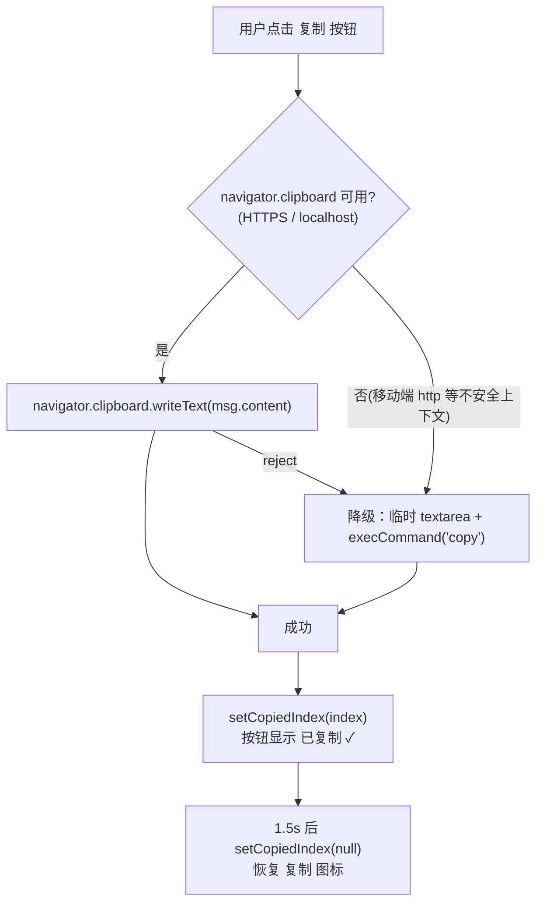

# 聊天回答一键复制 — 轻量设计文档（前端 UI）

> 在已有聊天页内新增一个"复制回答"按钮，解决移动端长按选区复制困难的问题。纯前端单文件改动，无后端接口/表变更。
> **最后更新**：2026-06-03

---

## 变更记录

| 版本 | 日期 | 变更内容摘要 |
|------|------|--------------|
| v1 | 2026-06-03 | 初始版本（草稿，待确认） |

---

## 1. 代码入口

- **入口**：`Chat`（React 组件）→ `llm-frontend/src/views/Chat.tsx`
- **改动点**：
  - 消息底部状态栏（assistant 分支）→ `Chat.tsx:183-192` 处新增"复制"按钮
  - 新增 `handleCopy(content)` 处理函数（含 Clipboard API + 降级方案）
  - 新增"已复制"短暂反馈状态（记录刚复制的消息 index）
- **目的（一句话）**：让用户一键复制 AI 回答的原始文本，移动端无需手动选区
- **是否写表**：否（纯前端，无网络请求、无后端调用）

---

## 2. 交互契约

- **触发**：点击 assistant 消息气泡下方的"复制"按钮
- **复制内容**：该条消息的**原始文本** `msg.content`（即 Markdown 源文，而非渲染后的 HTML）
- **反馈**：按钮图标 1.5s 内由"复制"切换为"已复制 ✓"，随后自动恢复
- **作用范围**：仅 assistant（AI 回答）消息显示复制按钮；user 消息不显示

---

## 3. 核心流程图

---

## 4. 关键规则

| 位置 | 规则 | 为什么 |
|------|------|--------|
| 复制内容 | 复制 `msg.content` 原文，不复制 `renderMarkdown` 后的 HTML | 用户要的是可二次使用的纯文本/Markdown，HTML 标签无意义 |
| 显示条件 | 仅 `msg.role === 'assistant'` 显示复制按钮 | 需求是"回答一键复制"，用户消息本就是自己输入的 |
| 复制 API | 优先 `navigator.clipboard.writeText`，不可用/失败时降级 `textarea + document.execCommand('copy')` | 移动端常处于非安全上下文(http)，Clipboard API 不可用，必须有降级才能真正解决移动端问题 |
| 反馈状态 | 用 `copiedIndex` state 标记刚复制的消息，1.5s 自动清除 | 给用户明确的"已复制"反馈，避免重复点击 |
| 图标/样式 | 用 lucide 的 `Copy` / `Check` 图标，沿用底部状态栏现有 muted 配色与 hover 规范 | 与现有 UI 一致，不引入硬编码颜色 |

---

## 5. 失败行为

| 失败位置 | 行为 |
|---------|------|
| `navigator.clipboard` 不存在或 writeText reject | 自动降级到 `textarea + execCommand` 方案，用户无感 |
| 降级方案也失败（极端浏览器） | 控制台 `console.error`，按钮不显示"已复制"；不弹错误打断用户 |
| 空内容（流式未完成的占位消息） | content 为空时按钮可不渲染或点击无效，不报错 |

---

## 6. 升级到完整模版的触发条件

- 若复制能力要扩展为"复制代码块/分段复制/导出全部对话"等多形态 → 升级 `template.md`
- 若需要后端记录复制行为埋点 → 涉及接口，升级完整模版

---

## 7. 修订记录

| 日期 | 修订摘要 |
|------|---------|
| 2026-06-03 | 首次落地（草稿） |
