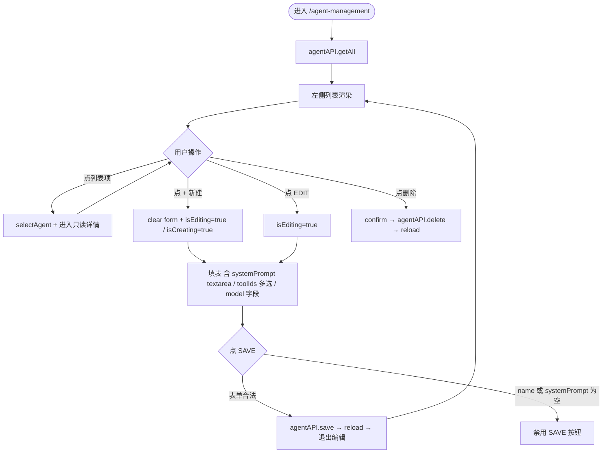

# 角色（Agent）管理页面

> 轻量模版 · 最后更新 2026-05-25

## 1. 代码入口

- 新增 view：`llm-frontend/src/views/AgentManagement.tsx`
- 加入导航：`llm-frontend/src/shell/nav.ts` 的「管理」组追加 `{ name: '角色管理', path: '/agent-management', icon: UserSquare }`
- 加入路由：`llm-frontend/src/App.tsx` 加 `<Route path="/agent-management" element={<AgentManagement />} />`
- 不动后端、不动 `agentAPI`（已齐全：getAll/getById/save/delete + getTools）

## 2. 接口契约（既有，本次零变更）

| 方法 | 路径 | 用途 |
|---|---|---|
| GET | `/api/v1/agents` | 列表 |
| GET | `/api/v1/agents/{agentId}` | 详情 |
| POST | `/api/v1/agents` | 新增 / 更新（body 含 `systemPrompt`） |
| DELETE | `/api/v1/agents/{agentId}` | 删除 |
| GET | `/api/v1/tools` | 拉 toolIds 多选选项 |

POST body 字段（`AgentDefinitionRequest`）：`id / name / description / systemPrompt / toolIds / llmProvider / llmModel / maxIterations / timeoutSeconds`，enabled 后端默认 true。

## 3. 核心流程

## 4. 关键规则

| 编号 | 规则 |
|---|---|
| R1 | 创建态 id 必填且只读后续；编辑态 id 不可改 |
| R2 | name + systemPrompt 必填；其余字段可空 |
| R3 | systemPrompt 用 ≥14 行 `<textarea>`，font-mono，主视觉位置 |
| R4 | toolIds 用 checkbox 多选，选项从 `toolAPI.getAll()` 拉 |
| R5 | maxIterations / timeoutSeconds 是数字输入，默认 10 / 120 |
| R6 | 删除前 `window.confirm` 二次确认 |
| R7 | 保存成功后保留当前选中 Agent 进入只读态 |
| R8 | 移动端单栏切换（同 TemplateManagement 的 isMobile 模式） |

## 5. 失败行为

- 列表加载失败：console.error + 列表为空 + 留 Refresh 按钮
- 保存失败：console.error + 按钮恢复可点（无 toast 库，先 console；后续接入再加 toast）
- 删除失败：同上

## 6. 视觉

参考 `views/TemplateManagement.tsx` 双栏布局：左 96 列表，右 flex-1 编辑卡片；样式用 oklch token（与重构后的 light/dark 一致）。
