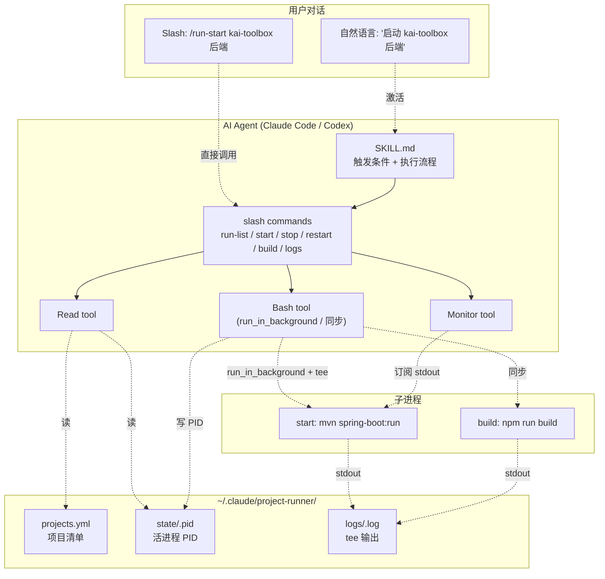
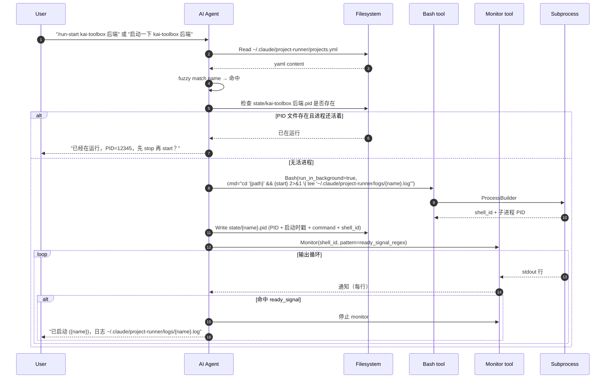
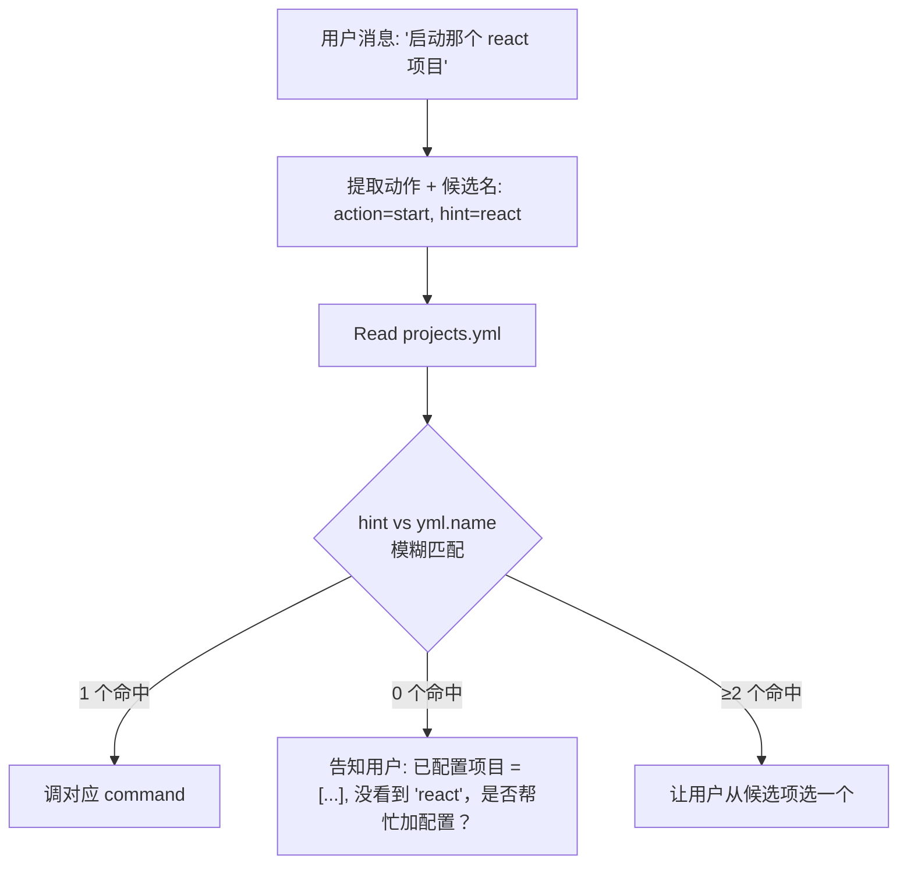

# 项目快速运行器 plugin

> 最后更新：2026-05-31
> 模版：完整-技术（template-tech.md）

一个适配 Claude Code 和 Codex 双端的 AI agent plugin。通过一份用户级配置文件（`~/.claude/project-runner/projects.yml`）声明若干项目（name / path / start / build / restart 命令），让用户能用自然语言或 slash command 触发"启动 / 停止 / 重启 / 编译 / 查日志"等操作；AI 在后台用 `Bash run_in_background` 起进程，输出 `tee` 到 `~/.claude/project-runner/logs/<name>.log`，用户既能在 Claude Code 工具框里看实时滚动，也能另开终端 `tail -f` 看长期日志。

**载体澄清**：本 plugin 是 AI agent plugin（由 Claude Code / Codex 在对话中加载），**不是**某个 Java/Node 项目的内嵌模块。plugin 自身不跑后台服务，所有进程管理由 AI 在用户对话中通过 Bash tool 完成。

---

## 1. 目标与边界

### 1.1 做什么

- 提供一份统一的项目清单配置文件 `~/.claude/project-runner/projects.yml`
- 在 Claude Code 端提供 1 个 skill + 5 个 slash command，让用户能：
  - `/run-list` —— 列出已配置项目 + 当前活进程
  - `/run-start <name>` —— 启动
  - `/run-stop <name>` —— 停止
  - `/run-restart <name>` —— 重启
  - `/run-build <name>` —— 编译
  - `/run-logs <name>` —— 拉最新日志（默认 100 行 + follow 30 秒）
- 在 Codex 端提供一份 `AGENTS.md` 片段，把同样的能力以指令形态注入到 Codex 的 system prompt
- 长驻进程通过 `Bash run_in_background=true` + 输出重定向 `2>&1 | tee` 落盘，**进程 PID 写到 `~/.claude/project-runner/state/<name>.pid` 文件**，使后续 stop/restart 能精准定位
- AI 用 `Monitor` 跟启动信号（"Started Application in"、"vite ready in"、"Local:" 等关键词），命中后停止 monitor + 告知用户启动成功
- 自然语言触发：用户说"启动 kai-toolbox 后端" / "重启那个 React 项目" / "编译这个项目"时，skill 自动激活并调用相应命令

### 1.2 不做什么

| 不做 | 原因 |
|------|------|
| 跑自己的后台守护进程 / web 服务 | plugin 只是给 AI 的指令集合，不应该自己起服务 |
| 持久化运行历史 / 数据库 | 日志文件就是历史；不引入 SQLite/JSON store |
| 实时 web UI 渲染日志 | Claude Code 工具框 + `tail -f` 已经够用 |
| 跨机器 / 远程项目 | 单用户本机工具 |
| 自动识别项目类型 / 默认命令 | 配置即权威，写明 start/build 命令字符串 |
| 任意命令编排（pipeline） | 一项目一组固定命令；要复杂逻辑用户自己写脚本 |
| 强进程隔离（PM2 级） | 走 Bash background + PID 文件即可；进程随会话退出是可接受的边界（README 注明） |

### 1.3 设计结论

- **plugin 形态**：标准 Claude Code plugin 目录（`.claude-plugin/plugin.json` + `skills/` + `commands/`），同目录额外放 `codex/AGENTS.md` 给 Codex 用，用户 `cat codex/AGENTS.md >> ~/.codex/AGENTS.md` 即接入
- **配置文件**：YAML，固定路径 `~/.claude/project-runner/projects.yml`；plugin 自带 `examples/projects.yml.example`，首次运行 skill 时检测不存在则提示用户从 example 拷贝
- **进程定位**：`~/.claude/project-runner/state/<name>.pid` 存活进程 PID + 启动时戳 + 命令；stop 时读 pid 跨平台 kill（Windows `taskkill /PID <pid> /T /F`，其他平台 `kill` / `kill -9`）
- **日志路径**：`~/.claude/project-runner/logs/<name>.log`，每次 start 覆盖（不追加，避免越长越大）；想保留历史用户自己改名
- **启动信号识别**：在 SKILL.md 里以"已知信号词表"列出常见框架的"启动成功"日志关键词（Spring Boot / Vite / Next / Webpack Dev Server / Flutter / Create React App），AI 用 Monitor 匹配；匹配不到时退到"30 秒无 stderr 视为已启动"
- **路径鲁棒性**：YAML 里写绝对路径；Bash 调用时双引号包裹，Windows 反斜杠和空格都不需要额外转义
- **跨平台 shell**：Bash tool 本身支持 PowerShell（Windows）/ bash（其他），但为统一行为，命令字符串里**禁止**用 PowerShell-only 语法（`$env:VAR`、backtick 续行）；如必须，用户自己包成 `.ps1` 脚本

---

## 2. 整体架构



**关键边界：**

- plugin 本身**不运行**任何 long-lived 进程；所有动作都是"AI 在收到触发后调一次工具的产物"
- 状态唯一存储是文件系统（PID 文件 + 日志文件）；plugin 重新加载、AI 重启都不丢
- Claude Code 和 Codex 通过相同的 `projects.yml` + 相似的 prompt 指令实现等价能力

---

## 3. 模块拆分与职责

### 3.1 `.claude-plugin/plugin.json`

Plugin 元数据。声明 name / version / description / author / 依赖工具（Bash / Monitor / Read）。

### 3.2 `skills/project-runner/SKILL.md`

核心 skill：

- **触发条件（description 字段）**：用户消息出现"启动 / 停止 / 重启 / 编译 / 跑一下 / 看日志"等动作动词 + 项目名/项目代号时，必须激活
- **执行流程**：
  1. 读 `~/.claude/project-runner/projects.yml`；不存在则提示用户从 example 拷贝
  2. 把用户提到的项目代号模糊匹配到 yml 里的 `name`（容忍空格、大小写、部分匹配）
  3. 不确定时让用户确认；确定后转交对应 slash command 逻辑
  4. 执行 + 实时反馈

### 3.3 Slash commands（`commands/*.md`）

每个 .md 文件是个 slash command 模板：

| 命令 | 作用 |
|---|---|
| `run-list` | 读 yml + state/ 目录，列出项目和活进程 |
| `run-start` | 读 yml.start → Bash run_in_background tee → 写 PID → Monitor 跟启动信号 |
| `run-stop` | 读 PID 文件 → 跨平台 kill → 删 PID 文件 |
| `run-restart` | 调 stop → 调 start |
| `run-build` | 读 yml.build → Bash 同步执行 → 把输出截选返回 |
| `run-logs` | tail -n 100 + 可选 follow 30 秒 |

### 3.4 `codex/AGENTS.md`

给 Codex 用的指令片段。内容是 SKILL.md 的精简版，描述同样的触发规则 + 执行流程，但不用 Claude Code 的 frontmatter；用户复制到 `~/.codex/AGENTS.md` 即生效。

### 3.5 `examples/projects.yml.example`

带注释的样例配置：

```yaml
# project-runner 配置文件，标准位置 ~/.claude/project-runner/projects.yml
projects:
  - name: kai-toolbox 后端
    path: D:\Users\zhang\IdeaProjects\kai-toolbox
    start: mvn -pl toolbox-starter -am spring-boot:run
    build: mvn clean install -DskipTests
    ready_signal: "Started ToolboxApplication"
  - name: kai-toolbox 前端
    path: D:\Users\zhang\IdeaProjects\kai-toolbox\frontend
    start: npm run dev
    build: npm run build
    ready_signal: "ready in"
```

`ready_signal` 是可选字段；不填则 AI 用内置常见信号词表（见 §5.2）。

### 3.6 `README.md`

人类可读的总入口：安装方法（Claude Code marketplace / 本地拷贝 / Codex 集成）、配置示例、命令速查、限制。

---

## 4. 关键交互

### 4.1 启动流程（slash command 或自然语言触发）



### 4.2 停止流程

```mermaid
sequenceDiagram
    autonumber
    participant U as User
    participant AI as AI Agent
    participant FS as Filesystem
    participant B as Bash tool

    U->>AI: "/run-stop kai-toolbox 后端"
    AI->>FS: Read state/{name}.pid
    alt PID 文件不存在
        FS-->>AI: not found
        AI-->>U: "未在运行"
    else 有 PID
        FS-->>AI: pid + shell_id
        AI->>B: KillShell(shell_id) 优先
        alt KillShell 失败 / 不可用
            AI->>B: Bash("taskkill /PID {pid} /T /F" 或 "kill -TERM {pid} ; sleep 3 ; kill -9 {pid}")
        end
        AI->>FS: 删除 state/{name}.pid
        AI-->>U: "已停止"
    end
```

### 4.3 自然语言模糊匹配



---

## 5. 核心业务规则

| 序号 | 规则 | 说明 |
|------|------|------|
| R1 | 配置文件路径硬编码 `~/.claude/project-runner/projects.yml` | 不接受 env / CLI flag 覆盖；保持 plugin 行为一致 |
| R2 | name 是唯一 key | yml 内 name 唯一；URL 安全字符不强制，匹配靠 fuzzy |
| R3 | 启动前检查 PID 存活 | 已在运行返回提示，不重复 start；用户要重启请显式 restart |
| R4 | 长驻进程必须落盘日志 | `2>&1 \| tee` 到 `logs/<name>.log`；每次 start 覆盖 |
| R5 | start 命令用 `Bash run_in_background=true` | 不阻塞 AI；KillShell / pid 跟 |
| R6 | build 命令用同步 Bash | 阻塞返回，AI 把 tail -50 输出贴给用户 |
| R7 | 状态文件原子写 | PID 文件先写 `.pid.tmp` 再 `mv`（Windows 用 PowerShell `Move-Item -Force`），防止半文件 |
| R8 | 跨平台 kill | Windows `taskkill /PID <pid> /T /F`（含子孙）；其他 `kill -TERM` 等 3 秒再 `kill -KILL` |
| R9 | 模糊匹配规则 | 大小写不敏感 + 去空格 + substring；多命中让用户选 |
| R10 | 命令字符串不做 escape | 用户责任；yml 里写法等同终端 |
| R11 | ready_signal 可选 | 不填用内置词表（§5.2）；都不命中时 30 秒无 stderr 即视为启动成功 |
| R12 | 关闭 Claude Code 会让进程退出 | 默认行为，README 明确告知；要后台守护用 nohup / pm2（plugin 不接管） |

### 5.1 配置 YAML 字段

| 字段 | 必填 | 类型 | 说明 |
|---|---|---|---|
| `name` | ✅ | string | 项目唯一名称，匹配 key |
| `path` | ✅ | string | 绝对路径，工作目录 |
| `start` | ✅ | string | 启动命令（长驻） |
| `build` | ❌ | string | 编译命令（一次性）；不填则禁用 `/run-build` |
| `restart` | ❌ | string | 自定义重启命令；不填走默认 stop+start |
| `ready_signal` | ❌ | string | 启动成功识别正则；不填走内置词表 |

### 5.2 内置 ready_signal 词表

按出现频率（命中即视为启动完成）：

```
Started \w+Application in
ready in \d+ ?ms
Local:\s+http
Listening on
Server running at
Compiled successfully
webpack compiled
Flutter run key commands
* Restarted server
```

---

## 6. 编码落点

```text
project-runner-plugin/                                                 [新增] 独立 git repo
├── .claude-plugin/
│   └── plugin.json                                                    [新增] plugin 元数据
├── skills/
│   └── project-runner/
│       └── SKILL.md                                                   [新增] 核心 skill，触发条件 + 执行流程
├── commands/
│   ├── run-list.md                                                    [新增] 列项目 + 活进程
│   ├── run-start.md                                                   [新增] 启动
│   ├── run-stop.md                                                    [新增] 停止
│   ├── run-restart.md                                                 [新增] 重启
│   ├── run-build.md                                                   [新增] 编译
│   └── run-logs.md                                                    [新增] 查日志
├── codex/
│   └── AGENTS.md                                                      [新增] Codex 指令片段
├── examples/
│   └── projects.yml.example                                           [新增] 样例配置 + 注释
├── README.md                                                          [新增] 安装 / 使用 / 限制
└── LICENSE                                                            [可选]
```

运行时路径（不在 repo 内，由用户机器自行生成）：

```text
~/.claude/project-runner/
├── projects.yml                                                       用户复制 examples/projects.yml.example 后改
├── state/
│   └── <name>.pid                                                     PID + shell_id + command + started_at
└── logs/
    └── <name>.log                                                     start 输出 tee 落盘
```

---

## 7. 数据与依赖变更

### 7.1 运行时依赖

- AI agent 必须提供：`Bash`（含 `run_in_background` + `shell_id`）/ `Monitor` / `Read` / `Edit` / `Write` / `KillShell`（可选，无则退到 taskkill/kill）
- 用户机器：Windows / macOS / Linux 任一；Windows 需 PowerShell 5+ 或 pwsh 7+

### 7.2 配置

唯一配置文件 `~/.claude/project-runner/projects.yml`；样例见 §3.5。

### 7.3 安装方式

| 方式 | 步骤 |
|---|---|
| 本地手工 | 克隆 repo → 拷贝 / 软链到 `~/.claude/plugins/project-runner/` → 重启 Claude Code |
| Claude Code marketplace | 待发布；发布后 `/plugin install project-runner` |
| Codex | `cat codex/AGENTS.md >> ~/.codex/AGENTS.md`（或加到项目 AGENTS.md） |

---

## 8. 风险与待确认

| 序号 | 风险 / 待确认 | 处置 |
|------|------|------|
| RK1 | KillShell 不可用（某些 Bash tool 版本） | 退化到 PID 跨平台 kill |
| RK2 | Windows `taskkill /T /F` 子孙进程不完全 | 第一版接受；npm 启动的多层 node 进程偶尔残留，用户可 `taskkill /F /IM node.exe` 兜底 |
| RK3 | 启动信号不命中 | 30 秒无新 stderr 视为启动成功；用户可在 yml 显式配 ready_signal |
| RK4 | 配置变更 AI 不感知 | 每次命令都 Read yml，无需 reload |
| RK5 | 关闭 Claude Code 后进程退出 | README 明确告知；要守护用 `nohup` 包 |
| RK6 | 模糊匹配歧义（kai-toolbox 后端 vs kai-toolbox 前端 vs kai-toolbox） | R9：多命中让用户选 |
| RK7 | 日志文件无限增长 | 每次 start 覆盖（不追加）；用户想留历史自己改名或加 rotate |
| RK8 | Codex 端能力差异 | Codex 没有 Monitor / shell_id 时退化到"启动后 sleep 5 + tail logs 判断"，README 标注差异 |
| RK9 | plugin 路径含中文（C:\Users\张凯\）在某些 shell 下 quote 失败 | 全部路径用单引号包裹；测试覆盖中文路径 |

---

## 9. 后续可选演进

- 项目级配置覆盖（`.project-runner.yml` 在项目根）
- 日志 rotate（按大小或天）
- 整合 PM2 / systemd 作为可选 backend
- `/run-status` 显式查活进程（独立于 list）
- 增加 `pre_start` / `post_start` hook 命令
- npm marketplace / Claude Code marketplace 一键安装
